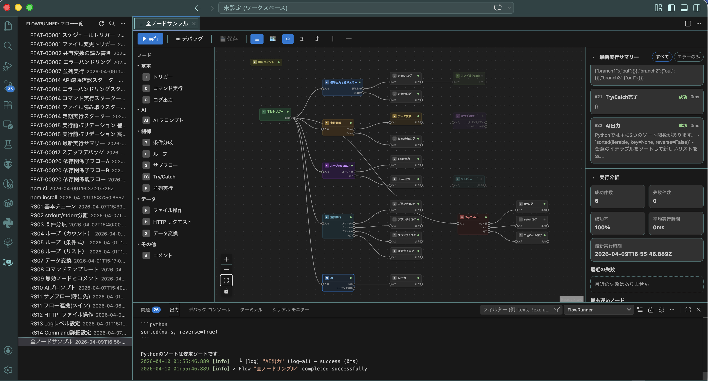

# FlowRunner

A node-based workflow execution extension for Visual Studio Code.

## Features

- **Visual Flow Editor** — Design workflows with drag-and-drop editing, auto layout, alignment, and copy/paste/duplicate tools
- **13 Built-in Nodes** — Trigger, Command, Log, AI Prompt, Condition, Loop, SubFlow, File, HTTP, Transform, Comment, Try/Catch, and Parallel
- **Flow Creation Paths** — Start from Blank Flow, Starter Template, or Recent Template
- **Execution and Debugging** — Run flows with preflight validation and step-debug them directly in VS Code
- **Right Sidebar Insights** — Review Latest Execution Summary, Execution Analytics, Flow Dependencies, and node Settings/Output in one place
- **Flow Management and History** — Duplicate, rename, import/export, trigger-manage, and retain execution history
- **i18n** — English and Japanese language support

## Getting Started

1. Open the **FlowRunner** panel from the activity bar
2. Click **Create Flow** and choose **Blank Flow**, **Starter Template**, or **Recent Template**
3. Add and connect nodes in the visual editor
4. Execute your flow with the **Execute Flow** command

## Requirements

- VS Code 1.99.0 or later

## Documentation

- [User Guide (English)](docs/user-guide.md)
- [ユーザーガイド（日本語）](docs/user-guide.ja.md)
- [README（日本語）](README.ja.md)

## License

[BSD-3-Clause](LICENSE)
