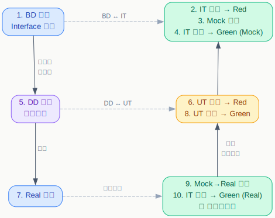

# Outside-in TDD プロンプトガイド

BD 完了時点から、各工程で使うエージェントとプロンプト例をまとめる。

## 全体フロー

## 工程別プロンプト一覧

> `{BD-XX}` は対象の BD 設計書番号に置き換える（例: BD-03, BD-04）。
> 各ステップは BD 設計書単位、またはその中のセクション単位で繰り返す。

| # | 工程 | エージェント | プロンプト例 | 期待される状態 |
|---|------|-------------|-------------|---------------|
| 1 | Interface 定義 | **coder** | `{BD-XX} の Interface 定義をコードに起こしてください。` | `.ts` に Interface が定義される |
| 2 | IT テスト作成 | **coder** | `{BD-XX} の IT テストを作成してください。Red を確認してください。` | IT: **Red** |
| 3 | Mock 実装 | **coder** | `{BD-XX} の Mock 実装を作成し、IT が Green になるようにしてください。` | Mock クラスが作成される |
| 4 | IT 確認 (Mock) | **coder** | `{BD-XX} の IT テストを Mock で実行し、Green を確認してください。` | IT: **Green (Mock)** |
| 5 | DD 作成 | **doc-writer** | `{BD-XX} §X.X の内部実装について詳細設計（DD）を作成してください。` | DD 設計書が作成される |
| 6 | UT テスト作成 | **coder** | `{DD-XX} の UT テストを作成してください。Red を確認してください。` | UT: **Red** |
| 7 | Real 実装 | **coder** | `{DD-XX} の Real 実装を作成し、UT が Green になるようにしてください。` | Real クラスが作成される |
| 8 | UT 確認 | **coder** | `{DD-XX} の UT テストを実行し、Green を確認してください。` | UT: **Green** |
| 9 | Mock→Real 差替 | **coder** | `{BD-XX} の IT テストの Mock を Real に差し替えてください。` | IT テストの DI が Real に変更される |
| 10 | IT 確認 (Real) | **coder** | `{BD-XX} の IT テストを Real で実行し、Green を確認してください。` | IT: **Green (Real)** |

## 補足

### 繰り返し単位

- 1〜4 は BD 設計書ごと（または大セクションごと）に繰り返す
- 5〜8 は DD 設計書ごと（または内部コンポーネントごと）に繰り返す
- 9〜10 は 7・8 が完了した DD 単位で随時実施可能

### Red にならない場合

- 2 で Red にならない → Interface 定義が不足している可能性。1 に戻る
- 6 で Red にならない → テストが実装に依存していないか確認。Interface に対して書き直す
