# RD-01 要求定義書

> **プロジェクト:** FlowRunner  
> **文書ID:** RD-01  
> **作成日:** 2026-03-11  
> **ステータス:** 承認済み

---

## 目次

- [RD-01 要求定義書](#rd-01-要求定義書)
  - [目次](#目次)
  - [1. はじめに](#1-はじめに)
  - [2. ステークホルダー (RD-01-002000)](#2-ステークホルダー-rd-01-002000)
  - [3. 背景 (RD-01-003000)](#3-背景-rd-01-003000)
  - [4. システムコンテキスト (RD-01-004000)](#4-システムコンテキスト-rd-01-004000)
  - [5. ユースケース](#5-ユースケース)
    - [5.1 ユースケース図 (RD-01-005001)](#51-ユースケース図-rd-01-005001)
    - [5.2 ユースケース一覧 (RD-01-005002)](#52-ユースケース一覧-rd-01-005002)
  - [6. 機能要求](#6-機能要求)
    - [6.1 フロー設計 (RD-01-006001)](#61-フロー設計-rd-01-006001)
    - [6.2 ビルトインノード一覧 (RD-01-006002)](#62-ビルトインノード一覧-rd-01-006002)
    - [6.3 フロー管理 (RD-01-006003)](#63-フロー管理-rd-01-006003)
    - [6.4 フロー実行 (RD-01-006004)](#64-フロー実行-rd-01-006004)
    - [6.5 デバッグ (RD-01-006005)](#65-デバッグ-rd-01-006005)
    - [6.6 実行履歴 (RD-01-006006)](#66-実行履歴-rd-01-006006)
    - [6.7 拡張性 (RD-01-006007)](#67-拡張性-rd-01-006007)
    - [6.8 国際化 (RD-01-006008)](#68-国際化-rd-01-006008)
  - [7. 品質要求 (RD-01-007000)](#7-品質要求-rd-01-007000)
  - [8. 制約事項 (RD-01-008000)](#8-制約事項-rd-01-008000)
  - [9. 前提条件 (RD-01-009000)](#9-前提条件-rd-01-009000)
  - [10. 将来拡張 (RD-01-010000)](#10-将来拡張-rd-01-010000)
  - [11. 用語集 (RD-01-011000)](#11-用語集-rd-01-011000)

---

## 1. はじめに

本書は FlowRunner の要求定義書である。FlowRunner は VSCode 拡張機能として動作するノードベースワークフロー実行環境であり、開発者が日常の作業を視覚的にフロー化し、実行・共有することを目的とする。

---

## 2. ステークホルダー (RD-01-002000)

| ID | 種別 | 説明 |
|---|---|---|
| — | 開発者（個人） | VSCode を利用するソフトウェア開発者。個人の作業を自動化・効率化したい |
| — | 開発チーム | 開発チームとしてフロー定義を共有し、定型作業を標準化したい |

---

## 3. 背景 (RD-01-003000)

| ID | 背景 |
|---|---|
| BG-00001 | VSCode での開発作業において、ビルド・テスト・デプロイなどの複数コマンドの実行順序管理がスクリプトファイルや手作業に依存しており、視覚的な管理ができない |
| BG-00002 | AI（LLM）プロンプトを活用したワークフロー構築基盤が存在せず、LLM との連携を含む作業の自動化が困難 |
| BG-00003 | チーム内の定型作業がメンバー個人の知識に依存しており、共有・標準化の手段が不足している |

---

## 4. システムコンテキスト (RD-01-004000)

FlowRunner と外部要素の関係を以下に示す。

---

## 5. ユースケース

### 5.1 ユースケース図 (RD-01-005001)

### 5.2 ユースケース一覧 (RD-01-005002)

| ID | ユースケース | 概要 |
|---|---|---|
| UC-00001 | フローを作成する | ノード UI 上でノードの追加・接続・設定を行い、新しいワークフローを定義する |
| UC-00002 | フローを編集する | 既存フローのノード構成・接続・設定を変更する |
| UC-00003 | フローを削除する | 不要になったフロー定義を削除する |
| UC-00004 | フローを実行する | 定義したフローを実行し、結果を確認する |
| UC-00005 | フローをデバッグする | ノード単位のステップ実行により、フローの動作を検証・問題を特定する |
| UC-00006 | フロー一覧を閲覧する | 作成済みフローの一覧をサイドバーで確認する |
| UC-00007 | フローを共有する | チームメンバーとフロー定義を共有する |
| UC-00008 | 実行履歴を確認する | 過去のフロー実行結果を参照・比較する |

---

## 6. 機能要求

### 6.1 フロー設計 (RD-01-006001)

| ID | 要求 | 関連UC |
|---|---|---|
| FR-00001 | ノードベースのビジュアルエディタ（WebView）でフローを設計できる | UC-00001, UC-00002 |
| FR-00002 | 以下のビルトインノードを提供する（§6.2 参照） | UC-00001 |
| FR-00003 | ノードごとに入力・出力を明示的に設定できる | UC-00001, UC-00002 |

### 6.2 ビルトインノード一覧 (RD-01-006002)

| # | ノード種類 | 説明 |
|---|---|---|
| 1 | トリガー | フローの開始点。v1.0 は手動実行のみ |
| 2 | コマンド実行 | シェルコマンドを実行する |
| 3 | AI プロンプト | LLM 連携 API 経由で Copilot LLM を呼び出す |
| 4 | 条件分岐 | 条件に基づきフローの実行パスを分岐する |
| 5 | ループ | 指定条件で処理を繰り返す |
| 6 | ログ出力 | ログメッセージを出力する |
| 7 | ファイル操作 | ファイルの読み書きを行う |
| 8 | HTTP リクエスト | HTTP API を呼び出す |
| 9 | 変数・データ変換 | データの変換・加工を行う |
| 10 | コメント | 実行されない。フロー上に説明メモを配置する |
| 11 | フロー連携 | 別のフロー定義を呼び出して実行する |

### 6.3 フロー管理 (RD-01-006003)

| ID | 要求 | 関連UC |
|---|---|---|
| FR-00004 | サイドバー（アクティビティバー）にフロー管理 UI を提供する | UC-00006 |
| FR-00005 | フロー定義を `.flowrunner/` フォルダに JSON 形式で永続化する | UC-00001, UC-00002, UC-00003, UC-00007 |
| FR-00006 | フロー定義を削除できる | UC-00003 |

### 6.4 フロー実行 (RD-01-006004)

| ID | 要求 | 関連UC |
|---|---|---|
| FR-00007 | フロー全体を実行できる | UC-00004 |
| FR-00008 | 実行中のノード状態（実行中・完了・エラー）を視覚的にフィードバックする | UC-00004, UC-00005 |
| FR-00009 | フロー完了時に VSCode 通知を表示する | UC-00004 |

### 6.5 デバッグ (RD-01-006005)

| ID | 要求 | 関連UC |
|---|---|---|
| FR-00010 | ノード単位のステップ実行ができる | UC-00005 |
| FR-00011 | ステップ実行時に中間結果（ノードの入出力値）を表示する | UC-00005 |

### 6.6 実行履歴 (RD-01-006006)

| ID | 要求 | 関連UC |
|---|---|---|
| FR-00012 | フロー実行履歴を記録する | UC-00008 |
| FR-00013 | 過去の実行結果を参照・比較できる | UC-00008 |

### 6.7 拡張性 (RD-01-006007)

| ID | 要求 | 関連UC |
|---|---|---|
| FR-00014 | 新しいノード種類の追加が容易なプラグインアーキテクチャを提供する | — |

### 6.8 国際化 (RD-01-006008)

| ID | 要求 | 関連UC |
|---|---|---|
| FR-00015 | 英語（EN）と日本語（JA）の多言語対応を行う | — |

---

## 7. 品質要求 (RD-01-007000)

| ID | 品質属性 | 要求 |
|---|---|---|
| QR-00001 | 拡張性 | 新しいノード種類の追加が、既存コードへの影響を最小限にして実現できること |
| QR-00002 | 信頼性 | ノード実行時のエラーを適切にハンドリングし、フロー全体が不正な状態にならないこと |
| QR-00003 | 使いやすさ | ノード UI によるフロー設計が直感的に行えること |
| QR-00004 | パフォーマンス | 多数のノードを含むフローでも操作・実行が円滑に行えること |
| QR-00005 | セキュリティ | ノード設定に含まれる認証情報を安全に管理できること |
| QR-00006 | 保守性 | コードの追跡順序が明確であり、テスト容易性が確保されていること |

---

## 8. 制約事項 (RD-01-008000)

| ID | 制約 | 説明 |
|---|---|---|
| CST-00001 | VSCode Extension API | 拡張機能は VSCode Extension API の範囲内で実現する。専用デーモンやバックエンドサーバーを必要としない |
| CST-00002 | クロスプラットフォーム | Windows / macOS / Linux で動作すること |
| CST-00003 | ノード内コマンドの自由度 | ノードが実行するコマンド内での外部連携（Docker、サービス等）は制約しない |

---

## 9. 前提条件 (RD-01-009000)

| ID | 前提 | 説明 |
|---|---|---|
| PRC-00001 | VSCode バージョン | VSCode 1.95 以上 |
| PRC-00002 | Node.js バージョン | Node.js 20 以上 |
| PRC-00003 | インターネット接続 | AI ノード・HTTP ノード使用時のみ必要。基本機能はオフラインで動作する |

---

## 10. 将来拡張 (RD-01-010000)

以下は v1.0 スコープ外だが、設計上考慮すべき項目として記録する。

| # | 機能 | 説明 |
|---|---|---|
| 1 | イベント / スケジュールトリガー | ファイル変更監視・タイマーによる自動実行 |
| 2 | 共有変数ストア | 全ノードがアクセス可能な変数空間 |
| 3 | Chat Participant（@flowrunner） | Copilot Chat から FlowRunner を操作。ターミナル履歴からのフロー自動生成を含む（2026-04-04 廃止、REV-020） |
| 4 | テンプレート | 定型フローの雛形を提供 |
| 5 | エクスポート / インポート | リポジトリ外へのフロー共有 |
| 6 | サブフロー | 再利用可能なフローコンポーネント |
| 7 | エラーハンドリングノード | try/catch 的なエラー処理パス定義 |
| 8 | 並列実行 | 分岐後の複数パスを同時実行 |
| 9 | VSCode タスク連携 | tasks.json ↔ フロー変換 |
| 10 | ノード設定値の Undo / Redo | ノード設定値の変更に対する元に戻す / やり直す |

---

## 11. 用語集 (RD-01-011000)

| 用語 | 説明 |
|---|---|
| フロー | ノードとエッジで構成されるワークフロー定義 |
| ノード | フロー内の処理単位。コマンド実行・AI 呼び出し等の種類がある |
| エッジ | ノード間の接続。データの流れと実行順序を表す |
| トリガー | フロー実行の開始契機。v1.0 では手動のみ |
| ステップ実行 | ノード単位でフローを逐次実行するデバッグ手法 |
| WebView | VSCode 内でリッチ UI を表示するための仕組み。フローのビジュアルエディタに使用 |
| LLM 連携 API | AI プロンプトノードから Copilot LLM にアクセスするための基盤 API。 |
