# RS-01 フロー設計・管理要件

> **プロジェクト:** FlowRunner  
> **文書ID:** RS-01  
> **作成日:** 2026-03-11  
> **ステータス:** 初版  
> **参照:** RD-01 §5, §6.1, §6.3

---

## 目次

1. [はじめに](#1-はじめに)
2. [UI 構造](#2-ui-構造)
3. [サイドバー（フロー一覧）](#3-サイドバーフロー一覧)
4. [フローエディタ（WebView）](#4-フローエディタwebview)
5. [プロパティパネル](#5-プロパティパネル)
6. [フロー保存・共有](#6-フロー保存共有)
7. [設定（settings.json）](#7-設定settingsjson)

---

## 1. はじめに

本書は RD-01 のフロー設計・管理に関するユースケース（UC-00001〜UC-00003, UC-00006, UC-00007）および機能要求（FR-00001, FR-00003〜FR-00006）を詳細化する要件定義書である。

---

## 2. UI 構造 (RS-01-002000)

FlowRunner の UI は「サイドバー」と「フローエディタ（WebView）」の2領域で構成される。

| 領域 | 役割 |
|---|---|
| サイドバー | フロー一覧の表示・管理。アクティビティバーのアイコンから開く |
| フローエディタ | ノード UI によるフロー設計。WebView で実装 |

---

## 3. サイドバー（フロー一覧）

RD-01 §6.3 FR-00004 を詳細化する。

### 3.1 表示要件 (RS-01-003001)

| # | 要件 | 関連FR |
|---|---|---|
| 1 | アクティビティバーに FlowRunner 専用アイコンを表示する | FR-00004 |
| 2 | フロー一覧をツリービューで表示する。フォルダによるグループ化に対応する | FR-00004 |
| 3 | 各フロー項目にフロー名と最終更新日時を表示する | FR-00004 |
| 4 | フロー名による検索・フィルター機能を提供する | FR-00004 |

### 3.2 操作要件 (RS-01-003002)

| # | 要件 | 関連FR |
|---|---|---|
| 1 | 「新規作成」ボタンでフロー名を入力し、新しいフローを作成する | FR-00004 |
| 2 | フロー項目をダブルクリックでフローエディタを開く | FR-00004 |
| 3 | フロー項目の「削除」ボタンで確認ダイアログの後にフローを削除する | FR-00006 |
| 4 | フロー項目の「実行」ボタンでフローを実行する | FR-00004 |
| 5 | フロー名のインライン編集（リネーム）に対応する | FR-00004 |

---

## 4. フローエディタ（WebView）

RD-01 §6.1 FR-00001, FR-00003 を詳細化する。

### 4.1 レイアウト (RS-01-004001)

| 領域 | 位置 | 役割 |
|---|---|---|
| ツールバー | 上部 | 実行・デバッグ・保存ボタン |
| ノードパレット | 左サイド | ドラッグ元のノード種別一覧 |
| フローキャンバス | 中央 | ノード・エッジの配置領域 |
| プロパティパネル | 右サイド | 選択ノードの設定・出力表示 |
| ミニマップ | 右下 | フロー全体の俯瞰 |

### 4.2 キャンバス操作 (RS-01-004002)

| # | 要件 | 関連FR |
|---|---|---|
| 1 | ノードパレットからキャンバスへのドラッグ&ドロップでノードを追加する | FR-00001 |
| 2 | キャンバス上でノードをドラッグして位置を移動する | FR-00001 |
| 3 | ノードの出力ポートから別ノードの入力ポートへドラッグしてエッジを作成する | FR-00003 |
| 4 | ズーム（拡大・縮小）に対応する | FR-00001 |
| 5 | ミニマップを表示し、フロー全体を俯瞰できる | FR-00001 |
| 6 | ノードをクリックしてプロパティパネルに設定を表示する | FR-00001 |

### 4.3 コンテキストメニュー (RS-01-004003)

| 対象 | メニュー項目 |
|---|---|
| ノード上 | 削除、コピー、切り取り、設定を開く |
| キャンバス上 | ペースト、全ノード選択、ズームリセット |
| エッジ上 | 削除 |

### 4.4 Undo / Redo (RS-01-004004)

| # | 要件 |
|---|---|
| 1 | ノードの追加・削除・移動を元に戻す / やり直す |
| 2 | エッジの接続・切断を元に戻す / やり直す |
| 3 | ノード設定値の変更に対する Undo / Redo は将来拡張とする |

### 4.5 ツールバー (RS-01-004005)

| ボタン | 動作 |
|---|---|
| ▶ 実行 | フロー全体を実行する |
| 🐛 デバッグ | デバッグモードで実行する（RS-03 §3 参照） |
| 💾 保存 | フロー定義を保存する |

---

## 5. プロパティパネル

### 5.1 概要 (RS-01-005001)

フローエディタ右サイドに配置するパネル。選択ノードの設定と実行出力を表示する。

### 5.2 タブ構成 (RS-01-005002)

| タブ | 内容 |
|---|---|
| 設定 | ノード種類に応じた設定フォーム。RS-02 §3 で各ノードの設定項目を定義 |
| 出力 | ノード実行後の出力結果を表示。実行前は空 |

### 5.3 要件 (RS-01-005003)

| # | 要件 |
|---|---|
| 1 | ノード選択時に「設定」タブを表示する |
| 2 | 実行後、ノードクリックで「出力」タブに切り替わる |
| 3 | パネル幅の調整・折り畳みに対応する |

---

## 6. フロー保存・共有

RD-01 §6.3 FR-00005 を詳細化する。

### 6.1 保存仕様 (RS-01-006001)

| # | 要件 | 関連FR |
|---|---|---|
| 1 | フロー定義をワークスペース直下の `.flowrunner/` フォルダに JSON 形式で保存する | FR-00005 |
| 2 | 保存タイミングは手動（Ctrl+S または保存ボタン）を基本とする | FR-00005 |
| 3 | 自動保存の有効・無効を設定で切り替え可能にする（§7 参照） | FR-00005 |
| 4 | フォルダ構造によるフローのグループ化に対応する | FR-00005 |

### 6.2 共有仕様 (RS-01-006002)

| # | 要件 | 関連FR |
|---|---|---|
| 1 | `.flowrunner/` フォルダを Git 等のバージョン管理に含めることでチーム間共有を実現する | FR-00005 |
| 2 | フロー定義 JSON は人間が読みやすいフォーマット（整形済み）で保存する | FR-00005 |

---

## 7. 設定（settings.json） (RS-01-007000)

FlowRunner の動作を VSCode の settings.json で制御する設定項目。

| 設定キー | 型 | デフォルト | 説明 |
|---|---|---|---|
| `flowrunner.autoSave` | boolean | false | フロー定義の自動保存を有効にする |
| `flowrunner.historyMaxCount` | number | 10 | フローごとの実行履歴保持件数。-1 で無制限、0 で保存しない |

---

## 8. 多言語対応 (RS-01-008000)

RD-01 FR-00015 の要件を定義する。

| 要件 | 説明 |
|---|---|
| ロケール準拠 | ユーザーに表示されるすべての UI テキスト（メニュー、通知、エラーメッセージ等）は、ユーザーのロケール設定に従い対応言語で表示されること |
| 対応言語 | en（英語）、ja（日本語） |
| 文字列外部化 | ユーザー向け文字列はソースコードにハードコードせず、外部リソースとして管理すること |
