# RS-02 ノード要件

> **プロジェクト:** FlowRunner  
> **文書ID:** RS-02  
> **作成日:** 2026-03-11  
> **ステータス:** 初版  
> **参照:** RD-01 §6.1, §6.2

---

## 目次

1. [はじめに](#1-はじめに)
2. [ノード共通仕様](#2-ノード共通仕様)
3. [個別ノード仕様](#3-個別ノード仕様)

---

## 1. はじめに

本書は RD-01 §6.2 のビルトインノード一覧および FR-00002, FR-00003, FR-00014 を詳細化する要件定義書である。

---

## 2. ノード共通仕様

### 2.1 ポートモデル (RS-02-002001)

RD-01 §6.1 FR-00003 を詳細化する。

| 要素 | 説明 |
|---|---|
| 入力ポート | エッジからデータを受け取る接続点。ノードは0個以上の入力ポートを持つ |
| 出力ポート | 処理結果を次ノードへ送る接続点。ノードは0個以上の出力ポートを持つ |
| エッジ | 出力ポートから入力ポートへの接続。データの流れと実行順序を表す |

### 2.2 ノード共通属性 (RS-02-002002)

| 属性 | 説明 |
|---|---|
| ノード名 | ユーザーが設定する表示名 |
| ノード種類 | ビルトインノードの種別（トリガー、コマンド実行 等） |
| 有効/無効 | 無効にしたノードは実行時にスキップされる |

### 2.3 拡張性 (RS-02-002003)

RD-01 §6.7 FR-00014 を詳細化する。

| # | 要件 |
|---|---|
| 1 | 新しいノード種類の追加が、共通インターフェースの実装のみで完結する仕組みを提供する |
| 2 | ノード種類ごとに入力ポート・出力ポートの数と名前を定義できる |
| 3 | ノード種類ごとに設定フォーム（プロパティパネル）をカスタマイズできる |

---

## 3. 個別ノード仕様

### 3.1 トリガーノード (RS-02-003001)

RD-01 §6.2 #1 を詳細化する。

| 項目 | 内容 |
|---|---|
| 入力ポート | なし |
| 出力ポート | 1個（実行開始シグナル） |
| 説明 | フローの開始点。v1.0 では手動実行のみ |

| 設定項目 | 型 | 説明 |
|---|---|---|
| — | — | v1.0 では設定項目なし |

> **補足:** 入力ポート・出力ポートは上記で明示的に定義されており、FR-00003 を満たす。設定項目はポート定義とは別の概念であり、トリガーノードはユーザー設定不要で動作する。

> **将来拡張:** イベントトリガー（ファイル変更監視）、スケジュールトリガー（タイマー）

### 3.2 コマンド実行ノード (RS-02-003002)

RD-01 §6.2 #2 を詳細化する。

| 項目 | 内容 |
|---|---|
| 入力ポート | 1個（前ノードの出力データ） |
| 出力ポート | 2個（stdout / stderr） |
| 説明 | 指定したシェルコマンドを実行する |

| 設定項目 | 型 | 説明 |
|---|---|---|
| コマンド | string | 実行するシェルコマンド文字列 |
| 作業ディレクトリ | string | コマンド実行時の作業ディレクトリ。空の場合はワークスペースルート |
| シェル | enum | 使用するシェル（bash / zsh / sh / cmd / pwsh）。デフォルトはシステムデフォルト |
| 環境変数 | key-value | コマンド実行時に追加する環境変数 |
| タイムアウト | number | 実行タイムアウト（秒）。0 で無制限 |

### 3.3 AI プロンプトノード (RS-02-003003)

RD-01 §6.2 #3 を詳細化する。

| 項目 | 内容 |
|---|---|
| 入力ポート | 1個（プロンプトに埋め込むデータ） |
| 出力ポート | 1個（LLM 応答テキスト） |
| 説明 | LLM 連携 API 経由で Copilot LLM を呼び出す。具体的な API は BD 委譲 |

| 設定項目 | 型 | 説明 |
|---|---|---|
| プロンプト | string | LLM に送信するプロンプト。`{{input}}` で入力ポートのデータを埋め込み可能 |
| モデル | enum | 使用する LLM モデル。LLM 連携 API から利用可能なモデル一覧を動的取得。API の詳細は BD 委譲 |

### 3.4 条件分岐ノード (RS-02-003004)

RD-01 §6.2 #4 を詳細化する。

| 項目 | 内容 |
|---|---|
| 入力ポート | 1個（評価対象データ） |
| 出力ポート | 2個（true / false） |
| 説明 | JS 式で入力データを評価し、結果に応じてフローのパスを分岐する |

| 設定項目 | 型 | 説明 |
|---|---|---|
| 条件式 | string | JS 式。入力データを `input` 変数として参照可能。サンドボックス内で安全に評価 |

### 3.5 ループノード (RS-02-003005)

RD-01 §6.2 #5 を詳細化する。

| 項目 | 内容 |
|---|---|
| 入力ポート | 1個（反復対象データまたは制御データ） |
| 出力ポート | 2個（ループ本体 / ループ完了） |
| 説明 | 指定条件で内包ノードを繰り返し実行する |

| 設定項目 | 型 | 説明 |
|---|---|---|
| ループ種別 | enum | 回数指定 / 条件指定 / リスト反復 |
| 回数 | number | ループ種別が「回数指定」の場合の反復回数 |
| 条件式 | string | ループ種別が「条件指定」の場合の JS 式。真の間繰り返す |

### 3.6 ログ出力ノード (RS-02-003006)

RD-01 §6.2 #6 を詳細化する。

| 項目 | 内容 |
|---|---|
| 入力ポート | 1個（ログ出力データ） |
| 出力ポート | 1個（入力データをそのまま通過） |
| 説明 | ログメッセージを Output Channel に出力する |

| 設定項目 | 型 | 説明 |
|---|---|---|
| メッセージ | string | ログメッセージ。`{{input}}` で入力データを埋め込み可能 |
| ログレベル | enum | info / warn / error |

### 3.7 ファイル操作ノード (RS-02-003007)

RD-01 §6.2 #7 を詳細化する。

| 項目 | 内容 |
|---|---|
| 入力ポート | 1個（操作対象データ。書き込み時はファイル内容、パス指定時はパス文字列） |
| 出力ポート | 1個（操作結果。読み込み時はファイル内容、それ以外は操作ステータス） |
| 説明 | ファイルシステム上のファイル操作を行う |

| 設定項目 | 型 | 説明 |
|---|---|---|
| 操作種別 | enum | 読み込み / 書き込み / 追記 / 削除 / 存在確認 / ディレクトリ一覧 |
| ファイルパス | string | 操作対象のファイルパス。`{{input}}` で入力データを埋め込み可能 |
| エンコーディング | enum | UTF-8（デフォルト）/ その他。BD 委譲 |

### 3.8 HTTP リクエストノード (RS-02-003008)

RD-01 §6.2 #8 を詳細化する。

| 項目 | 内容 |
|---|---|
| 入力ポート | 1個（リクエストボディまたは動的パラメータ） |
| 出力ポート | 2個（レスポンスボディ / ステータスコード） |
| 説明 | HTTP API を呼び出す |

| 設定項目 | 型 | 説明 |
|---|---|---|
| URL | string | リクエスト先 URL。`{{input}}` で入力データを埋め込み可能 |
| メソッド | enum | GET / POST / PUT / DELETE / PATCH |
| ヘッダー | key-value | リクエストヘッダー |
| ボディ | string | リクエストボディ。`{{input}}` で入力データを埋め込み可能 |
| 認証 | object | 認証方式と認証情報。Bearer トークン等 |
| タイムアウト | number | リクエストタイムアウト（秒） |

### 3.9 変数・データ変換ノード (RS-02-003009)

RD-01 §6.2 #9 を詳細化する。

| 項目 | 内容 |
|---|---|
| 入力ポート | 1個（変換元データ） |
| 出力ポート | 1個（変換結果） |
| 説明 | データの変換・加工を行う |

| 設定項目 | 型 | 説明 |
|---|---|---|
| 変換種別 | enum | JSON パース / JSON ストリング化 / テキスト置換 / テキスト分割 / テキスト結合 / 正規表現 / テンプレート / JS 式 |
| 式 / パラメータ | string | 変換種別に応じたパラメータ。JS 式の場合は `input` 変数で入力データを参照 |

### 3.10 コメントノード (RS-02-003010)

RD-01 §6.2 #10 を詳細化する。

| 項目 | 内容 |
|---|---|
| 入力ポート | なし |
| 出力ポート | なし |
| 説明 | 実行されないノード。フロー上に説明メモを配置する |

| 設定項目 | 型 | 説明 |
|---|---|---|
| コメント | string | 説明テキスト（複数行対応） |

### 3.11 フロー連携ノード (RS-02-003011)

RD-01 §6.2 #11 を詳細化する。

| 項目 | 内容 |
|---|---|
| 入力ポート | 1個（呼び出し先フローへの入力データ） |
| 出力ポート | 1個（呼び出し先フローの最終出力） |
| 説明 | 別のフロー定義を呼び出して実行する |

| 設定項目 | 型 | 説明 |
|---|---|---|
| フロー | enum | 呼び出し先のフロー名。`.flowrunner/` 内のフロー一覧から選択 |
