# RS-03 実行・デバッグ・履歴要件

> **プロジェクト:** FlowRunner  
> **文書ID:** RS-03  
> **作成日:** 2026-03-11  
> **ステータス:** 初版  
> **参照:** RD-01 §6.4, §6.5, §6.6

---

## 目次

1. [はじめに](#1-はじめに)
2. [フロー実行](#2-フロー実行)
3. [デバッグ](#3-デバッグ)
4. [実行履歴](#4-実行履歴)
5. [完了通知](#5-完了通知)

---

## 1. はじめに

本書は RD-01 のフロー実行（FR-00007〜FR-00009）、デバッグ（FR-00010, FR-00011）、実行履歴（FR-00012, FR-00013）を詳細化する要件定義書である。

---

## 2. フロー実行

### 2.1 実行フロー (RS-03-002001)

### 2.2 実行仕様 (RS-03-002002)

| # | 要件 | 関連FR |
|---|---|---|
| 1 | トリガーノードからトポロジカル順序でノードを逐次実行する | FR-00007 |
| 2 | 各ノードの出力データをエッジ経由で後続ノードの入力ポートに伝播する | FR-00007 |
| 3 | ノード実行中は該当ノードを「実行中」状態として視覚的に表示する（色・アニメーション等） | FR-00008 |
| 4 | ノード実行完了後は「完了」または「エラー」状態を表示する | FR-00008 |
| 5 | 実行中のフローを途中停止できる | FR-00007 |
| 6 | 無効に設定されたノードは実行時にスキップし、次のノードに制御を渡す | FR-00007 |

### 2.3 エラー時の動作 (RS-03-002003)

| # | 要件 |
|---|---|
| 1 | ノード実行時にエラーが発生した場合、フロー全体の実行を停止する |
| 2 | エラーが発生したノードを「エラー」状態で表示する |
| 3 | エラーノードをクリックすると、プロパティパネルの「出力」タブにエラー詳細を表示する |

### 2.4 実行時フィードバック (RS-03-002004)

| # | 要件 | 関連FR |
|---|---|---|
| 1 | フロー全体の実行進捗をプログレスバーで表示する | FR-00008 |
| 2 | 各ノードの実行出力を Output Channel に出力する | FR-00008 |

---

## 3. デバッグ

RD-01 §6.5 FR-00010, FR-00011 を詳細化する。

### 3.1 デバッグモード (RS-03-003001)

| # | 要件 | 関連FR |
|---|---|---|
| 1 | ツールバーの「デバッグ」ボタンでデバッグモードを開始する | FR-00010 |
| 2 | デバッグモード中はステップ実行ボタンおよび停止ボタンを表示する | FR-00010 |
| 3 | フロー完了または停止ボタン押下でデバッグモードを終了する | FR-00010 |

### 3.2 ステップ実行 (RS-03-003002)

| # | 要件 | 関連FR |
|---|---|---|
| 1 | ステップ実行ボタンで次の1ノードのみ実行する | FR-00010 |
| 2 | ステップ実行後、次に実行されるノードをハイライト表示する | FR-00010 |

### 3.3 中間結果表示 (RS-03-003003)

| # | 要件 | 関連FR |
|---|---|---|
| 1 | ステップ実行後、プロパティパネルの「出力」タブにノードの入出力値を表示する | FR-00011 |
| 2 | 実行済みノードをクリックすると過去の入出力値を確認できる | FR-00011 |

---

## 4. 実行履歴

RD-01 §6.6 FR-00012, FR-00013 を詳細化する。

### 4.1 保存仕様 (RS-03-004001)

| # | 要件 | 関連FR |
|---|---|---|
| 1 | フロー実行完了時に実行結果を `.flowrunner/history/` 配下に JSON 形式で保存する。具体的なディレクトリ構造は BD 委譲 | FR-00012 |
| 2 | フローごとの保持件数は設定で制御する（RS-01 §7 `flowrunner.historyMaxCount` 参照） | FR-00012 |
| 3 | 保持件数を超えた場合、最も古い履歴から自動削除する | FR-00012 |

### 4.2 履歴データ (RS-03-004002)

| 項目 | 説明 |
|---|---|
| 実行日時 | フロー実行の開始日時 |
| 実行時間 | フロー全体の実行所要時間 |
| 実行結果 | 成功 / 失敗 |
| ノード別結果 | 各ノードの実行結果・入出力データ |
| エラー情報 | エラー発生時のノードとエラー詳細 |

### 4.3 履歴参照 (RS-03-004003)

| # | 要件 | 関連FR |
|---|---|---|
| 1 | サイドバーまたはフローエディタから実行履歴一覧を参照できる。具体的な UI は BD 委譲 | FR-00013 |
| 2 | 過去の実行結果を選択して詳細を確認できる | FR-00013 |

---

## 5. 完了通知 (RS-03-005000)

RD-01 §6.4 FR-00009 を詳細化する。

| # | 要件 | 関連FR |
|---|---|---|
| 1 | フロー実行完了時に VSCode 情報通知を表示する。成功時と失敗時で通知の種類を分ける | FR-00009 |
| 2 | 通知にはフロー名と実行結果（成功 / 失敗）を含む | FR-00009 |
