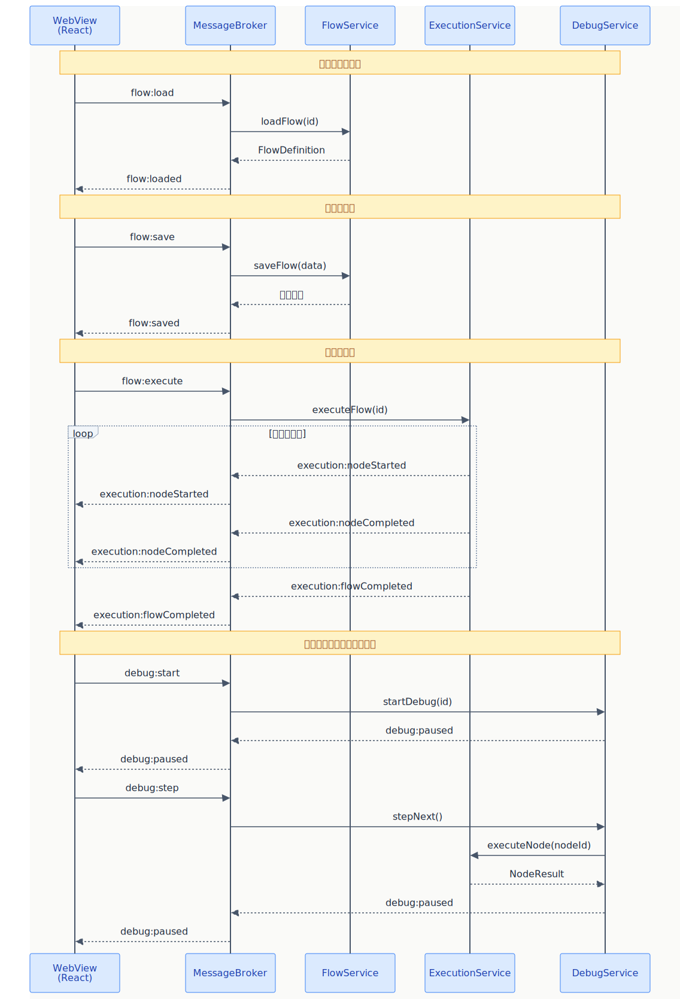

# BD-01 アーキテクチャ設計

> **プロジェクト:** FlowRunner  
> **文書ID:** BD-01  
> **作成日:** 2026-03-13  
> **ステータス:** 承認済み  
> **参照:** RS-01, RS-02, RS-03

---

## 目次

1. [はじめに](#1-はじめに)
2. [レイヤーアーキテクチャ](#2-レイヤーアーキテクチャ)
3. [コンポーネント設計](#3-コンポーネント設計)
4. [通信プロトコル設計](#4-通信プロトコル設計)
5. [package.json 設計](#5-packagejson-設計)

---

## 1. はじめに

本書は FlowRunner のアーキテクチャ全体像を定義する基本設計書である。RS-01（フロー設計・管理）、RS-02（ノード要件）、RS-03（実行・デバッグ・履歴）の全要件を実現するためのレイヤー構成、コンポーネント分割、通信方式、および package.json 構成を設計する。

BD-02〜BD-04 で各コンポーネントのインターフェース詳細を定義するための土台となる。

---

## 2. レイヤーアーキテクチャ

### 2.1 レイヤー構成 (BD-01-002001)

FlowRunner は以下の3層で構成される。

| レイヤー | 実行環境 | 責務 |
|---|---|---|
| Presentation | WebView（ブラウザサンドボックス） | フローエディタ UI の描画・ユーザー操作の受付 |
| Application | Extension Host（Node.js） | ビジネスロジック、VSCode API 連携、WebView 管理 |
| Infrastructure | ファイルシステム / 外部プロセス / 外部 API | データ永続化、コマンド実行、外部サービス呼び出し |

**レイヤー間の依存方向:**

- Presentation → Application: postMessage による非同期メッセージ通信のみ（直接 API 呼び出し不可）
- Application → Infrastructure: インターフェースを介した依存（Repository パターン）
- Infrastructure → Application: 依存なし（逆方向の依存を禁止）

### 2.2 レイヤー間の責務分離 (BD-01-002002)

| 観点 | Presentation | Application | Infrastructure |
|---|---|---|---|
| UI 描画 | ○ | × | × |
| ユーザー操作ハンドリング | ○ | × | × |
| VSCode API 呼び出し | × | ○ | × |
| ビジネスロジック | × | ○ | × |
| データ永続化 | × | × | ○ |
| 外部プロセス実行 | × | × | ○ |
| 外部 API 呼び出し | × | × | ○ |

**設計原則:**

- WebView は「表示と操作の受付」に専念し、ビジネスロジックを持たない
- Application レイヤーは Infrastructure の具象実装に依存せず、インターフェースに依存する（依存性逆転の原則）
- Infrastructure レイヤーの実装は差し替え可能（テスト時に Mock に置換可能）

---

## 3. コンポーネント設計

### 3.1 コンポーネント一覧 (BD-01-003001)

#### Extension Host コンポーネント

| コンポーネント | レイヤー | 責務 | 対応RS |
|---|---|---|---|
| ExtensionMain | Application | 拡張機能のエントリーポイント。activate() で全コンポーネントを初期化し、deactivate() でクリーンアップする | — |
| CommandRegistry | Application | VSCode コマンドの登録とハンドラへのルーティング | RS-01 §3.2 |
| FlowTreeProvider | Application | サイドバーのフロー一覧ツリービュー。TreeDataProvider を実装する | RS-01 §3.1, §3.2 |
| FlowEditorManager | Application | WebviewPanel のライフサイクル管理（作成・表示・破棄）。フローごとに1つの WebviewPanel を管理する | RS-01 §4.1 |
| MessageBroker | Application | Extension ↔ WebView 間のメッセージルーティング。メッセージ型に応じて適切なサービスにディスパッチする | — |
| FlowService | Application | フロー定義の CRUD ビジネスロジック | RS-01 §6.1, §6.2 |
| ExecutionService | Application | フロー実行のオーケストレーション。トポロジカル順序でノードを実行し、データを伝播する | RS-03 §2.1, §2.2, §2.3 |
| DebugService | Application | デバッグモードの管理。ステップ実行の制御と中間結果の提供 | RS-03 §3.1, §3.2, §3.3 |
| HistoryService | Application | 実行履歴のビジネスロジック。保持件数管理を含む | RS-03 §4.1, §4.2 |
| NodeExecutorRegistry | Application | ノード種類ごとの INodeExecutor 実装を管理するレジストリ。新ノード追加時はここに登録するだけで拡張可能 | RS-02 §2.3 |
| INodeExecutor | Application | 各ノード種類の実行ロジックを定義するインターフェース。ビルトインノード11種がこれを実装する | RS-02 §3 全体 |
| FlowRepository | Infrastructure | フロー定義 JSON の読み書き（.flowrunner/ フォルダ） | RS-01 §6.1 |
| HistoryRepository | Infrastructure | 実行履歴 JSON の読み書き（.flowrunner/history/ フォルダ） | RS-03 §4.1 |

#### WebView コンポーネント

| コンポーネント | レイヤー | 責務 | 対応RS |
|---|---|---|---|
| FlowEditorApp | Presentation | フローエディタのルート React コンポーネント | RS-01 §4.1 |
| Toolbar | Presentation | 実行・デバッグ・保存ボタン | RS-01 §4.5 |
| NodePalette | Presentation | ドラッグ可能なノード種別一覧 | RS-01 §4.1 |
| FlowCanvas | Presentation | React Flow を利用したノード・エッジの描画と操作 | RS-01 §4.2 |
| PropertyPanel | Presentation | 選択ノードの設定フォームと出力表示 | RS-01 §5.1, §5.2, §5.3 |
| MessageClient | Presentation | postMessage の送受信を抽象化するクライアント | — |

### 3.2 コンポーネント間の依存関係 (BD-01-003002)

**依存の方向と原則:**

| 依存元 | 依存先 | 依存方式 | 説明 |
|---|---|---|---|
| ExtensionMain | 全 Application コンポーネント | 直接生成 | エントリーポイントが DI コンテナとして各コンポーネントをインスタンス化 |
| CommandRegistry | FlowEditorManager, FlowService, ExecutionService | 直接参照 | コマンドハンドラが各サービスを呼び出す |
| FlowTreeProvider | FlowService | 直接参照 | ツリービューの表示データを取得 |
| FlowEditorManager | MessageBroker | 直接参照 | WebView の postMessage を MessageBroker に委譲 |
| MessageBroker | FlowService, ExecutionService, DebugService | 直接参照 | メッセージ型に応じてサービスにルーティング |
| ExecutionService | NodeExecutorRegistry | 直接参照 | ノード実行時に該当する Executor を取得 |
| ExecutionService | HistoryService | 直接参照 | 実行完了時に履歴を保存 |
| DebugService | NodeExecutorRegistry | 直接参照 | ステップ実行時に該当する Executor を取得して単一ノードを実行 |
| FlowService | FlowRepository（interface） | インターフェース依存 | 永続化の実装詳細から分離 |
| HistoryService | HistoryRepository（interface） | インターフェース依存 | 永続化の実装詳細から分離 |
| NodeExecutorRegistry | INodeExecutor（interface） | インターフェース依存 | ノード種類の実装詳細から分離 |

**テスト容易性の確保:**

- FlowRepository / HistoryRepository / INodeExecutor はインターフェースとして定義し、テスト時に Mock 実装に差し替え可能とする
- MessageBroker を介した WebView 通信もインターフェースを通じてテスト可能とする

---

## 4. 通信プロトコル設計

### 4.1 通信方式 (BD-01-004001)

Extension Host と WebView 間の通信は VSCode の postMessage API を使用する。

| 項目 | 仕様 |
|---|---|
| 通信方式 | 非同期メッセージパッシング（postMessage / onDidReceiveMessage） |
| データ形式 | JSON オブジェクト |
| メッセージ構造 | `{ type: string, payload: object }` |
| 方向 | 双方向（WebView ↔ Extension） |

**設計原則:**

- すべてのメッセージは `type` フィールドで識別する
- `type` はカテゴリとアクションをコロンで区切る（例: `flow:save`, `execution:nodeCompleted`）
- `payload` はメッセージ型ごとに固有のデータを持つ
- エラー応答は `error` カテゴリで統一する（例: `error:flowNotFound`）

### 4.2 メッセージ型一覧 (BD-01-004002)

#### WebView → Extension（リクエスト）

| type | payload 概要 | トリガー | 対応コンポーネント |
|---|---|---|---|
| `flow:load` | フロー ID | エディタ初期化時 | FlowService |
| `flow:save` | フロー定義データ | 保存ボタン / Ctrl+S | FlowService |
| `flow:execute` | フロー ID | 実行ボタン | ExecutionService |
| `flow:stop` | フロー ID | 停止ボタン | ExecutionService |
| `debug:start` | フロー ID | デバッグボタン | DebugService |
| `debug:step` | — | ステップ実行ボタン | DebugService |
| `debug:stop` | — | 停止ボタン | DebugService |
| `node:getTypes` | — | ノードパレット初期化時 | NodeExecutorRegistry |

#### Extension → WebView（レスポンス / イベント）

| type | payload 概要 | トリガー | 送信元 |
|---|---|---|---|
| `flow:loaded` | フロー定義データ | flow:load の応答 | FlowService |
| `flow:saved` | 保存結果 | flow:save の応答 | FlowService |
| `node:typesLoaded` | ノード種別一覧 | node:getTypes の応答 | NodeExecutorRegistry |
| `execution:nodeStarted` | ノード ID | ノード実行開始時 | ExecutionService |
| `execution:nodeCompleted` | ノード ID, 出力データ | ノード実行完了時 | ExecutionService |
| `execution:nodeError` | ノード ID, エラー情報 | ノード実行エラー時 | ExecutionService |
| `execution:flowCompleted` | 実行結果サマリ | フロー実行完了時 | ExecutionService |
| `debug:paused` | 次実行ノード ID, 現在の中間結果 | ステップ実行後 | DebugService |
| `error:general` | エラーメッセージ | 各種エラー発生時 | MessageBroker |

---

## 5. package.json 設計

### 5.1 Activation Events (BD-01-005001)

拡張機能の起動条件を定義する。

| イベント | 説明 | 対応RS |
|---|---|---|
| `onView:flowrunner.flowList` | サイドバーのフロー一覧ビューが開かれたとき | RS-01 §3.1 |
| `onCommand:flowrunner.createFlow` | フロー新規作成コマンド実行時 | RS-01 §3.2 |
| `onCommand:flowrunner.openEditor` | フローエディタを開くコマンド実行時 | RS-01 §3.2 |

### 5.2 Contributes 設計 (BD-01-005002)

package.json の `contributes` セクションに登録する VSCode 拡張ポイントを定義する。

#### Views Containers（アクティビティバー）

| ID | アイコン | タイトル | 対応RS |
|---|---|---|---|
| `flowrunner` | FlowRunner 専用アイコン | FlowRunner | RS-01 §3.1 #1 |

#### Views（ビュー）

| ID | コンテナ | 名前 | 型 | 対応RS |
|---|---|---|---|---|
| `flowrunner.flowList` | `flowrunner` | フロー一覧 | tree | RS-01 §3.1 |

#### Commands（コマンド）

| ID | タイトル | カテゴリ | 対応RS |
|---|---|---|---|
| `flowrunner.createFlow` | フローを作成 | FlowRunner | RS-01 §3.2 #1 |
| `flowrunner.openEditor` | フローを開く | FlowRunner | RS-01 §3.2 #2 |
| `flowrunner.deleteFlow` | フローを削除 | FlowRunner | RS-01 §3.2 #3 |
| `flowrunner.executeFlow` | フローを実行 | FlowRunner | RS-01 §3.2 #4 |
| `flowrunner.renameFlow` | フロー名を変更 | FlowRunner | RS-01 §3.2 #5 |
| `flowrunner.debugFlow` | フローをデバッグ | FlowRunner | RS-03 §3.1 #1 |

#### Menus（メニュー配置）

| コンテキスト | コマンド | 条件 |
|---|---|---|
| `view/title`（flowrunner.flowList） | `flowrunner.createFlow` | — |
| `view/item/context`（flowrunner.flowList） | `flowrunner.openEditor` | — |
| `view/item/context`（flowrunner.flowList） | `flowrunner.deleteFlow` | — |
| `view/item/context`（flowrunner.flowList） | `flowrunner.executeFlow` | — |
| `view/item/context`（flowrunner.flowList） | `flowrunner.renameFlow` | — |

#### Configuration（設定）

| キー | 型 | デフォルト | 説明 | 対応RS |
|---|---|---|---|---|
| `flowrunner.autoSave` | boolean | false | フロー定義の自動保存 | RS-01 §7 |
| `flowrunner.historyMaxCount` | number | 10 | フローごとの実行履歴保持件数 | RS-01 §7 |

#### L10n（多言語対応）

RS-01 §8 の多言語対応要件を実現する。@vscode/l10n を使用し、以下の構成で国際化を行う。

| 項目 | 仕様 | 対応RS |
|---|---|---|
| ライブラリ | @vscode/l10n | RS-01 §8 |
| 対応ロケール | en（デフォルト）、ja | RS-01 §8 |
| Extension Host 文字列 | `l10n.t()` API で外部バンドルから取得 | RS-01 §8 |
| package.json 文字列 | `package.nls.json`（en）/ `package.nls.ja.json`（ja）で管理 | RS-01 §8 |
| バンドル配置 | `l10n/bundle.l10n.ja.json` | RS-01 §8 |

**対象範囲:**

| 対象 | 国際化方式 | 例 |
|---|---|---|
| コマンドタイトル | `package.nls.*.json` の `%key%` 置換 | `%command.createFlow%` |
| ビュータイトル | `package.nls.*.json` の `%key%` 置換 | `%view.flowList%` |
| 設定説明 | `package.nls.*.json` の `%key%` 置換 | `%config.autoSave%` |
| 通知メッセージ | `l10n.t()` | `l10n.t('Flow "{0}" completed', flowName)` |
| エラーメッセージ | `l10n.t()` | `l10n.t('Flow not found: {0}', flowId)` |
| ユーザー入力プロンプト | `l10n.t()` | `l10n.t('Enter flow name')` |
| WebView UI 文字列 | WebView は Extension Host から受信した翻訳済み文字列を表示する | — |

**キー命名規則:**

| カテゴリ | プレフィックス | 例 |
|---|---|---|
| コマンドタイトル | `command.` | `command.createFlow` |
| ビュー名 | `view.` | `view.flowList` |
| 設定説明 | `config.` | `config.autoSave` |
| 通知・エラー・プロンプト | — （英語原文をキーとして使用） | `Flow "{0}" completed successfully` |

**多言語対応ルール:**

- ユーザーに表示されるすべての文字列（コマンドタイトル、通知、エラーメッセージ、入力プロンプト等）は国際化の対象とする
- ログ出力・デバッグ用メッセージは対象外
- 具体的な対象文字列の特定と翻訳内容は実装工程に委ねる
