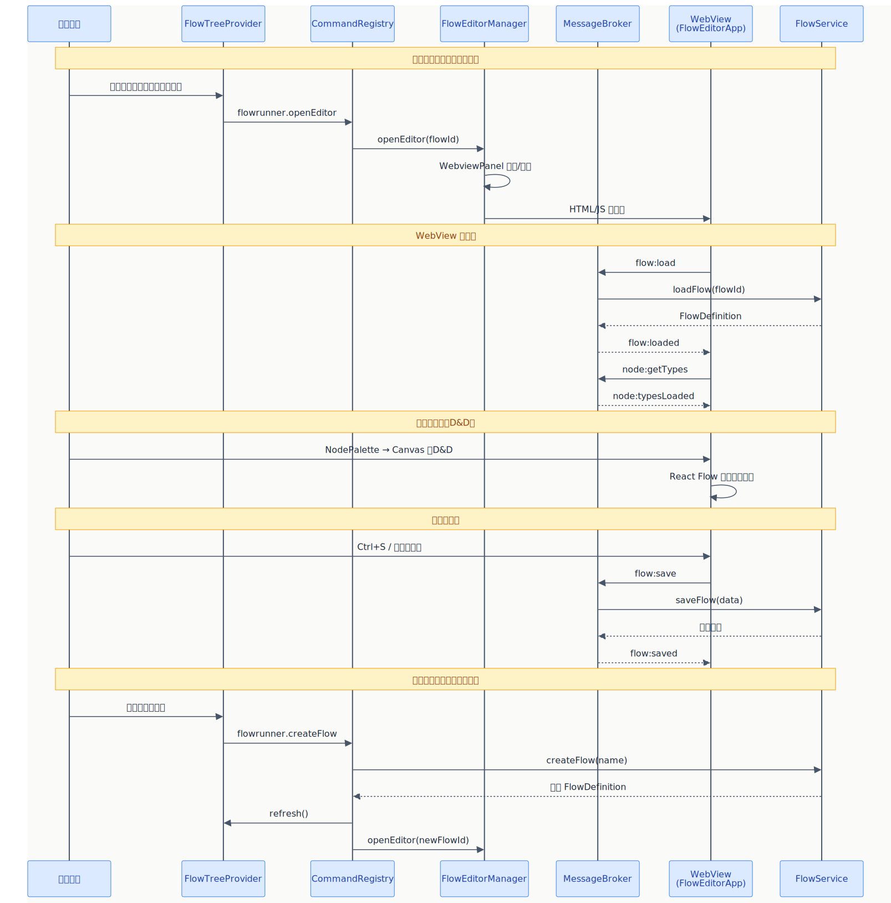

# BD-02 UI コンポーネント設計

> **プロジェクト:** FlowRunner  
> **文書ID:** BD-02  
> **作成日:** 2026-03-13  
> **ステータス:** 承認済み  
> **参照:** RS-01, BD-01

---

## 目次

1. [はじめに](#1-はじめに)
2. [FlowTreeProvider（サイドバー）](#2-flowtreeproviderサイドバー)
3. [FlowEditorManager（WebviewPanel 管理）](#3-floweditormanagerwebviewpanel-管理)
4. [WebView コンポーネント設計](#4-webview-コンポーネント設計)
5. [UI インタラクションフロー](#5-ui-インタラクションフロー)

---

## 1. はじめに

本書は BD-01 §3.1 で定義した UI 関連コンポーネントのインターフェースを詳細設計する。対象は以下の通り。

| 対象 | BD-01 コンポーネント | 対応RS |
|---|---|---|
| サイドバー | FlowTreeProvider | RS-01 §3 |
| WebView 管理 | FlowEditorManager | RS-01 §4.1 |
| WebView 内部 | FlowEditorApp, Toolbar, NodePalette, FlowCanvas, PropertyPanel, MessageClient | RS-01 §4, §5 |

---

## 2. FlowTreeProvider（サイドバー）

RS-01 §3.1, §3.2 を詳細設計する。

### 2.1 概要 (BD-02-002001)

FlowTreeProvider は VSCode の TreeDataProvider インターフェースを実装し、サイドバーにフロー一覧をツリー表示する。

### 2.2 IFlowTreeProvider インターフェース (BD-02-002002)

| メソッド | 引数 | 戻り値 | 同期/非同期 | 説明 | 対応RS |
|---|---|---|---|---|---|
| getChildren | parentId?: string | FlowTreeItem[] | 非同期 | 指定フォルダ配下のフロー・フォルダ一覧を返す。引数なしでルート一覧 | RS-01 §3.1 #2 |
| getTreeItem | item: FlowTreeItem | TreeItem | 同期 | FlowTreeItem を VSCode の TreeItem に変換する | RS-01 §3.1 #3 |
| refresh | — | void | 同期 | ツリービュー全体を再描画する。内部で onDidChangeTreeData イベントを発火する | RS-01 §3.1 |

### 2.3 FlowTreeItem 型 (BD-02-002003)

ツリービューの各項目を表現するデータ型。

| 属性 | 型 | 説明 |
|---|---|---|
| id | string | フロー ID またはフォルダパス |
| label | string | 表示名（フロー名またはフォルダ名） |
| type | "flow" / "folder" / "history" | 項目種別 |
| description | string | 補足情報（最終更新日時など） |
| parentId | string? | 親フォルダの ID。ルートの場合は undefined |

### 2.4 コンテキストメニューとコマンドバインディング (BD-02-002004)

FlowTreeProvider のツリー項目に対するユーザー操作と、発行されるコマンドの対応を定義する。

| 操作 | 発行コマンド | 条件 | 対応RS |
|---|---|---|---|
| ビュータイトルバーの「＋」ボタン | `flowrunner.createFlow` | 常時表示 | RS-01 §3.2 #1 |
| フロー項目をダブルクリック | `flowrunner.openEditor` | type = "flow" | RS-01 §3.2 #2 |
| コンテキストメニュー → 削除 | `flowrunner.deleteFlow` | type = "flow" | RS-01 §3.2 #3 |
| コンテキストメニュー → 実行 | `flowrunner.executeFlow` | type = "flow" | RS-01 §3.2 #4 |
| コンテキストメニュー → 名前の変更 | `flowrunner.renameFlow` | type = "flow" | RS-01 §3.2 #5 |

### 2.5 検索・フィルター (BD-02-002005)

RS-01 §3.1 #4 のフロー名検索・フィルターは、VSCode 組み込みのツリービュー検索機能（Ctrl+F でフィルター入力）を活用する。TreeDataProvider の標準機能として提供されるため、追加のインターフェース定義は不要。

### 2.6 FlowService との連携 (BD-02-002006)

FlowTreeProvider は FlowService に依存してフロー一覧を取得する。

| 呼び出し元 | FlowService メソッド | 用途 |
|---|---|---|
| getChildren | listFlows(parentId?) | フォルダ配下のフロー/フォルダ一覧を取得 |
| refresh | — | FlowService でのフロー作成・削除・名称変更後に呼び出される |

FlowService が使用するデータモデルおよび IFlowRepository インターフェースは BD-03 で定義する。

---

## 3. FlowEditorManager（WebviewPanel 管理）

RS-01 §4.1 を詳細設計する。

### 3.1 概要 (BD-02-003001)

FlowEditorManager は WebviewPanel のライフサイクルを管理する。フローごとに 1 つの WebviewPanel を保持し、同一フローを複数回開いた場合は既存パネルをアクティブにする。

### 3.2 IFlowEditorManager インターフェース (BD-02-003002)

| メソッド | 引数 | 戻り値 | 同期/非同期 | 説明 | 対応RS |
|---|---|---|---|---|---|
| openEditor | flowId: string, flowName?: string | void | 同期 | 指定フローのエディタを開く。既存パネルがあればアクティブ化、なければ新規作成。flowName が指定された場合、WebviewPanel のタブタイトルに使用する | RS-01 §4.1 |
| closeEditor | flowId: string | void | 同期 | 指定フローのエディタパネルを閉じる | — |
| getActiveFlowId | — | string? | 同期 | 現在アクティブなエディタのフロー ID を返す。エディタ未表示なら undefined | — |
| dispose | — | void | 同期 | 全パネルを破棄する。deactivate() 時に呼ばれる | — |

### 3.3 パネルライフサイクル (BD-02-003003)

| イベント | 処理 |
|---|---|
| パネル作成 | WebviewPanel を生成し、React アプリ（FlowEditorApp）の HTML をロード。MessageBroker にメッセージリスナーを登録 |
| パネル表示 | WebView が visible になったとき、必要に応じてステートを復元する |
| パネル非表示 | WebView が hidden になったとき、リソース消費を抑えるためにタイマー等を停止する |
| パネル破棄 | ユーザーがタブを閉じたとき、内部マップから該当フロー ID のエントリを削除し、リスナーを解除する |

### 3.4 WebviewPanel のオプション設計 (BD-02-003004)

| オプション | 値 | 理由 |
|---|---|---|
| enableScripts | true | React アプリの実行に必要 |
| retainContextWhenHidden | true | タブ切り替え時にフロー編集状態を維持する。RS-01 §4.4 の Undo/Redo ステートを保護 |
| localResourceRoots | WebView ビルド出力ディレクトリ | セキュリティ: ロード可能なリソースを制限する |

### 3.5 MessageBroker との連携 (BD-02-003005)

FlowEditorManager は WebviewPanel ごとに MessageBroker のインスタンスを関連付ける。

| 責務 | FlowEditorManager | MessageBroker |
|---|---|---|
| WebView → Extension のメッセージ受信 | onDidReceiveMessage を登録し、受信したメッセージを MessageBroker に転送 | メッセージ型に基づいて該当サービスにディスパッチ |
| Extension → WebView のメッセージ送信 | MessageBroker から受け取った応答/イベントを webview.postMessage() で WebView に送信 | サービスからの応答/イベントを FlowEditorManager に通知 |

---

## 4. WebView コンポーネント設計

RS-01 §4, §5 を詳細設計する。

### 4.1 コンポーネント階層 (BD-02-004001)

FlowEditorApp を頂点として以下の階層で構成する。

| コンポーネント | 親 | 責務 | 対応RS |
|---|---|---|---|
| FlowEditorApp | — | ルートコンポーネント。各子コンポーネントの配置と全体ステート管理 | RS-01 §4.1 |
| Toolbar | FlowEditorApp | 実行・デバッグ・保存ボタンの表示とクリックイベントの発火 | RS-01 §4.5 |
| NodePalette | FlowEditorApp | ノード種別の一覧表示。各項目はドラッグ可能 | RS-01 §4.1 |
| FlowCanvas | FlowEditorApp | React Flow による描画領域。ノード・エッジの描画と操作を担当 | RS-01 §4.2 |
| PropertyPanel | FlowEditorApp | 選択ノードの設定フォームと出力表示 | RS-01 §5 |
| MessageClient | FlowEditorApp | Extension Host との postMessage 通信を抽象化 | BD-01 §4.1 |

### 4.2 FlowEditorApp（ルートコンポーネント） (BD-02-004002)

#### ステート管理

| ステート | 型 | 説明 |
|---|---|---|
| nodes | Node[] | React Flow のノード配列 |
| edges | Edge[] | React Flow のエッジ配列 |
| selectedNodeId | string? | 現在選択中のノード ID |
| executionState | Map | 各ノードの実行状態（idle / running / completed / error） |
| isDebugMode | boolean | デバッグモード中かどうか |

#### メッセージハンドリング

FlowEditorApp は MessageClient 経由で Extension Host からのメッセージを受信し、ステートを更新する。

| 受信メッセージ | ステート更新内容 |
|---|---|
| `flow:loaded` | nodes, edges を初期化 |
| `execution:nodeStarted` | 該当ノードの executionState を "running" に更新 |
| `execution:nodeCompleted` | 該当ノードの executionState を "completed" に更新 |
| `execution:nodeError` | 該当ノードの executionState を "error" に更新 |
| `execution:flowCompleted` | 全ノードの実行状態を確定 |
| `debug:paused` | 次実行ノードをハイライト、isDebugMode を true に維持 |
| `node:typesLoaded` | NodePalette にノード種別一覧をセット |

### 4.3 Toolbar (BD-02-004003)

| ボタン | 発行メッセージ | 表示条件 | 対応RS |
|---|---|---|---|
| ▶ 実行 | `flow:execute` | デバッグモード中は非表示 | RS-01 §4.5 |
| ⏹ 停止 | `flow:stop` | 実行中またはデバッグ中のみ表示 | RS-01 §4.5 |
| 🐛 デバッグ | `debug:start` | 実行中は非表示 | RS-01 §4.5 |
| ⏭ ステップ | `debug:step` | デバッグモード中のみ表示 | RS-03 §3.1 |
| 💾 保存 | `flow:save` | 常時表示（未変更時は disabled） | RS-01 §4.5 |

### 4.4 NodePalette（ノードパレット） (BD-02-004004)

#### INodePaletteItem

| 属性 | 型 | 説明 |
|---|---|---|
| nodeType | string | ノード種類の識別子（例: "trigger", "command", "aiPrompt"） |
| label | string | 表示名 |
| icon | string | アイコン識別子 |
| category | string | グループ分類（例: "基本", "データ", "制御"） |

#### ドラッグ&ドロップ

| 操作 | 処理 |
|---|---|
| ドラッグ開始 | NodePaletteItem の nodeType をドラッグデータとして設定 |
| キャンバスへのドロップ | FlowCanvas がドロップ位置を算出し、該当 nodeType の新規ノードを nodes ステートに追加 |

### 4.5 FlowCanvas（フローキャンバス） (BD-02-004005)

React Flow（@xyflow/react）を使用してノードとエッジの描画・操作を行う。

#### React Flow 設定

| 設定項目 | 値 | 対応RS |
|---|---|---|
| nodeTypes | カスタムノードコンポーネントのマップ | RS-01 §4.2 |
| minZoom / maxZoom | 0.1 / 2.0 | RS-01 §4.2 #4 |
| fitView | true（初期表示時にフロー全体をフィット） | RS-01 §4.2 |
| MiniMap コンポーネント | 有効 | RS-01 §4.2 #5 |

#### CustomNodeComponent

各ノード種類に対応するカスタム React コンポーネント。

| 責務 | 説明 |
|---|---|
| ノードヘッダー | ノード名・種類アイコン・有効/無効バッジを表示 |
| ポートハンドル | 入力ポート（Handle type="target"）と出力ポート（Handle type="source"）を定義に基づき描画 |
| 実行状態の視覚化 | executionState に応じてボーダー色・アニメーションを切り替え |

#### コンテキストメニュー

RS-01 §4.3 で定義されたコンテキストメニューの設計。

| 対象 | メニュー項目 | アクション |
|---|---|---|
| ノード上 | 削除 | nodes ステートから削除 |
| ノード上 | コピー | クリップボードステートにノード情報を保存 |
| ノード上 | 切り取り | コピー後に削除 |
| ノード上 | 設定を開く | PropertyPanel の設定タブを表示 |
| キャンバス上 | ペースト | クリップボードステートからノードを追加 |
| キャンバス上 | 全ノード選択 | 全ノードを選択状態にする |
| キャンバス上 | ズームリセット | fitView を呼び出す |
| エッジ上 | 削除 | edges ステートから削除 |

#### Undo / Redo

RS-01 §4.4 の Undo/Redo を実現するステート履歴管理。

| 項目 | 設計 |
|---|---|
| 管理対象 | nodes 配列と edges 配列のスナップショット |
| 履歴スタック | undoStack と redoStack の 2 つの配列で管理 |
| 記録タイミング | ノード追加・削除・移動完了時、エッジ接続・切断時 |
| 操作 | Ctrl+Z で undoStack から復元し現在状態を redoStack に積む。Ctrl+Y で逆操作 |
| 除外対象 | ノード設定値の変更（RS-01 §4.4 #3 に基づき将来拡張） |

### 4.6 PropertyPanel（プロパティパネル） (BD-02-004006)

#### IPropertyPanelProps

| プロパティ | 型 | 説明 |
|---|---|---|
| selectedNode | Node? | 現在選択中のノード。未選択時は undefined |
| executionOutput | NodeOutput? | 選択ノードの実行出力。未実行なら undefined |
| activeTab | "settings" / "output" | 表示中のタブ |
| onSettingsChange | (nodeId, settings) => void | 設定変更時のコールバック |

#### タブ切り替えロジック

| 条件 | 表示タブ | 対応RS |
|---|---|---|
| ノード未選択 | パネルは空 or 折り畳み | RS-01 §5.1 |
| ノード選択時（未実行） | 設定タブ | RS-01 §5.3 #1 |
| 実行後のノードをクリック | 出力タブ | RS-01 §5.3 #2 |
| ユーザーがタブを手動切り替え | 選択されたタブ | — |

#### SettingsTab

ノード種類に応じた設定フォームを動的に描画する。各ノードの設定項目は BD-03 で定義するノードメタデータに基づく。

| 責務 | 説明 |
|---|---|
| フォーム動的生成 | ノード種類のメタデータ（フィールド定義配列）からフォーム要素を自動生成 |
| バリデーション | 各フィールドのバリデーションルールに基づき入力値を検証 |
| 変更通知 | フォーム値の変更を onSettingsChange コールバック経由で FlowEditorApp に通知 |

#### OutputTab

| 責務 | 説明 |
|---|---|
| 出力データ表示 | ノード実行後の出力データを読み取り専用で表示 |
| エラー表示 | エラー発生時はエラーメッセージとスタックトレースを表示 |
| 入出力の両方表示 | デバッグモード時はノードの入力データと出力データの両方を表示（RS-03 §3.3） |

### 4.7 MessageClient (BD-02-004007)

WebView 側で postMessage 通信を抽象化するクライアント。

#### IMessageClient インターフェース

| メソッド | 引数 | 戻り値 | 同期/非同期 | 説明 |
|---|---|---|---|---|
| send | type: string, payload: object | void | 同期 | Extension Host にメッセージを送信 |
| onMessage | handler: (msg) => void | Disposable | 同期 | メッセージ受信リスナーを登録。戻り値で解除可能 |

#### 設計方針

- VSCode WebView API（`acquireVsCodeApi().postMessage()`）を内部で使用する
- `acquireVsCodeApi()` は WebView 内で 1 回のみ呼び出し可能なため、MessageClient をシングルトンとして初期化する
- テスト時は IMessageClient のモック実装に差し替え可能とする

---

## 5. UI インタラクションフロー

### 5.1 主要操作フロー (BD-02-005001)

### 5.2 フロー一覧操作 (BD-02-005002)

| 操作 | フロー | 関与コンポーネント |
|---|---|---|
| フロー作成 | ユーザー → FlowTreeProvider → CommandRegistry → FlowService → FlowTreeProvider.refresh() → FlowEditorManager.openEditor() | RS-01 §3.2 #1 |
| フロー削除 | ユーザー → FlowTreeProvider → CommandRegistry → 確認ダイアログ → FlowService → FlowTreeProvider.refresh() | RS-01 §3.2 #3 |
| フロー名変更 | ユーザー → FlowTreeProvider → CommandRegistry → インライン編集 → FlowService → FlowTreeProvider.refresh() | RS-01 §3.2 #5 |
| フロー実行 | ユーザー → FlowTreeProvider → CommandRegistry → ExecutionService | RS-01 §3.2 #4 |

### 5.3 エディタ操作 (BD-02-005003)

| 操作 | フロー | 関与コンポーネント |
|---|---|---|
| ノード追加 | NodePalette → D&D → FlowCanvas → nodes ステート更新 → Undo スタックに記録 | RS-01 §4.2 #1 |
| エッジ接続 | ノードポートドラッグ → FlowCanvas → edges ステート更新 → Undo スタックに記録 | RS-01 §4.2 #3 |
| ノード設定変更 | FlowCanvas → ノードクリック → PropertyPanel → SettingsTab → onSettingsChange → nodes ステート更新 | RS-01 §5.3 #1 |
| 保存 | Toolbar → MessageClient → MessageBroker → FlowService | RS-01 §4.5 |
