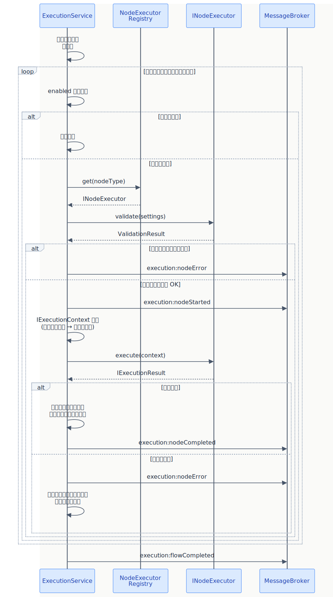

# BD-03 ノードシステム・データモデル設計

> **プロジェクト:** FlowRunner  
> **文書ID:** BD-03  
> **作成日:** 2026-03-13  
> **ステータス:** 承認済み  
> **参照:** RS-02, RS-01, BD-01

---

## 目次

1. [はじめに](#1-はじめに)
2. [INodeExecutor インターフェース](#2-inodeexecutor-インターフェース)
3. [NodeExecutorRegistry](#3-nodeexecutorregistry)
4. [ノードメタデータ](#4-ノードメタデータ)
5. [フロー定義データモデル](#5-フロー定義データモデル)
6. [ビルトインノード Executor 設計](#6-ビルトインノード-executor-設計)

---

## 1. はじめに

本書は BD-01 §3.1 で定義した NodeExecutorRegistry, INodeExecutor のインターフェース詳細と、フロー定義のデータモデルを設計する。

| 対象 | BD-01 コンポーネント | 対応RS |
|---|---|---|
| ノード実行インターフェース | INodeExecutor | RS-02 §2.3 |
| ノード種別管理 | NodeExecutorRegistry | RS-02 §2.3 |
| ノード共通属性 | — | RS-02 §2.1, §2.2 |
| フロー定義スキーマ | FlowService, FlowRepository | RS-01 §6.1 |
| ビルトインノード | INodeExecutor 実装群 | RS-02 §3 全体 |

---

## 2. INodeExecutor インターフェース

RS-02 §2.3 を詳細設計する。

### 2.1 概要 (BD-03-002001)

INodeExecutor はすべてのノード種類が実装する共通インターフェースである。ノードの実行ロジック、設定バリデーション、メタデータ提供の3つの責務を持つ。

### 2.2 INodeExecutor メソッド定義 (BD-03-002002)

| メソッド | 引数 | 戻り値 | 同期/非同期 | 説明 |
|---|---|---|---|---|
| execute | context: IExecutionContext | IExecutionResult | 非同期 | ノード固有の処理を実行する。入力データを受け取り、出力データを返す |
| validate | settings: NodeSettings | ValidationResult | 同期 | ノードの設定値が正しいかを検証する。実行前に呼ばれる |
| getMetadata | — | INodeTypeMetadata | 同期 | ノード種別のメタデータ（ポート定義、設定スキーマ等）を返す |

**設計原則:**

- execute は非同期処理を前提とする（外部プロセス実行、HTTP リクエスト等）
- execute は IExecutionContext から AbortSignal を受け取り、キャンセル要求に応答する
- validate は実行前のプリフライトチェックとして使用する。バリデーションエラーがある場合、ノードは実行されない
- getMetadata は静的な定義を返す。UI（NodePalette, PropertyPanel）がこの情報を使用してノード種別の表示と設定フォームを動的に生成する

### 2.3 IExecutionContext (BD-03-002003)

| 属性 | 型 | 説明 |
|---|---|---|
| nodeId | string | 実行中のノードインスタンス ID |
| settings | NodeSettings | ノードに設定された値（key-value） |
| inputs | PortDataMap | 入力ポートごとのデータ。キーはポート ID、値はポートデータ |
| flowId | string | 実行中のフロー ID |
| signal | AbortSignal | キャンセル/タイムアウト用シグナル |
| depth | number（省略可） | SubFlow の再帰呼び出し深度。SubFlowExecutor が循環検出に使用する |

PortDataMap はポート ID をキー、任意のデータを値とする辞書型である。

### 2.4 IExecutionResult (BD-03-002004)

| 属性 | 型 | 説明 |
|---|---|---|
| status | ExecutionStatus | 実行結果ステータス |
| outputs | PortDataMap | 出力ポートごとのデータ。キーはポート ID、値はポートデータ |
| error | ErrorInfo（省略可） | エラー発生時のエラー情報 |
| duration | number | 実行時間（ミリ秒） |

#### ExecutionStatus

| 値 | 説明 |
|---|---|
| success | 正常完了 |
| error | エラー終了 |
| skipped | 無効ノードなどによるスキップ |
| cancelled | キャンセルによる中断 |

#### ErrorInfo

| 属性 | 型 | 説明 |
|---|---|---|
| message | string | エラーメッセージ |
| code | string（省略可） | エラーコード（ノード種類固有） |
| details | unknown（省略可） | 追加のエラー詳細データ |

### 2.5 ValidationResult (BD-03-002005)

| 属性 | 型 | 説明 |
|---|---|---|
| valid | boolean | バリデーション成功かどうか |
| errors | ValidationError[]（省略可） | バリデーションエラーの一覧 |

#### ValidationError

| 属性 | 型 | 説明 |
|---|---|---|
| field | string | エラーのある設定項目キー |
| message | string | エラーメッセージ |

---

## 3. NodeExecutorRegistry

RS-02 §2.3 を詳細設計する。

### 3.1 概要 (BD-03-003001)

NodeExecutorRegistry はノード種類（nodeType）をキーに INodeExecutor 実装を管理するレジストリである。新しいノード種類を追加する際は、INodeExecutor を実装して register() で登録するだけで拡張できる。

### 3.2 INodeExecutorRegistry インターフェース (BD-03-003002)

| メソッド | 引数 | 戻り値 | 同期/非同期 | 説明 |
|---|---|---|---|---|
| register | nodeType: string, executor: INodeExecutor | void | 同期 | ノード種類と Executor を登録する。同一 nodeType の重複登録はエラー |
| get | nodeType: string | INodeExecutor | 同期 | 指定された nodeType の Executor を返す。未登録の場合はエラー |
| getAll | — | INodeExecutor[] | 同期 | 登録済みの全 Executor を返す。NodePalette が表示用に使用する |
| has | nodeType: string | boolean | 同期 | 指定された nodeType が登録済みかを返す |

### 3.3 初期化と登録フロー (BD-03-003003)

| ステップ | 処理 | 関与コンポーネント |
|---|---|---|
| 1 | ExtensionMain.activate() が NodeExecutorRegistry を生成する | ExtensionMain |
| 2 | ビルトインノード11種の Executor を register() で登録する | ExtensionMain |
| 3 | NodeExecutorRegistry を ExecutionService, DebugService に渡す | ExtensionMain |
| 4 | WebView から `node:getTypes` メッセージを受信すると、getAll() から全メタデータを収集して応答する | MessageBroker |

---

## 4. ノードメタデータ

RS-02 §2.1, §2.2 を詳細設計する。

### 4.1 INodeTypeMetadata (BD-03-004001)

INodeTypeMetadata はノード種別の静的な定義情報を表す。UI（NodePalette, PropertyPanel）とデータモデル（NodeInstance）の両方がこの情報を参照する。

| 属性 | 型 | 説明 | 対応RS |
|---|---|---|---|
| nodeType | string | ノード種別の一意識別子（例: "trigger", "command"） | RS-02 §2.2 |
| label | string | ノード種別の表示名 | RS-02 §2.2 |
| icon | string | アイコン識別子 | RS-02 §2.2 |
| category | string | グループ分類（例: "基本", "データ", "制御"） | RS-02 §2.2 |
| inputPorts | PortDefinition[] | 入力ポート定義の配列 | RS-02 §2.1 |
| outputPorts | PortDefinition[] | 出力ポート定義の配列 | RS-02 §2.1 |
| settingsSchema | SettingFieldDef[] | 設定フォームのフィールド定義 | RS-02 §2.3 #3 |

### 4.2 PortDefinition (BD-03-004002)

| 属性 | 型 | 説明 |
|---|---|---|
| id | string | ポートの一意識別子（ノード種別内で一意） |
| label | string | ポートの表示名 |
| dataType | string | ポートが扱うデータ型の識別子（例: "string", "any", "number"） |

**データ型について:**

- ポートの dataType はエッジ接続時の互換性チェックに使用する
- "any" は任意のデータ型を受け入れることを表す
- v1.0 では型チェックは警告のみとし、接続自体は許可する（RS-02 §2.1 のポートモデルに基づく柔軟性を優先）

### 4.3 SettingFieldDef (BD-03-004003)

SettingFieldDef はノード種別ごとの設定フォームフィールドを定義する。PropertyPanel がこの定義に基づいて動的にフォームを生成する。

| 属性 | 型 | 説明 |
|---|---|---|
| key | string | 設定項目のキー。NodeSettings のキーと対応する |
| label | string | フォームの表示ラベル |
| type | FieldType | フィールドの入力タイプ |
| required | boolean | 必須入力かどうか |
| defaultValue | unknown（省略可） | デフォルト値 |
| options | SelectOption[]（省略可） | type が "select" の場合の選択肢 |
| placeholder | string（省略可） | プレースホルダーテキスト |
| description | string（省略可） | フィールドの補足説明（フォーム上でラベル下に表示） |
| visibleWhen | { field: string, value: string / string[] }（省略可） | 条件付き表示。指定フィールドが指定値のときのみ表示する。ループノード等のモード別設定切替に使用 |

#### FieldType

| 値 | 説明 | 対応する入力方式 |
|---|---|---|
| string | テキスト入力 | 単一行テキストフィールド |
| text | 複数行テキスト入力 | テキストエリア |
| number | 数値入力 | 数値フィールド |
| boolean | 真偽値 | チェックボックス |
| select | 選択 | ドロップダウン |
| keyValue | キーバリューペア | 動的な行追加型テーブル |

#### SelectOption

| 属性 | 型 | 説明 |
|---|---|---|
| value | string | 選択肢の値 |
| label | string | 選択肢の表示名 |

---

## 5. フロー定義データモデル

RS-01 §6.1 を詳細設計する。

### 5.1 概要 (BD-03-005001)

フロー定義は JSON ファイルとして `.flowrunner/` ディレクトリに保存される。FlowRepository がこのデータの読み書きを担当する。

### 5.2 FlowDefinition (BD-03-005002)

| 属性 | 型 | 説明 |
|---|---|---|
| id | string | フロー定義の一意識別子（UUID） |
| name | string | フローの表示名 |
| description | string | フローの説明テキスト |
| version | string | フロー定義のバージョン（セマンティックバージョニング） |
| nodes | NodeInstance[] | フロー内のノードインスタンス配列 |
| edges | EdgeInstance[] | フロー内のエッジインスタンス配列 |
| createdAt | string | 作成日時（ISO 8601） |
| updatedAt | string | 更新日時（ISO 8601） |

### 5.3 NodeInstance (BD-03-005003)

| 属性 | 型 | 説明 |
|---|---|---|
| id | string | ノードインスタンスの一意識別子（UUID） |
| type | string | ノード種別識別子。INodeTypeMetadata.nodeType と対応する |
| label | string | ユーザーが設定した表示名 |
| enabled | boolean | 有効/無効フラグ。false のノードは実行時にスキップされる |
| position | Position | キャンバス上の配置座標 |
| settings | NodeSettings | ノード種別固有の設定値（key-value） |

#### Position

| 属性 | 型 | 説明 |
|---|---|---|
| x | number | キャンバス上の X 座標 |
| y | number | キャンバス上の Y 座標 |

#### NodeSettings

ノード種別ごとに異なるキーバリューペア。INodeTypeMetadata.settingsSchema で定義されたフィールドに対応する値を保持する。

### 5.4 EdgeInstance (BD-03-005004)

| 属性 | 型 | 説明 |
|---|---|---|
| id | string | エッジインスタンスの一意識別子（UUID） |
| sourceNodeId | string | 接続元ノードの ID |
| sourcePortId | string | 接続元ノードの出力ポート ID |
| targetNodeId | string | 接続先ノードの ID |
| targetPortId | string | 接続先ノードの入力ポート ID |

**エッジの制約:**

- 同一ポート間に複数のエッジは作成できない
- 入力ポートに接続できるエッジは1本のみ（出力ポートからは複数のエッジが出せる）
- 循環参照（ループエッジ）は禁止する。フロー保存時に DAG（有向非巡回グラフ）であることを検証する
  - ただし、LoopExecutor のループ本体出力ポートからの接続は例外として、ループ対象ノード間のエッジを許可する設計を DD で検討する

### 5.5 IFlowRepository インターフェース (BD-03-005005)

FlowRepository は FlowDefinition の永続化を担当する Infrastructure レイヤーのインターフェースである。

| メソッド | 引数 | 戻り値 | 同期/非同期 | 説明 | 対応RS |
|---|---|---|---|---|---|
| save | flow: FlowDefinition | void | 非同期 | フロー定義を保存する | RS-01 §6.1 |
| load | flowId: string | FlowDefinition | 非同期 | 指定 ID のフロー定義を読み込む | RS-01 §6.1 |
| delete | flowId: string | void | 非同期 | 指定 ID のフロー定義を削除する | RS-01 §3.2 |
| list | parentId?: string | FlowSummary[] | 非同期 | フロー一覧を返す。parentId 指定でフォルダ配下のみ | RS-01 §3.1 |
| exists | flowId: string | boolean | 非同期 | 指定 ID のフロー定義が存在するか | — |

#### FlowSummary

| 属性 | 型 | 説明 |
|---|---|---|
| id | string | フロー ID |
| name | string | フロー名 |
| updatedAt | string | 最終更新日時 |

**保存先:**

- ワークスペースルート直下の `.flowrunner/` ディレクトリ
- ファイルパス: `.flowrunner/<flowId>.json`
- RS-01 §6.2 に基づき、`.flowrunner/` はバージョン管理対象（.gitignore に含めない）

---

## 6. ビルトインノード Executor 設計

RS-02 §3 の各ノード種別に対して、INodeExecutor を実装する Executor のメタデータと実行仕様を定義する。

### 6.1 トリガーノード（TriggerExecutor） (BD-03-006001)

RS-02 §3.1 を詳細設計する。

#### メタデータ

| 属性 | 値 |
|---|---|
| nodeType | "trigger" |
| label | "トリガー" |
| category | "基本" |
| inputPorts | なし |
| outputPorts | `[{ id: "out", label: "出力", dataType: "any" }]` |
| settingsSchema | なし（v1.0） |

#### 実行仕様

| 項目 | 内容 |
|---|---|
| 入力 | なし（フロー開始点） |
| 処理 | 出力ポートに空オブジェクトを出力する |
| 出力 | `{ out: {} }` |
| エラー条件 | なし |

### 6.2 コマンド実行ノード（CommandExecutor） (BD-03-006002)

RS-02 §3.2 を詳細設計する。

#### メタデータ

| 属性 | 値 |
|---|---|
| nodeType | "command" |
| label | "コマンド実行" |
| category | "基本" |
| inputPorts | `[{ id: "in", label: "入力", dataType: "any" }]` |
| outputPorts | `[{ id: "stdout", label: "標準出力", dataType: "string" }, { id: "stderr", label: "標準エラー", dataType: "string" }]` |

#### settingsSchema

| key | label | type | required | defaultValue |
|---|---|---|---|---|
| command | コマンド | text | true | — |
| cwd | 作業ディレクトリ | string | false | "" |
| shell | シェル | select | false | "default" |
| env | 環境変数 | keyValue | false | — |
| timeout | タイムアウト（秒） | number | false | 0 |

shell の選択肢: default, bash, zsh, sh, cmd, pwsh

#### 実行仕様

| 項目 | 内容 |
|---|---|
| 入力 | 入力ポートデータを環境変数 `FLOW_INPUT` として注入する |
| 処理 | 子プロセスでシェルコマンドを実行する。AbortSignal でキャンセルに対応する |
| 出力 | stdout ポートに標準出力、stderr ポートに標準エラー出力をそれぞれ文字列で出力する |
| エラー条件 | 非ゼロ終了コード、タイムアウト超過 |
| セキュリティ | コマンド文字列はユーザーが明示的に設定した値のみ実行する。入力データの直接挿入は行わず、環境変数経由でデータを渡す |

### 6.3 AI プロンプトノード（AIPromptExecutor） (BD-03-006003)

RS-02 §3.3 を詳細設計する。

#### メタデータ

| 属性 | 値 |
|---|---|
| nodeType | "aiPrompt" |
| label | "AI プロンプト" |
| category | "AI" |
| inputPorts | `[{ id: "in", label: "入力", dataType: "any" }]` |
| outputPorts | `[{ id: "out", label: "応答", dataType: "string" }]` |

#### settingsSchema

| key | label | type | required | defaultValue |
|---|---|---|---|---|
| prompt | プロンプト | text | true | — |
| model | モデル | select | false | — |

model の選択肢: VSCode LLM API から動的に取得する。利用可能なモデル一覧は Extension Host 側で取得し、`node:typesLoaded` のメタデータに含めて WebView に送信する

#### 実行仕様

| 項目 | 内容 |
|---|---|
| 入力 | 入力ポートデータを `{{input}}` プレースホルダーに埋め込む |
| 処理 | VSCode LLM API（`vscode.lm.selectChatModels` / `sendRequest`）経由で LLM を呼び出す |
| 出力 | LLM 応答テキストを out ポートに出力する |
| エラー条件 | LLM API エラー、タイムアウト、モデル未選択 |

### 6.4 条件分岐ノード（ConditionExecutor） (BD-03-006004)

RS-02 §3.4 を詳細設計する。

#### メタデータ

| 属性 | 値 |
|---|---|
| nodeType | "condition" |
| label | "条件分岐" |
| category | "制御" |
| inputPorts | `[{ id: "in", label: "入力", dataType: "any" }]` |
| outputPorts | `[{ id: "true", label: "True", dataType: "any" }, { id: "false", label: "False", dataType: "any" }]` |

#### settingsSchema

| key | label | type | required | defaultValue |
|---|---|---|---|---|
| expression | 条件式 | text | true | — |

#### 実行仕様

| 項目 | 内容 |
|---|---|
| 入力 | 入力ポートデータを `input` 変数として式に提供する |
| 処理 | 条件式をサンドボックス内で評価する。結果が truthy なら true ポート、falsy なら false ポートにデータを出力する |
| 出力 | 選択されたポートに入力データをそのまま通過させる。選択されなかったポートには出力しない |
| エラー条件 | 式の構文エラー、実行時エラー |
| セキュリティ | サンドボックスで実行し、グローバルオブジェクトやファイルシステムへのアクセスを禁止する |

### 6.5 ループノード（LoopExecutor） (BD-03-006005)

RS-02 §3.5 を詳細設計する。

#### メタデータ

| 属性 | 値 |
|---|---|
| nodeType | "loop" |
| label | "ループ" |
| category | "制御" |
| inputPorts | `[{ id: "in", label: "入力", dataType: "any" }]` |
| outputPorts | `[{ id: "body", label: "ループ本体", dataType: "any" }, { id: "done", label: "完了", dataType: "any" }]` |

#### settingsSchema

| key | label | type | required | defaultValue |
|---|---|---|---|---|
| loopType | ループ種別 | select | true | "count" |
| count | 回数 | number | false | 1 |
| expression | 条件式 | text | false | — |

loopType の選択肢: count（回数指定）, condition（条件指定）, list（リスト反復）

#### 実行仕様

| 項目 | 内容 |
|---|---|
| 入力 | 入力ポートデータ（リスト反復時はイテラブルなデータ） |
| 処理 | ループ種別に応じてループ本体ポートへの出力を繰り返す。各反復で body ポートから接続されたサブフロー（後続ノード群）を ExecutionService 経由で実行する |
| 出力 | body ポートに各反復データ、done ポートにループ完了後の集約結果を出力する |
| エラー条件 | 条件式エラー、最大反復回数超過（無限ループ防止） |

### 6.6 ログ出力ノード（LogExecutor） (BD-03-006006)

RS-02 §3.6 を詳細設計する。

#### メタデータ

| 属性 | 値 |
|---|---|
| nodeType | "log" |
| label | "ログ出力" |
| category | "基本" |
| inputPorts | `[{ id: "in", label: "入力", dataType: "any" }]` |
| outputPorts | `[{ id: "out", label: "出力", dataType: "any" }]` |

#### settingsSchema

| key | label | type | required | defaultValue |
|---|---|---|---|---|
| message | メッセージ | text | false | "{{input}}" |
| level | ログレベル | select | false | "info" |

level の選択肢: info, warn, error

#### 実行仕様

| 項目 | 内容 |
|---|---|
| 入力 | 入力ポートデータ |
| 処理 | メッセージテンプレートの `{{input}}` を入力データで置換し、指定ログレベルで VSCode OutputChannel に出力する |
| 出力 | 入力データをそのまま out ポートに通過させる（パススルー） |
| エラー条件 | なし |

### 6.7 ファイル操作ノード（FileExecutor） (BD-03-006007)

RS-02 §3.7 を詳細設計する。

#### メタデータ

| 属性 | 値 |
|---|---|
| nodeType | "file" |
| label | "ファイル操作" |
| category | "データ" |
| inputPorts | `[{ id: "in", label: "入力", dataType: "any" }]` |
| outputPorts | `[{ id: "out", label: "出力", dataType: "any" }]` |

#### settingsSchema

| key | label | type | required | defaultValue |
|---|---|---|---|---|
| operation | 操作種別 | select | true | "read" |
| path | ファイルパス | string | true | — |
| encoding | エンコーディング | select | false | "utf-8" |

operation の選択肢: read, write, append, delete, exists, listDir

encoding の選択肢: utf-8, ascii, base64

#### 実行仕様

| 操作 | 入力の扱い | 出力 |
|---|---|---|
| read | — | ファイル内容（文字列） |
| write | 入力データを書き込み内容として使用 | 操作ステータス |
| append | 入力データを追記内容として使用 | 操作ステータス |
| delete | — | 操作ステータス |
| exists | — | 存在判定（boolean） |
| listDir | — | ファイル名一覧（文字列配列） |

**セキュリティ:**

- 絶対パスはそのまま使用する。相対パスはワークスペースルート基点で解決する
- 相対パスに対してパストラバーサル（`../` 等）を検出してエラーとする

### 6.8 HTTP リクエストノード（HttpExecutor） (BD-03-006008)

RS-02 §3.8 を詳細設計する。

#### メタデータ

| 属性 | 値 |
|---|---|
| nodeType | "http" |
| label | "HTTP リクエスト" |
| category | "データ" |
| inputPorts | `[{ id: "in", label: "入力", dataType: "any" }]` |
| outputPorts | `[{ id: "body", label: "レスポンスボディ", dataType: "string" }, { id: "status", label: "ステータスコード", dataType: "number" }]` |

#### settingsSchema

| key | label | type | required | defaultValue |
|---|---|---|---|---|
| url | URL | string | true | — |
| method | メソッド | select | false | "GET" |
| headers | ヘッダー | keyValue | false | — |
| body | ボディ | text | false | — |
| auth | 認証 | select | false | "none" |
| authToken | トークン | string | false | — |
| timeout | タイムアウト（秒） | number | false | 30 |

method の選択肢: GET, POST, PUT, DELETE, PATCH

auth の選択肢: none, bearer

#### 実行仕様

| 項目 | 内容 |
|---|---|
| 入力 | URL、ボディの `{{input}}` プレースホルダーを入力データで置換する |
| 処理 | Node.js の HTTP クライアントでリクエストを送信する。AbortSignal でキャンセルに対応する |
| 出力 | body ポートにレスポンスボディ、status ポートにステータスコードを出力する |
| エラー条件 | ネットワークエラー、タイムアウト、URL 未設定 |

**セキュリティ:**

- リクエスト先 URL はユーザーが設定で明示的に指定した値のみ使用する
- プライベートネットワーク（127.0.0.1, localhost, 10.0.0.0/8 等）へのリクエストは警告を表示する（SSRF 対策）

### 6.9 変数・データ変換ノード（TransformExecutor） (BD-03-006009)

RS-02 §3.9 を詳細設計する。

#### メタデータ

| 属性 | 値 |
|---|---|
| nodeType | "transform" |
| label | "データ変換" |
| category | "データ" |
| inputPorts | `[{ id: "in", label: "入力", dataType: "any" }]` |
| outputPorts | `[{ id: "out", label: "出力", dataType: "any" }]` |

#### settingsSchema

| key | label | type | required | defaultValue |
|---|---|---|---|---|
| transformType | 変換種別 | select | true | "jsonParse" |
| expression | 式/パラメータ | text | false | — |

transformType の選択肢: jsonParse, jsonStringify, textReplace, textSplit, textJoin, regex, template, jsExpression

#### 実行仕様

| 変換種別 | 処理 | expression の用途 |
|---|---|---|
| jsonParse | 入力文字列を JSON パースする | — |
| jsonStringify | 入力データを JSON 文字列化する | — |
| textReplace | テキスト置換 | `search\|replace` 形式 |
| textSplit | テキスト分割 | 区切り文字 |
| textJoin | 配列をテキスト結合 | 区切り文字 |
| regex | 正規表現マッチ | 正規表現パターン |
| template | テンプレート展開 | テンプレート文字列（`{{input}}` で入力参照） |
| jsExpression | JS 式で変換 | JS 式（`input` 変数で入力データ参照） |

**セキュリティ:**

- jsExpression は条件分岐ノードと同様にサンドボックス内で実行する

### 6.10 コメントノード（CommentExecutor） (BD-03-006010)

RS-02 §3.10 を詳細設計する。

#### メタデータ

| 属性 | 値 |
|---|---|
| nodeType | "comment" |
| label | "コメント" |
| category | "その他" |
| inputPorts | なし |
| outputPorts | なし |
| settingsSchema | `[{ key: "comment", label: "コメント", type: "text", required: false, defaultValue: "" }]` |

#### 実行仕様

| 項目 | 内容 |
|---|---|
| 処理 | 何もしない。ExecutionService はコメントノードをスキップする |
| 出力 | なし |
| ステータス | skipped を返す |

### 6.11 フロー連携ノード（SubFlowExecutor） (BD-03-006011)

RS-02 §3.11 を詳細設計する。

#### メタデータ

| 属性 | 値 |
|---|---|
| nodeType | "subFlow" |
| label | "フロー連携" |
| category | "制御" |
| inputPorts | `[{ id: "in", label: "入力", dataType: "any" }]` |
| outputPorts | `[{ id: "out", label: "出力", dataType: "any" }]` |

#### settingsSchema

| key | label | type | required | defaultValue |
|---|---|---|---|---|
| flowId | フロー | select | true | — |

flowId の選択肢: FlowRepository.list() から動的に取得する

#### 実行仕様

| 項目 | 内容 |
|---|---|
| 入力 | 入力ポートデータを呼び出し先フローのトリガーノード出力として注入する |
| 処理 | FlowRepository から呼び出し先フロー定義をロードし、ExecutionService で実行する |
| 出力 | 呼び出し先フローの最終ノード出力を out ポートに出力する |
| エラー条件 | フロー未指定、フロー未存在、呼び出し先フローでのエラー、循環呼び出し検出 |

**循環呼び出し防止:**

- 実行コンテキストにフロー呼び出しスタックを保持し、現在実行中のフロー ID が含まれている場合はエラーとする

---

## 付録: ノード実行シーケンス

実行フローの詳細手順は BD-04 §2.3 を参照。
