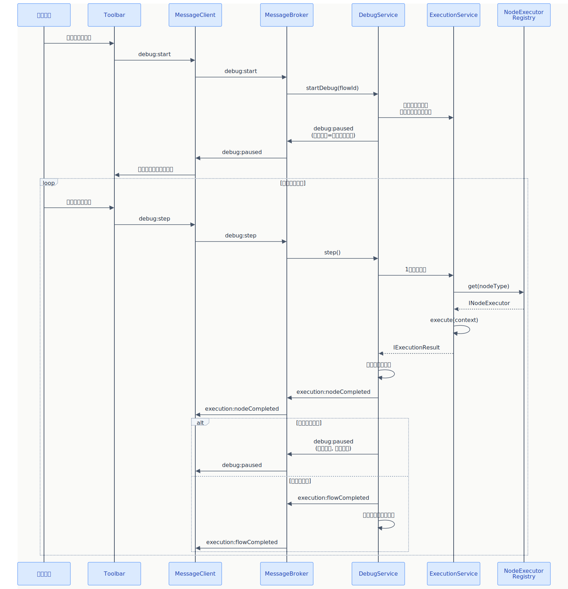
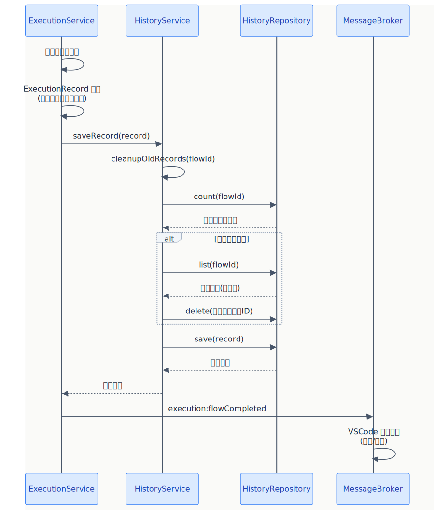

# BD-04 実行エンジン・デバッグ・履歴設計

> **プロジェクト:** FlowRunner  
> **文書ID:** BD-04  
> **作成日:** 2026-03-13  
> **ステータス:** 承認済み  
> **参照:** RS-03, BD-01, BD-03

---

## 目次

1. [はじめに](#1-はじめに)
2. [ExecutionService（フロー実行）](#2-executionserviceフロー実行)
3. [DebugService（デバッグ）](#3-debugserviceデバッグ)
4. [HistoryService（実行履歴）](#4-historyservice実行履歴)
5. [完了通知](#5-完了通知)

---

## 1. はじめに

本書は BD-01 §3.1 で定義した ExecutionService, DebugService, HistoryService のインターフェース詳細と、実行履歴のデータモデルを設計する。

| 対象 | BD-01 コンポーネント | 対応RS |
|---|---|---|
| フロー実行エンジン | ExecutionService | RS-03 §2 |
| デバッグ | DebugService | RS-03 §3 |
| 実行履歴 | HistoryService, HistoryRepository | RS-03 §4 |
| 完了通知 | ExecutionService | RS-03 §5 |



---

## 2. ExecutionService（フロー実行）

RS-03 §2.1, §2.2, §2.3, §2.4 を詳細設計する。

### 2.1 概要 (BD-04-002001)

ExecutionService はフローの実行を統括するオーケストレーターである。フロー定義のノードをトポロジカル順序で逐次実行し、ノード間のデータ伝播を管理する。

### 2.2 IExecutionService インターフェース (BD-04-002002)

| メソッド | 引数 | 戻り値 | 同期/非同期 | 説明 | 対応RS |
|---|---|---|---|---|---|
| executeFlow | flowId: string, options?: { depth?: number } | PortDataMap / undefined | 非同期 | フロー全体を実行する。トポロジカル順でノードを逐次実行する。正常完了時は最終ノードの出力を返す。options.depth は SubFlow 再帰呼び出し時の深度制限に使用する | RS-03 §2.1, §2.2 |
| stopFlow | flowId: string | void | 同期 | 実行中のフローを停止する。AbortController を使用してキャンセルを通知する | RS-03 §2.2 #5 |
| getRunningFlows | — | string[] | 同期 | 現在実行中のフロー ID 一覧を返す | — |
| isRunning | flowId: string | boolean | 同期 | 指定フローが実行中かどうかを返す | — |

#### イベント

| イベント名 | ペイロード | 発火タイミング | 対応RS |
|---|---|---|---|
| onFlowEvent | FlowEvent | ノード開始/完了/エラー、フロー完了時 | RS-03 §2.2, §2.4 |

#### FlowEvent 型定義

FlowEvent は実行エンジン内部のイベントであり、以下のフラットインターフェースで定義する。

| 属性 | 型 | 必須 | 説明 |
|---|---|---|---|
| type | nodeStarted / nodeCompleted / nodeError / flowCompleted | ○ | イベント種別 |
| flowId | string | ○ | 実行中のフロー ID |
| flowName | string | — | フロー名（通知表示用） |
| status | success / error / cancelled | — | フロー完了時の最終ステータス |
| error | string | — | エラーメッセージ |
| nodeId | string | — | 対象ノード ID |
| nodeStatus | ExecutionStatus | — | ノード実行結果ステータス |
| nodeOutput | PortDataMap | — | ノード出力データ |
| result | NodeResult | — | ノード実行結果詳細 |
| progress | { current: number, total: number } | — | 実行進捗（実行済みノード数 / 全ノード数） |

FlowEvent.type は内部イベント用の短縮名であり、BD-01 §4.2 のメッセージプロトコル型（execution:nodeStarted 等）とは異なる。MessageBroker が FlowEvent をリッスンし、type を `execution:*` プレフィックス付きのメッセージ型にマッピングして WebView に転送する。

### 2.3 実行フロー詳細 (BD-04-002003)

| ステップ | 処理 | 関与コンポーネント |
|---|---|---|
| 1 | FlowService からフロー定義（FlowDefinition）を取得する | FlowService |
| 2 | エッジ情報に基づいてノードをトポロジカルソートする。循環検出時はエラーとする | — |
| 3 | AbortController を生成し、フロー ID と紐づけて管理する | — |
| 4 | ソート順に各ノードを走査する | — |
| 5 | 無効ノード（enabled=false）はスキップする（status: skipped）。さらに、全入力エッジの送信元がスキップ済みノードであるノードもスキップする（チェーンスキップ）。他パスからの有効な入力がある場合は実行する | RS-03 §2.2 #6 |
| 6 | NodeExecutorRegistry から該当 nodeType の Executor を取得する | NodeExecutorRegistry |
| 7 | validate() で設定値を検証する。エラー時はフロー停止 | BD-03 §2.2 |
| 8 | IExecutionContext を構築する（前ノードの出力を入力ポートにマッピング） | — |
| 9 | onFlowEvent で FlowEvent(type: nodeStarted) を発火する | RS-03 §2.2 #3 |
| 10 | execute() を呼び出す | BD-03 §2.2 |
| 11 | 実行結果に応じて FlowEvent(type: nodeCompleted) または FlowEvent(type: nodeError) を発火する | RS-03 §2.2 #4 |
| 12 | エラー発生時、エラーポリシーに基づいてフロー停止を判定する | RS-03 §2.3 #1 |
| 13 | 全ノード完了後、ExecutionRecord を構築して HistoryService に保存する | RS-03 §4.1 |
| 14 | FlowEvent(type: flowCompleted) を発火する | RS-03 §2.2 |

### 2.4 データ伝播 (BD-04-002004)

ノード間のデータ伝播は、エッジ情報に基づいて出力ポートから入力ポートへマッピングすることで実現する。

| 項目 | 仕様 |
|---|---|
| マッピング単位 | エッジ単位。1本のエッジが sourcePortId → targetPortId のデータフローを定義する |
| データ格納 | 実行中、各ノードの出力を `Map<nodeId, PortDataMap>` として保持する |
| 入力構築 | ターゲットノードの IExecutionContext.inputs を構築する際、接続元ノードの対応ポート出力をコピーする |
| 未接続入力 | 入力ポートにエッジが接続されていない場合、該当ポートのデータは undefined とする |
| 複数出力 | 1つの出力ポートから複数のエッジが出ている場合、各ターゲットに同一データをコピーする |

### 2.5 フロー停止 (BD-04-002005)

| 項目 | 仕様 |
|---|---|
| 停止トリガー | stopFlow() 呼び出し（ユーザーの停止ボタン押下） |
| 停止メカニズム | AbortController.abort() を呼び出す。実行中の INodeExecutor は IExecutionContext.signal を監視して中断する |
| 停止後の状態 | 実行中ノードは cancelled 状態、未実行ノードは skipped 状態とする |
| 停止後の履歴 | 途中停止した実行も ExecutionRecord として保存する。status は cancelled とする |

### 2.6 エラーポリシー (BD-04-002006)

| ポリシー | 動作 | 対応RS |
|---|---|---|
| stopOnError（デフォルト） | ノードエラー発生時にフロー全体を停止する | RS-03 §2.3 #1 |

v1.0 では stopOnError のみをサポートする。将来的に continueOnError（エラーノードをスキップして続行）ポリシーを追加する可能性を考慮し、エラーポリシーを設計上分離する。

### 2.7 実行時フィードバック (BD-04-002007)

| フィードバック | 実装方式 | 対応RS |
|---|---|---|
| ノード状態表示 | onFlowEvent → MessageBroker → WebView で FlowEvent.type（nodeStarted / nodeCompleted / nodeError）を execution:* メッセージ型に変換して送信する。WebView 側で executionState ステートを更新して色・アニメーションで表示する（BD-02 §4.2 参照） | RS-03 §2.2 #3, #4 |
| プログレスバー | 実行済みノード数 / 全ノード数をペイロードに含めて進捗率を算出する | RS-03 §2.4 #1 |
| Output Channel | 各ノードの実行出力を VSCode OutputChannel（チャネル名: "FlowRunner"）に書き出す | RS-03 §2.4 #2 |

---

## 3. DebugService（デバッグ）

RS-03 §3.1, §3.2, §3.3 を詳細設計する。

### 3.1 概要 (BD-04-003001)

DebugService はデバッグモードを管理し、ステップ実行の制御と中間結果の保持を担当する。NodeExecutorRegistry から Executor を取得し、1ノードずつ実行を進める。



### 3.2 IDebugService インターフェース (BD-04-003002)

| メソッド | 引数 | 戻り値 | 同期/非同期 | 説明 | 対応RS |
|---|---|---|---|---|---|
| startDebug | flowId: string | void | 非同期 | デバッグモードを開始する。フロー定義を取得し、トポロジカルソートして最初のノードの手前で停止する | RS-03 §3.1 #1 |
| step | — | void | 非同期 | 次の1ノードを実行し、その後停止する | RS-03 §3.2 #1 |
| stopDebug | — | void | 同期 | デバッグモードを終了する | RS-03 §3.1 #3 |
| isDebugging | — | boolean | 同期 | デバッグモード中かどうかを返す | — |
| getIntermediateResults | — | NodeResultMap | 同期 | 実行済みノードの中間結果一覧を返す | RS-03 §3.3 |

#### イベント

| イベント名 | ペイロード | 発火タイミング | 対応RS |
|---|---|---|---|
| onDebugEvent | DebugEvent | ステップ実行後の一時停止、デバッグ終了時 | RS-03 §3.2 #2 |

DebugEvent は BD-01 §4.2 の debug:paused メッセージに対応する内部イベントである。DebugService は単一種別のイベント（一時停止）のみを発火するため、FlowEvent のような type フィールドは持たない。MessageBroker が DebugEvent をリッスンし、debug:paused メッセージとして WebView に転送する。

#### DebugEvent 型定義

| 属性 | 型 | 必須 | 説明 |
|---|---|---|---|
| nextNodeId | string / undefined | ○ | 次に実行されるノードの ID。全ノード完了時は undefined |
| intermediateResults | NodeResultMap | ○ | 実行済みノードの中間結果一覧 |

### 3.3 デバッグ実行フロー (BD-04-003003)

#### デバッグ開始

| ステップ | 処理 |
|---|---|
| 1 | FlowService からフロー定義を取得する |
| 2 | トポロジカルソートして実行順序を決定する |
| 3 | 実行カーソルを先頭（最初のノード）に設定する |
| 4 | 中間結果マップを初期化する |
| 5 | debug:paused イベントを発火する（次実行ノード = 最初のノード） |

#### ステップ実行

| ステップ | 処理 |
|---|---|
| 1 | 実行カーソルが指すノードに対して IExecutionContext を構築する（中間結果から入力を取得） |
| 2 | NodeExecutorRegistry から Executor を取得し、validate() → execute() を呼び出す |
| 3 | 実行結果を中間結果マップに保存する |
| 4 | onFlowEvent で FlowEvent(type: nodeCompleted) または FlowEvent(type: nodeError) を発火する |
| 5 | 実行カーソルを次ノードに進める |
| 6 | 次ノードが存在する場合、debug:paused を発火する（次実行ノード + 中間結果） |
| 7 | 次ノードがない場合、フロー完了として ExecutionRecord を保存し、デバッグモードを終了する |

#### デバッグ停止

| ステップ | 処理 |
|---|---|
| 1 | デバッグモードフラグを解除する |
| 2 | 途中までの実行結果を ExecutionRecord として保存する（status: cancelled） |
| 3 | 実行カーソルと中間結果をクリアする |

### 3.4 中間結果 (BD-04-003004)

NodeResultMap は各ノードの実行結果を保持する辞書型（Record 型）である。キーはノード ID、値は NodeResult（BD-04 §4.3 参照）。JSON シリアライズとの親和性を考慮し、Map ではなく Record を採用する。

| 操作 | 処理 | 対応RS |
|---|---|---|
| ステップ実行後 | 実行したノードの入出力と結果を NodeResultMap に追加する | RS-03 §3.3 #1 |
| ノードクリック | WebView から中間結果取得リクエストを受信し、該当ノードの NodeResult を返す | RS-03 §3.3 #2 |

### 3.5 条件分岐・ループの扱い (BD-04-003005)

| ケース | デバッグ時の動作 |
|---|---|
| 条件分岐ノード | ステップ実行で条件を評価し、選択されたパス（true / false）のみを後続の実行対象とする。選択されなかったパスのノードはスキップする |
| ループノード | ステップ実行で各反復を1ステップとして扱う。ループ本体の先頭ノードに戻る際も debug:paused を発火する |

---

## 4. HistoryService（実行履歴）

RS-03 §4.1, §4.2, §4.3 を詳細設計する。

### 4.1 概要 (BD-04-004001)

HistoryService はフロー実行の履歴を管理するサービスである。実行完了時に ExecutionRecord を保存し、過去の実行結果を参照・削除する機能を提供する。



### 4.2 IHistoryService インターフェース (BD-04-004002)

| メソッド | 引数 | 戻り値 | 同期/非同期 | 説明 | 対応RS |
|---|---|---|---|---|---|
| saveRecord | record: ExecutionRecord | void | 非同期 | 実行記録を保存する。保持件数超過時は古い履歴を自動削除する | RS-03 §4.1 #1 |
| getRecords | flowId: string | ExecutionSummary[] | 非同期 | 指定フローの実行履歴サマリ一覧を返す（新しい順） | RS-03 §4.3 #1 |
| getRecord | recordId: string | ExecutionRecord | 非同期 | 指定 ID の実行記録詳細を返す | RS-03 §4.3 #2 |
| deleteRecord | recordId: string | void | 非同期 | 指定 ID の実行記録を削除する | — |
| cleanupOldRecords | flowId: string | void | 非同期 | 保持件数を超過した履歴を古い順に自動削除する | RS-03 §4.1 #3 |

### 4.3 ExecutionRecord（実行記録） (BD-04-004003)

| 属性 | 型 | 説明 | 対応RS |
|---|---|---|---|
| id | string | 実行記録の一意識別子（UUID） | — |
| flowId | string | 実行したフローの ID | — |
| flowName | string | 実行したフローの名前 | — |
| startedAt | string | 実行開始日時（ISO 8601） | RS-03 §4.2 |
| completedAt | string | 実行完了日時（ISO 8601） | — |
| duration | number | 実行時間（ミリ秒） | RS-03 §4.2 |
| status | ExecutionStatus | 実行結果ステータス（success / error / cancelled） | RS-03 §4.2 |
| nodeResults | NodeResult[] | 各ノードの実行結果リスト | RS-03 §4.2 |
| error | ErrorInfo（省略可） | フロー全体のエラー情報 | RS-03 §4.2 |

#### NodeResult

| 属性 | 型 | 説明 |
|---|---|---|
| nodeId | string | ノードインスタンス ID |
| nodeType | string | ノード種別 |
| nodeLabel | string | ノードの表示名 |
| status | ExecutionStatus | 実行結果ステータス |
| inputs | PortDataMap | ノードが受け取った入力データ |
| outputs | PortDataMap | ノードが出力したデータ |
| duration | number | 実行時間（ミリ秒） |
| error | ErrorInfo（省略可） | ノード固有のエラー情報 |

#### ExecutionSummary

| 属性 | 型 | 説明 |
|---|---|---|
| id | string | 実行記録 ID |
| flowId | string | フロー ID |
| flowName | string | フロー名 |
| startedAt | string | 実行開始日時 |
| duration | number | 実行時間（ミリ秒） |
| status | ExecutionStatus | 実行結果ステータス |

ExecutionSummary はノード別結果を含まない軽量なサマリであり、履歴一覧表示に使用する。

### 4.4 IHistoryRepository インターフェース (BD-04-004004)

| メソッド | 引数 | 戻り値 | 同期/非同期 | 説明 | 対応RS |
|---|---|---|---|---|---|
| save | record: ExecutionRecord | void | 非同期 | 実行記録を JSON ファイルとして保存する | RS-03 §4.1 #1 |
| load | recordId: string | ExecutionRecord | 非同期 | 指定 ID の実行記録を読み込む | RS-03 §4.3 #2 |
| list | flowId: string | ExecutionSummary[] | 非同期 | 指定フローの実行記録サマリ一覧を返す（新しい順） | RS-03 §4.3 #1 |
| delete | recordId: string | void | 非同期 | 指定 ID の実行記録ファイルを削除する | — |
| count | flowId: string | number | 非同期 | 指定フローの実行記録件数を返す | RS-03 §4.1 #2 |

**保存先:**

- `.flowrunner/history/<flowId>/` ディレクトリ
- ファイルパス: `.flowrunner/history/<flowId>/<recordId>.json`
- list() 実行時はディレクトリ内のファイルを走査し、ExecutionSummary を構築して返す（全データの読み込みではなく、ファイル名とメタデータのみ取得する最適化を DD で検討する）

### 4.5 保持件数管理 (BD-04-004005)

| 項目 | 仕様 | 対応RS |
|---|---|---|
| 設定キー | `flowrunner.historyMaxCount`（BD-01 §5.2 で定義済み） | RS-03 §4.1 #2 |
| デフォルト値 | 10 | — |
| 削除タイミング | saveRecord() 呼び出し時に cleanupOldRecords() を実行する | RS-03 §4.1 #3 |
| 削除順序 | startedAt が最も古い記録から削除する | RS-03 §4.1 #3 |

### 4.6 履歴参照 UI (BD-04-004006)

RS-03 §4.3 を詳細設計する。

| UI 要素 | 配置 | 機能 |
|---|---|---|
| 履歴ツリービュー | サイドバー（FlowTreeProvider のサブツリーとして表示） | フローの子要素として実行履歴一覧を表示する。クリックで詳細を表示 |
| 履歴詳細表示 | WebView 内（FlowEditorApp 内のモーダルまたは別パネル） | ExecutionRecord の全データ（ノード別結果を含む）を表示する |

**ツリー構造:**

```
FlowRunner
├── フローA
│   ├── 📊 履歴 2026-03-13 10:30 ✅
│   └── 📊 履歴 2026-03-13 09:15 ❌
└── フローB
    └── 📊 履歴 2026-03-13 11:00 ✅
```

> ※ 上記はツリービューの表示イメージであり、コードブロックではない

---

## 5. 完了通知

RS-03 §5 を詳細設計する。

### 5.1 通知設計 (BD-04-005001)

| 項目 | 仕様 | 対応RS |
|---|---|---|
| 成功通知 | VSCode の `vscode.window.showInformationMessage` を使用する。メッセージ: "フロー「{flowName}」の実行が完了しました" | RS-03 §5 #1, #2 |
| 失敗通知 | VSCode の `vscode.window.showErrorMessage` を使用する。メッセージ: "フロー「{flowName}」の実行が失敗しました: {errorMessage}" | RS-03 §5 #1, #2 |
| キャンセル通知 | VSCode の `vscode.window.showWarningMessage` を使用する。メッセージ: "フロー「{flowName}」の実行がキャンセルされました" | — |
| 通知タイミング | flowCompleted イベント発火時に、スタンドアロンの通知ハンドラが VSCode 通知を表示する（DD-04 §6.1 参照） | RS-03 §5 #1 |

### 5.2 通知アクション (BD-04-005002)

| 通知種別 | アクションボタン | 処理 |
|---|---|---|
| 成功通知 | "履歴を表示" | 当該フローの最新実行履歴詳細を開く |
| 失敗通知 | "詳細を表示" | エラーが発生したノードを選択状態にしてプロパティパネルの出力タブを表示する |
| キャンセル通知 | — | アクションなし |
