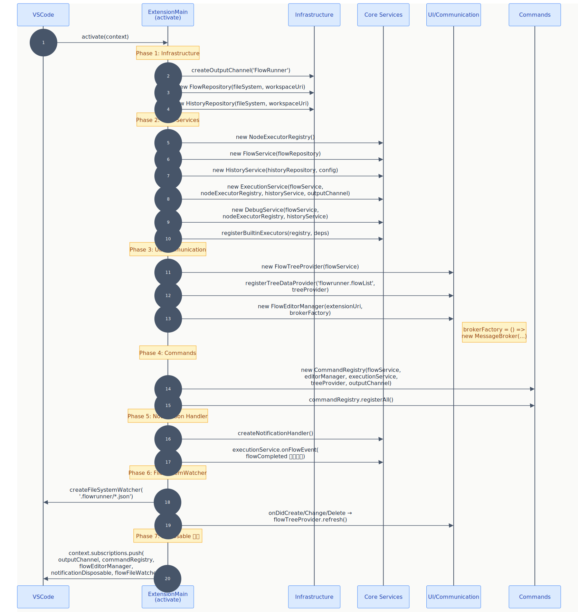

# DD-01 Extension コア詳細設計

> **プロジェクト:** FlowRunner  
> **文書ID:** DD-01  
> **作成日:** 2026-03-21  
> **ステータス:** 完了  
> **参照:** BD-01 アーキテクチャ設計

---

## 目次

1. [はじめに](#1-はじめに)
2. [ExtensionMain](#2-extensionmain)
3. [FlowService](#3-flowservice)
4. [CommandRegistry](#4-commandregistry)
5. [MessageBroker](#5-messagebroker)

---

## 1. はじめに

本書は BD-01 アーキテクチャ設計に定義された Extension Host の基盤コンポーネント 4 種の内部実装を詳細設計する。

| コンポーネント | BD 参照 | 責務 |
|---|---|---|
| ExtensionMain | BD-01 §3.1 | 拡張機能エントリーポイント。DI コンテナとして全コンポーネントを生成・接続・破棄する |
| FlowService | BD-01 §3.1 | フロー定義の CRUD ビジネスロジック |
| CommandRegistry | BD-01 §3.1 | VSCode コマンドの登録とハンドラへのルーティング |
| MessageBroker | BD-01 §3.1 | Extension ↔ WebView メッセージのディスパッチ |

---

## 2. ExtensionMain

### 2.1 概要 (DD-01-002001)

ExtensionMain は VSCode 拡張機能のライフサイクルを管理するエントリーポイントである。`activate()` で全コンポーネントをインスタンス化・初期化し、`deactivate()` でリソースを解放する。

BD-01 §3.2 に定義された依存関係に基づき、ExtensionMain は DI コンテナとしてコンストラクタインジェクションを手動で行う（DI フレームワークは使用しない）。

### 2.2 クラス設計 (DD-01-002002)



**公開関数:**

| 関数 | シグネチャ | 説明 |
|---|---|---|
| `activate` | `(context: vscode.ExtensionContext) → void` | VSCode から呼び出されるエントリーポイント。全コンポーネントを初期化する |
| `deactivate` | `() → void` | VSCode から呼び出されるクリーンアップ関数 |

`activate()` と `deactivate()` は VSCode Extension API の規約に従い、モジュールレベルの named export として定義する（クラスではなく関数）。

### 2.3 初期化フェーズ (DD-01-002003)



`activate()` では以下の 7 フェーズで順にコンポーネントを生成する。各フェーズのコンポーネントは、前フェーズのコンポーネントに依存する。

#### フェーズ 1: Infrastructure

外部依存（ファイルシステム）へのアクセスを提供する永続化層を生成する。

| コンポーネント | コンストラクタ引数 | 説明 |
|---|---|---|
| OutputChannel | `vscode.window.createOutputChannel('FlowRunner')` | ログ出力先 |
| FlowRepository | `fs: IFileSystem, workspaceRoot: URI` | フロー定義の永続化。`.flowrunner/` フォルダを使用 |
| HistoryRepository | `fs: IFileSystem, workspaceRoot: URI` | 実行履歴の永続化。`.flowrunner/history/` フォルダを使用 |

`workspaceRoot` は `vscode.workspace.workspaceFolders?.[0]?.uri` から取得する。`IFileSystem` には `vscode.workspace.fs` を渡す。ワークスペースが開かれていない場合はエラーメッセージを表示して `activate()` を早期 return する。

#### フェーズ 2: Core Services

ビジネスロジック層のサービスを生成する。

| コンポーネント | コンストラクタ引数 | 説明 |
|---|---|---|
| NodeExecutorRegistry | — | ビルトインノード Executor を登録するレジストリ |
| FlowService | `flowRepository: IFlowRepository` | フロー CRUD |
| HistoryService | `repository: IHistoryRepository, configProvider: () => number` | 履歴管理 |
| ExecutionService | `flowService: IFlowService, executorRegistry: INodeExecutorRegistry, historyService: IHistoryService, outputChannel: vscode.OutputChannel` | フロー実行 |
| DebugService | `flowService: IFlowService, executorRegistry: INodeExecutorRegistry, historyService: IHistoryService` | デバッグ制御 |

`configProvider` には `() => vscode.workspace.getConfiguration('flowrunner').get('historyMaxCount', 10)` を渡す（DD-04 §4.2 参照）。

ExecutionService 生成後に `registerBuiltinExecutors(registry, { outputChannel, flowRepository, executionService })` を呼び出し、ビルトインノード 11 種を登録する（DD-03 §2.4 で設計）。SubFlowExecutor が ExecutionService を必要とするため、NodeExecutorRegistry 生成直後ではなく ExecutionService 生成後に呼び出す。

#### フェーズ 3: UI & Communication

ユーザーインターフェース層と通信層を生成する。

| コンポーネント | コンストラクタ引数 | 説明 |
|---|---|---|
| FlowTreeProvider | `flowService: IFlowService` | サイドバーツリービュー |
| TreeView 登録 | `vscode.window.registerTreeDataProvider('flowrunner.flowList', flowTreeProvider)` | VSCode へのツリービュー登録 |
| MessageBroker | `flowService: IFlowService, executionService: IExecutionService, debugService: IDebugService, nodeExecutorRegistry: INodeExecutorRegistry` | メッセージディスパッチ |
| FlowEditorManager | `extensionUri: URI, messageBrokerFactory: () => IMessageBroker` | WebView パネル管理 |

#### フェーズ 4: Commands

コマンドハンドラを登録する。

| コンポーネント | コンストラクタ引数 | 説明 |
|---|---|---|
| CommandRegistry | `flowService: IFlowService, flowEditorManager: IFlowEditorManager, executionService: IExecutionService, flowTreeProvider: IFlowTreeProvider, outputChannel: vscode.OutputChannel` | コマンド登録 |

CommandRegistry の `registerAll()` メソッドで全コマンドを一括登録する。

#### フェーズ 5: Notification handler

完了通知ハンドラを生成し、ExecutionService の FlowEvent のうち `flowCompleted` イベントのみをフィルタリングして登録する。

| コンポーネント | 処理 | 説明 |
|---|---|---|
| notificationHandler | `createNotificationHandler()` | 通知ファクトリで通知関数を生成（DD-04 §6.1） |
| notificationDisposable | `executionService.onFlowEvent(...)` | ラッパー関数で `event.type === "flowCompleted"` をフィルタリングし、該当イベントのみ notificationHandler に委譲 |

#### フェーズ 6: FileSystemWatcher

フロー定義ファイルの変更を監視し、ツリービューを自動更新する。

| コンポーネント | 処理 | 説明 |
|---|---|---|
| flowFileWatcher | `vscode.workspace.createFileSystemWatcher(".flowrunner/*.json")` | `.flowrunner/*.json` パターンでファイル監視を作成 |
| — | `flowFileWatcher.onDidCreate / onDidChange / onDidDelete` | ファイルの作成・変更・削除時に `flowTreeProvider.refresh()` を呼び出し |

#### フェーズ 7: Disposable 登録

全コンポーネントの Disposable を `context.subscriptions` に追加し、拡張機能アンロード時に自動解放されるようにする。

| Disposable | 説明 |
|---|---|
| `outputChannel` | ログ出力チャネル |
| `commandRegistry` | 登録済みコマンド一覧 |
| `flowEditorManager` | WebView パネル管理 |
| `notificationDisposable` | 通知ハンドラのイベントリスナー |
| `flowFileWatcher` | フロー定義ファイル監視 |

### 2.4 deactivate 処理 (DD-01-002004)

`deactivate()` は空関数とする。リソース解放は `context.subscriptions` の Disposable が VSCode によって自動的に呼び出されるため、明示的なクリーンアップは不要。

### 2.5 エラーハンドリング (DD-01-002005)

| 条件 | 動作 |
|---|---|
| ワークスペース未オープン | `vscode.window.showErrorMessage()` でエラー表示し、`activate()` を早期 return |
| コンポーネント生成エラー | 例外をキャッチし、`vscode.window.showErrorMessage()` で通知。OutputChannel にスタックトレースを出力 |

---

## 3. FlowService

### 3.1 概要 (DD-01-003001)

FlowService はフロー定義の CRUD ビジネスロジックを提供する。IFlowRepository を通じてデータを永続化し、変更時に IFlowTreeProvider を通知してサイドバーを更新する。

BD-01 §3.1 に定義された責務:
- フロー定義の CRUD ビジネスロジック（RS-01 §6.1, §6.2 を実現）

### 3.2 IFlowService インターフェース (DD-01-003002)

FlowService の公開 API を IFlowService インターフェースとして定義する。

| メソッド | シグネチャ | 説明 |
|---|---|---|
| `createFlow` | `(name: string) → Promise<FlowDefinition>` | 新規フロー作成。トリガーノードを自動配置する |
| `getFlow` | `(flowId: string) → Promise<FlowDefinition>` | フロー定義を取得 |
| `saveFlow` | `(flow: FlowDefinition) → Promise<void>` | フロー定義を保存（更新） |
| `deleteFlow` | `(flowId: string) → Promise<void>` | フロー定義を削除 |
| `renameFlow` | `(flowId: string, newName: string) → Promise<void>` | フロー名を変更 |
| `listFlows` | `() → Promise<FlowSummary[]>` | フロー一覧取得（サマリのみ） |
| `existsFlow` | `(flowId: string) → Promise<boolean>` | フロー存在確認 |

### 3.3 クラス設計 (DD-01-003003)



**コンストラクタ引数:**

| 引数 | 型 | 説明 |
|---|---|---|
| `flowRepository` | `IFlowRepository` | フロー定義の永続化 |

**フィールド:**

| フィールド | 型 | 説明 |
|---|---|---|
| `flowRepository` | `IFlowRepository` | 永続化アクセス |
| `onDidChangeFlows` | `vscode.EventEmitter<void>` | フロー変更通知イベント |

FlowTreeProvider は `FlowService.onDidChangeFlows.event` を購読してツリーをリフレッシュする。

### 3.4 メソッド詳細 (DD-01-003004)

#### createFlow

1. `crypto.randomUUID()` でフロー ID を生成
2. トリガーノード（`NodeInstance`）を自動生成し、`nodes` に配置
3. `FlowDefinition` オブジェクトを構築（`version: "1.0.0"`, `createdAt / updatedAt: 現在時刻`）
4. `flowRepository.save(flow)` で永続化
5. `onDidChangeFlows.fire()` でツリー更新を通知
6. 作成した `FlowDefinition` を返す

#### getFlow

1. `flowRepository.load(flowId)` でフロー定義を取得
2. 存在しない場合は例外をスロー

#### saveFlow

1. `flow.updatedAt` を現在時刻に更新
2. `flowRepository.save(flow)` で永続化
3. `onDidChangeFlows.fire()` でツリー更新を通知

#### deleteFlow

1. `flowRepository.delete(flowId)` で削除
2. `onDidChangeFlows.fire()` でツリー更新を通知

#### renameFlow

1. `flowRepository.load(flowId)` で既存フローを取得
2. `flow.name` を新しい名前に更新
3. `flow.updatedAt` を現在時刻に更新
4. `flowRepository.save(flow)` で永続化
5. `onDidChangeFlows.fire()` でツリー更新を通知

#### listFlows

1. `flowRepository.list()` を呼び出して `FlowSummary[]` を返す

#### existsFlow

1. `flowRepository.exists(flowId)` を呼び出して結果を返す

### 3.5 トリガーノード自動生成 (DD-01-003005)

`createFlow()` で新規フロー作成時に、以下のトリガーノードを自動配置する。

| プロパティ | 値 |
|---|---|
| `id` | `crypto.randomUUID()` |
| `type` | `'trigger'` |
| `label` | `'Trigger'` |
| `enabled` | `true` |
| `position` | `{ x: 250, y: 50 }` |
| `settings` | `{}` |

---

## 4. CommandRegistry

### 4.1 概要 (DD-01-004001)

CommandRegistry は VSCode コマンドの登録とハンドラへのルーティングを行う。BD-01 §5.2 に定義された 6 つのコマンドに加え、ツリービュー手動リフレッシュ用の `flowrunner.refreshFlowList` コマンド（計 7 コマンド）を登録し、各コマンドの実行を対応するサービスに委譲する。

### 4.2 クラス設計 (DD-01-004002)



**コンストラクタ引数:**

| 引数 | 型 | 説明 |
|---|---|---|
| `flowService` | `IFlowService` | フロー CRUD |
| `flowEditorManager` | `IFlowEditorManager` | エディタパネル管理 |
| `executionService` | `IExecutionService` | フロー実行 |
| `flowTreeProvider` | `IFlowTreeProvider` | ツリーリフレッシュ |
| `outputChannel` | `vscode.OutputChannel` | ログ出力チャネル。`wrapHandler` 内のエラーログ出力に使用 |

**フィールド:**

| フィールド | 型 | 説明 |
|---|---|---|
| `disposables` | `vscode.Disposable[]` | 登録したコマンドの Disposable 一覧 |

### 4.3 registerAll メソッド (DD-01-004003)

`registerAll()` で以下のコマンドを一括登録する。各コマンドハンドラはエラーハンドリングラッパー `wrapHandler()` で囲む。

コマンドハンドラの引数は `string`（flowId 直接指定）または FlowTreeItem オブジェクト（ツリービューのコンテキストメニュー経由）のいずれかを受け付ける。内部ヘルパー `resolveFlowId(arg)` がオブジェクトの場合は `arg.id` を、文字列の場合はそのまま flowId として返す。

| コマンド ID | ハンドラ | 引数 | 処理概要 |
|---|---|---|---|
| `flowrunner.createFlow` | `handleCreateFlow` | — | フロー名を入力ダイアログで取得 → `flowService.createFlow()` → `flowEditorManager.openEditor(flow.id, name)` → `flowTreeProvider.refresh()` |
| `flowrunner.openEditor` | `handleOpenEditor` | `arg: string \| FlowTreeItem` | `resolveFlowId(arg)` で flowId を取得。引数が FlowTreeItem の場合は `arg.label` を flowName として `flowEditorManager.openEditor(flowId, flowName)` |
| `flowrunner.deleteFlow` | `handleDeleteFlow` | `arg: string \| FlowTreeItem` | 確認ダイアログ表示 → `flowService.deleteFlow()` → `flowEditorManager.closeEditor()` → `flowTreeProvider.refresh()` |
| `flowrunner.executeFlow` | `handleExecuteFlow` | `arg: string \| FlowTreeItem` | `resolveFlowId(arg)` で flowId を取得。取得できない場合は `flowEditorManager.getActiveFlowId()` でアクティブエディタの flowId にフォールバック。いずれも取得できない場合は警告表示 → `executionService.executeFlow(flowId)` |
| `flowrunner.renameFlow` | `handleRenameFlow` | `arg: string \| FlowTreeItem` | 新しい名前を入力ダイアログで取得 → `flowService.renameFlow()` → `flowTreeProvider.refresh()` |
| `flowrunner.debugFlow` | `handleDebugFlow` | `arg: string \| FlowTreeItem` | `resolveFlowId(arg)` で flowId を取得。取得できない場合は `flowEditorManager.getActiveFlowId()` にフォールバック。いずれも取得できない場合は警告表示。事前バリデーション通過後に `flowEditorManager.openEditor(flowId, flow.name)` を呼び、`debugService.startDebug(flowId)` で開始 |
| `flowrunner.refreshFlowList` | `handleRefreshFlowList` | — | `flowTreeProvider.refresh()` を呼び出しツリービューを手動でリフレッシュ |

### 4.4 wrapHandler (DD-01-004004)

各コマンドハンドラのエラーハンドリングを共通化するラッパー関数。

**動作:**

1. ハンドラ関数を `try-catch` で囲んで実行
2. 例外発生時に `vscode.window.showErrorMessage()` でユーザーに通知
3. OutputChannel にエラー詳細を出力

### 4.5 dispose (DD-01-004005)

`dispose()` で `disposables` 配列内の全 Disposable を解放する。

---

## 5. MessageBroker

### 5.1 概要 (DD-01-005001)

MessageBroker は Extension ↔ WebView 間のメッセージルーティングを行う。BD-01 §4 に定義された通信プロトコルに従い、メッセージの `type` を解析して適切なサービスメソッドにディスパッチし、結果を WebView に返送する。

### 5.2 クラス設計 (DD-01-005002)



**コンストラクタ引数:**

| 引数 | 型 | 説明 |
|---|---|---|
| `flowService` | `IFlowService` | フロー CRUD |
| `executionService` | `IExecutionService` | フロー実行 |
| `debugService` | `IDebugService` | デバッグ制御 |
| `nodeExecutorRegistry` | `INodeExecutorRegistry` | ノード型一覧取得 |

**フィールド:**

| フィールド | 型 | 説明 |
|---|---|---|
| `handlerMap` | `Map<string, MessageHandler>` | メッセージ type → ハンドラ関数のマッピング |
| `eventDisposables` | `Disposable[]` | サービスイベントの購読解除用 |

`MessageHandler` の型定義:

```
type MessageHandler = (payload: unknown) => Promise<FlowRunnerMessage | void>
```

### 5.3 ハンドラ登録 (DD-01-005003)

コンストラクタで `handlerMap` にメッセージ type ごとのハンドラを登録する。

| メッセージ type | ハンドラ処理 | 応答 type |
|---|---|---|
| `flow:load` | `flowService.getFlow(payload.flowId)` | `flow:loaded` |
| `flow:save` | `flowService.saveFlow(payload.flow)` | `flow:saved` |
| `flow:execute` | `executionService.executeFlow(payload.flowId)` | — (イベントで通知) |
| `flow:stop` | `executionService.stopFlow(payload.flowId)` | — |
| `debug:start` | `debugService.startDebug(payload.flowId)` | — |
| `debug:step` | `debugService.step()` | — |
| `debug:stop` | `debugService.stopDebug()` | — |
| `node:getTypes` | `nodeExecutorRegistry.getAll()` → メタデータ収集 | `node:typesLoaded` |

### 5.4 handleMessage メソッド (DD-01-005004)

WebView からメッセージを受信した際に呼び出されるメインディスパッチメソッド。

**シグネチャ:** `handleMessage(message: FlowRunnerMessage, panel: vscode.WebviewPanel) → Promise<void>`

**処理フロー:**

1. `message.type` で `handlerMap` からハンドラを検索
2. ハンドラが見つからない場合、`error:general` メッセージを WebView に返送
3. ハンドラを `try-catch` で実行
4. ハンドラが `FlowRunnerMessage` を返した場合、`panel.webview.postMessage()` で WebView に送信
5. 例外発生時、`error:general` メッセージ（エラー詳細を payload に含む）を WebView に返送

### 5.5 イベントフォワーディング (DD-01-005005)

ExecutionService・DebugService のイベントを WebView に転送する仕組み。

**setupEventForwarding メソッド:**

`setupEventForwarding(panel: vscode.WebviewPanel) → Disposable`

| サービスイベント | 転送先 type | payload |
|---|---|---|
| `executionService.onFlowEvent` (type: `nodeStarted`) | `execution:nodeStarted` | `{ nodeId }` |
| `executionService.onFlowEvent` (type: `nodeCompleted`) | `execution:nodeCompleted` | `{ nodeId, outputs }` |
| `executionService.onFlowEvent` (type: `nodeError`) | `execution:nodeError` | `{ nodeId, error }` |
| `executionService.onFlowEvent` (type: `flowCompleted`) | `execution:flowCompleted` | `{ status, duration }` |
| `debugService.onDebugEvent` | `debug:paused` | `{ nextNodeId, intermediateResults }` |

FlowEditorManager が WebView パネルを作成する際に `setupEventForwarding()` を呼び出し、返された Disposable をパネルの `onDidDispose` で解放する。

### 5.6 dispose (DD-01-005006)

`dispose()` で `eventDisposables` 内の全 Disposable を解放する。
