# DD-02 UI コンポーネント詳細設計

> **プロジェクト:** FlowRunner  
> **文書ID:** DD-02  
> **作成日:** 2026-03-21  
> **ステータス:** 完了  
> **参照:** BD-02 UI コンポーネント設計

---

## 目次

1. [はじめに](#1-はじめに)
2. [FlowTreeProvider](#2-flowtreeprovider)
3. [FlowEditorManager](#3-floweditormanager)
4. [FlowEditorApp](#4-floweditorapp)
5. [Toolbar](#5-toolbar)
6. [NodePalette](#6-nodepalette)
7. [FlowCanvas](#7-flowcanvas)
8. [PropertyPanel](#8-propertypanel)
9. [MessageClient](#9-messageclient)

---

## 1. はじめに

本書は BD-02 UI コンポーネント設計に定義されたコンポーネント群の内部実装を詳細設計する。

| コンポーネント | BD 参照 | 実行環境 | 責務 |
|---|---|---|---|
| FlowTreeProvider | BD-02 §2 | Extension Host | サイドバーのフロー一覧ツリー表示 |
| FlowEditorManager | BD-02 §3 | Extension Host | WebviewPanel のライフサイクル管理 |
| FlowEditorApp | BD-02 §4.2 | WebView | ルートコンポーネント・ステート管理 |
| Toolbar | BD-02 §4.3 | WebView | 操作ボタン群 |
| NodePalette | BD-02 §4.4 | WebView | ノード種別パレット・D&D |
| FlowCanvas | BD-02 §4.5 | WebView | React Flow 描画領域 |
| PropertyPanel | BD-02 §4.6 | WebView | ノード設定・出力パネル |
| MessageClient | BD-02 §4.7 | WebView | postMessage 通信抽象化 |

---

## 2. FlowTreeProvider

### 2.1 概要 (DD-02-002001)

FlowTreeProvider は BD-02 §2.2 で定義された IFlowTreeProvider インターフェースの実装クラスである。VSCode の `TreeDataProvider<FlowTreeItem>` を実装し、サイドバーにフロー一覧をツリー表示する。

### 2.2 クラス設計 (DD-02-002002)

**コンストラクタ引数:**

| 引数 | 型 | 説明 |
|---|---|---|
| `flowService` | IFlowService | フロー一覧の取得 |

**フィールド:**

| フィールド | 型 | 可視性 | 説明 |
|---|---|---|---|
| `flowService` | IFlowService | private readonly | フロー一覧の取得元 |
| `changeEmitter` | `EventEmitter<FlowTreeItem \| undefined>` | private readonly | ツリー変更通知用。`undefined` 発火でツリー全体を再描画 |
| `onDidChangeTreeData` | `Event<FlowTreeItem \| undefined>` | public readonly | VSCode API 規約。changeEmitter.event を公開する |

### 2.3 getChildren 実装 (DD-02-002003)

| ステップ | 処理 |
|---|---|
| 1 | `parentId` が undefined の場合、`flowService.listFlows()` でルートのフロー一覧を取得 |
| 2 | `parentId` が指定された場合、`flowService.listFlows(parentId)` でフォルダ配下を取得 |
| 3 | 取得した FlowSummary 配列を FlowTreeItem 配列に変換して返す |

**FlowSummary → FlowTreeItem 変換:**

| FlowSummary 属性 | FlowTreeItem 属性 | 変換 |
|---|---|---|
| `id` | `id` | そのまま |
| `name` | `label` | そのまま |
| — | `type` | `"flow"` 固定（v1.0 ではフォルダ未対応） |
| `updatedAt` | `description` | ISO 8601 → ローカライズ済み日時文字列に整形 |
| — | `parentId` | `parentId` 引数をそのまま設定 |

### 2.4 getTreeItem 実装 (DD-02-002004)

FlowTreeItem を VSCode の TreeItem に変換する。

| FlowTreeItem 属性 | TreeItem 設定 | 説明 |
|---|---|---|
| `id` | `treeItem.id` | 一意識別子 |
| `label` | `treeItem.label` | 表示名 |
| `description` | `treeItem.description` | 補足テキスト（更新日時） |
| `type = "flow"` | `treeItem.collapsibleState = None` | 展開不可 |
| `type = "folder"` | `treeItem.collapsibleState = Collapsed` | 展開可能 |
| `type = "flow"` | `treeItem.command = { command: 'flowrunner.openEditor', arguments: [id] }` | ダブルクリックでエディタを開く |
| `type = "flow"` | `treeItem.contextValue = 'flowItem'` | コンテキストメニュー条件に使用 |
| `type = "folder"` | `treeItem.contextValue = 'folderItem'` | コンテキストメニュー条件に使用 |

### 2.5 コンテキストメニュー設定 (DD-02-002005)

BD-02 §2.4 で定義されたコンテキストメニューを `package.json` の `contributes.menus` で静的に定義する。

| メニュー設定 | コマンド | when 条件 |
|---|---|---|
| `view/title` | `flowrunner.createFlow` | `view == flowrunner.flowList` |
| `view/item/context` | `flowrunner.deleteFlow` | `viewItem == flowItem` |
| `view/item/context` | `flowrunner.executeFlow` | `viewItem == flowItem` |
| `view/item/context` | `flowrunner.renameFlow` | `viewItem == flowItem` |

**refresh() の実装:** `changeEmitter.fire(undefined)` を呼び出すだけの単純な実装。FlowService でフロー作成・削除・名称変更が発生した際に、CommandRegistry のハンドラから呼び出される。

---

## 3. FlowEditorManager

### 3.1 概要 (DD-02-003001)

FlowEditorManager は BD-02 §3.2 で定義された IFlowEditorManager インターフェースの実装クラスである。フローごとに 1 つの WebviewPanel を管理する。

### 3.2 クラス設計 (DD-02-003002)

**コンストラクタ引数:**

| 引数 | 型 | 説明 |
|---|---|---|
| `extensionUri` | URI | 拡張機能ルート URI。WebView リソースパスの構築に使用 |
| `messageBrokerFactory` | `() => IMessageBroker` | MessageBroker を生成する引数なしファクトリ。panel は openEditor 内で setupEventForwarding/handleMessage 経由で注入する |

**フィールド:**

| フィールド | 型 | 可視性 | 説明 |
|---|---|---|---|
| `extensionUri` | URI | private readonly | 拡張機能ルート |
| `messageBrokerFactory` | `() => IMessageBroker` | private readonly | MessageBroker ファクトリ |
| `panels` | `Map<string, { panel: WebviewPanel; broker: IMessageBroker }>` | private | flowId → WebviewPanel + MessageBroker の統合管理マップ |

### 3.3 openEditor 実装 (DD-02-003003)

| ステップ | 処理 |
|---|---|
| 1 | `panels.has(flowId)` が true の場合、既存パネルの `reveal()` を呼び出して終了。`flowName` があればタイトル更新 |
| 2 | `vscode.window.createWebviewPanel()` で新規パネルを生成する |
| 3 | BD-02 §3.4 のオプション（enableScripts, retainContextWhenHidden, localResourceRoots）を設定する |
| 4 | `getWebviewContent(panel.webview)` で HTML を生成し、`panel.webview.html` に設定する |
| 5 | `messageBrokerFactory()` で MessageBroker を生成し、`broker.setupEventForwarding(panel)` でパネルを注入する |
| 6 | `panel.webview.onDidReceiveMessage` で受信メッセージの `payload` に `flowId` を自動注入してから `broker.handleMessage()` に委譲する。WebView 側は flowId を意識せずにメッセージを送信できる |
| 7 | `panels.set(flowId, { panel, broker })` でパネルとブローカーを統合保存する |
| 8 | `panel.onDidDispose()` にクリーンアップ処理を登録する（panels からの削除、activeFlowId リセット） |

### 3.4 HTML 生成 (DD-02-003004)

`getWebviewContent()` は WebView にロードする HTML を構築する内部メソッドである。

| 項目 | 仕様 |
|---|---|
| ビルド出力パス | `{extensionUri}/dist/webview.js` |
| エントリポイント | 単一バンドル `webview.js`（CSS は JS にインライン化） |
| CSP（Content Security Policy） | `script-src` に WebView の `cspSource` と `'nonce-${nonce}'` を許可。`style-src` に `cspSource` と `'unsafe-inline'` を許可 |
| nonce | `crypto.randomBytes(16).toString('base64')` で生成し、`<script>` タグの `nonce` 属性に設定する。CSP の `script-src` に `nonce-${nonce}` を含める |

**リソース URI 変換:** `panel.webview.asWebviewUri()` を使用して、ローカルファイルパスを WebView で利用可能な URI に変換する。

### 3.5 パネルライフサイクル (DD-02-003005)

BD-02 §3.3 のライフサイクルイベントへの対応。

| イベント | フック | 処理 |
|---|---|---|
| パネル破棄 | `panel.onDidDispose` | `broker.dispose()`, `panels.delete(flowId)`, `activeFlowId` リセット |
| 可視性変更 | `panel.onDidChangeViewState` | `panel.visible === true` のとき `activeFlowId = flowId` を設定。`retainContextWhenHidden: true` により WebView DOM は保持されるため、フロー定義の再ロードは不要。オートセーブ機能によりデータは常に最新状態が維持される |

**dispose() の実装:** `panels` の全エントリに対して `broker.dispose()` と `panel.dispose()` を呼び出し、`panels.clear()` でマップを空にする。

**getActiveFlowId():** 現在アクティブなパネルの flowId を返すメソッド。パネルがない場合は `undefined` を返す。CommandRegistry の `handleExecuteFlow` でフォールバック取得に使用される。

---

## 4. FlowEditorApp

### 4.1 概要 (DD-02-004001)

FlowEditorApp は WebView 内のルート React コンポーネントである。BD-02 §4.2 のステート管理とメッセージハンドリングを内部実装する。

### 4.2 ステート管理 (DD-02-004002)

React の `useReducer` を使用して、複数の関連ステートを一元管理する。

**FlowEditorState 型:**

| フィールド | 型 | 初期値 | 説明 |
|---|---|---|---|
| `nodes` | `Node[]` | `[]` | React Flow のノード配列 |
| `edges` | `Edge[]` | `[]` | React Flow のエッジ配列 |
| `selectedNodeId` | `string \| null` | `null` | 選択中のノード ID |
| `executionState` | `Map<string, NodeExecState>` | `new Map()` | 各ノードの実行状態 |
| `isDebugMode` | `boolean` | `false` | デバッグモード中フラグ |
| `isDirty` | `boolean` | `false` | 未保存変更ありフラグ |

**補助ステート（useState で管理）:**

| ステート | 型 | 初期値 | 説明 |
|---|---|---|---|
| `leftPanelOpen` | `boolean` | `true` | 左パネル（NodePalette）の表示/非表示 |
| `rightPanelOpen` | `boolean` | `true` | 右パネル（PropertyPanel）の表示/非表示 |
| `rightPanelWidth` | `number` | `300` | 右パネルの幅（px）。マウスドラッグでリサイズ可能（200〜600） |
| `showMiniMap` | `boolean` | `false` | MiniMap の表示/非表示（デフォルト非表示） |
| `nodeTypesList` | `INodeTypeMetadata[]` | `[]` | ノード種別メタデータ一覧 |
| `executionResults` | `Map<string, NodeResult>` | `new Map()` | ノード別の実行結果 |

**オートセーブ:** `isDirty` が `true` になると 3 秒のデバウンスタイマーを開始する。タイマー満了時に `flow:save` メッセージを送信し、`isDirty` を `false` にリセットする。タイマー中に再度変更があった場合はリセットして再開する。手動保存（`Ctrl+S` / `Cmd+S`）も引き続き可能。

**NodeExecState 列挙:**

| 値 | 説明 |
|---|---|
| `idle` | 未実行 / リセット済み |
| `running` | 実行中 |
| `completed` | 実行完了 |
| `error` | エラー発生 |

**FlowEditorAction 型:**

| action.type | ペイロード | ステート更新 |
|---|---|---|
| `FLOW_LOADED` | `{ nodes, edges }` | nodes, edges を設定。executionState をリセット。isDirty = false |
| `NODES_CHANGED` | `{ changes: NodeChange[] }` | React Flow の `applyNodeChanges` で nodes を更新。isDirty = true |
| `EDGES_CHANGED` | `{ changes: EdgeChange[] }` | React Flow の `applyEdgeChanges` で edges を更新。isDirty = true |
| `NODE_SELECTED` | `{ nodeId }` | selectedNodeId を更新 |
| `NODE_EXEC_STATE` | `{ nodeId, state }` | executionState の該当エントリを更新 |
| `DEBUG_MODE` | `{ active }` | isDebugMode を更新 |
| `FLOW_SAVED` | — | isDirty = false |

### 4.3 メッセージハンドリング (DD-02-004003)

`useEffect` で MessageClient のリスナーを登録し、Extension Host からのメッセージを FlowEditorAction にマッピングする。

| 受信メッセージ | dispatch するアクション |
|---|---|
| `flow:loaded` | `{ type: 'FLOW_LOADED', nodes, edges }` — 後述の型変換を適用 |
| `execution:nodeStarted` | `{ type: 'NODE_EXEC_STATE', nodeId, state: 'running' }` |
| `execution:nodeCompleted` | `{ type: 'NODE_EXEC_STATE', nodeId, state: 'completed' }` + executionResults に結果を蓄積 |
| `execution:nodeError` | `{ type: 'NODE_EXEC_STATE', nodeId, state: 'error' }` |
| `execution:flowCompleted` | （現時点では追加処理なし） |
| `debug:paused` | intermediateResults から各ノードの実行状態を復元 + nextNodeId を running/selected に設定。nextNodeId が存在しない場合はデバッグモードを終了 |
| `node:typesLoaded` | NodePalette のノード種別リストを更新（別の useState で管理） |

**`flow:loaded` のペイロード変換:** Extension Host から受信する `flow:loaded` のペイロードは `{ flow: { nodes: NodeInstance[], edges: EdgeInstance[] } }` の形式である。FlowEditorApp は以下の変換を行ってから reducer に dispatch する。

| 変換元（NodeInstance） | 変換先（FlowNode） | 説明 |
|---|---|---|
| `n.id` | `id` | そのまま |
| `n.type` | `type` | そのまま |
| `n.position` | `position` | そのまま |
| `n.data` または `{ label, enabled, settings }` | `data` | `n.data` が存在すればそのまま使用。なければ `label`, `enabled`, `settings` フィールドから構築 |

| 変換元（EdgeInstance） | 変換先（FlowEdge） | 説明 |
|---|---|---|
| `e.source` / `e.sourceNodeId` | `source` | いずれか存在する方を採用 |
| `e.target` / `e.targetNodeId` | `target` | いずれか存在する方を採用 |
| `e.sourceHandle` / `e.sourcePortId` | `sourceHandle` | いずれか存在する方を採用 |
| `e.targetHandle` / `e.targetPortId` | `targetHandle` | いずれか存在する方を採用 |

**コールバック関数:**

| コールバック | 説明 |
|---|---|
| `handleSettingsChange(nodeId, settings)` | PropertyPanel からのノード設定変更。対象ノードの `data.settings` を更新し NODES_CHANGED を dispatch |
| `handleLabelChange(nodeId, label)` | PropertyPanel からのラベル変更。対象ノードの `data.label` を更新し NODES_CHANGED を dispatch |
| `handleEnabledChange(nodeId, enabled)` | PropertyPanel からの有効/無効トグル。対象ノードの `data.enabled` を更新し NODES_CHANGED を dispatch |

**マウント時の初期化:** `useEffect([], ...)` で MessageClient 経由で `flow:load` と `node:getTypes` メッセージを送信し、フロー定義とノード種別メタデータのロードを要求する。

---

## 5. Toolbar

### 5.1 コンポーネント設計 (DD-02-005001)

BD-02 §4.3 のボタン定義を React の関数コンポーネントとして実装する。

**Props:**

| プロパティ | 型 | 説明 |
|---|---|---|
| `isRunning` | boolean | フロー実行中フラグ |
| `isDebugMode` | boolean | デバッグモードフラグ |
| `isDirty` | boolean | 未保存変更フラグ |
| `onExecute` | `() => void` | 実行ボタンクリック |
| `onStop` | `() => void` | 停止ボタンクリック |
| `onDebugStart` | `() => void` | デバッグ開始クリック |
| `onDebugStep` | `() => void` | ステップ実行クリック |
| `onSave` | `() => void` | 保存ボタンクリック |
| `showMiniMap` | `boolean` （省略可） | MiniMap 表示状態 |
| `onToggleMiniMap` | `() => void` （省略可） | MiniMap トグル |
| `leftPanelOpen` | `boolean` （省略可） | 左パネル（NodePalette）表示状態 |
| `onToggleLeftPanel` | `() => void` （省略可） | 左パネルトグル |
| `rightPanelOpen` | `boolean` （省略可） | 右パネル（PropertyPanel）表示状態 |
| `onToggleRightPanel` | `() => void` （省略可） | 右パネルトグル |

**ボタン表示ロジック:**

| ボタン | 表示条件 | disabled 条件 |
|---|---|---|
| 実行 | `!isDebugMode` | `isRunning` |
| 停止 | `isRunning \|\| isDebugMode` | — |
| デバッグ | `!isRunning` | `isDebugMode`（既に開始済み） |
| ステップ | `isDebugMode` | — |
| 保存 | 常時 | `!isDirty` |
| NodePalette トグル | `onToggleLeftPanel` が提供された場合 | — |
| MiniMap トグル | `onToggleMiniMap` が提供された場合 | — |
| PropertyPanel トグル | `onToggleRightPanel` が提供された場合 | — |

パネルトグルボタンはアクティブ状態（パネルが開いている）を CSS クラス `fr-toolbar-btn--active` で視覚的に示す。

---

## 6. NodePalette

### 6.1 コンポーネント設計 (DD-02-006001)

BD-02 §4.4 のノードパレットを React の関数コンポーネントとして実装する。

**Props:**

| プロパティ | 型 | 説明 |
|---|---|---|
| `nodeTypes` | `INodePaletteItem[]` | 表示するノード種別一覧 |

**レンダリング:**

| ステップ | 処理 |
|---|---|
| 1 | `nodeTypes` を `category` でグループ化する |
| 2 | カテゴリごとに折り畳みセクション（details/summary 要素）を描画する |
| 3 | 各ノード種別を draggable な要素として描画する |

### 6.2 ドラッグ&ドロップ (DD-02-006002)

| イベント | ハンドラ | 処理 |
|---|---|---|
| `onDragStart` | NodePalette 内の各アイテム | `event.dataTransfer.setData('application/flowrunner-node-type', nodeType)` でノード種別を設定。`event.dataTransfer.effectAllowed = 'move'` |
| `onDragOver` | FlowCanvas | `event.preventDefault()` でドロップを許可する |
| `onDrop` | FlowCanvas | `event.dataTransfer.getData('application/flowrunner-node-type')` でノード種別を取得。React Flow の `screenToFlowPosition()` でドロップ座標を算出。新規ノードを nodes ステートに追加する |

**新規ノード生成:**

| 属性 | 値 |
|---|---|
| `id` | `crypto.randomUUID()` |
| `type` | ドラッグデータの nodeType |
| `position` | ドロップ座標（React Flow 座標系） |
| `data` | `{ label: paletteItem.label, settings: {} }` |

---

## 7. FlowCanvas

### 7.1 概要 (DD-02-007001)

FlowCanvas は React Flow（@xyflow/react）をラップするコンポーネントである。BD-02 §4.5 のキャンバス操作、コンテキストメニュー、Undo/Redo を実装する。

### 7.2 React Flow 設定 (DD-02-007002)

| 設定 | 値 | 説明 |
|---|---|---|
| `nodeTypes` | `{ trigger: CustomNode, command: CustomNode, condition: CustomNode, ... }` | ノード種別ごとのコンポーネントマッピング。BD-03 §6 のビルトイン11種の nodeType 名に対応する。v1.0 では全種別で共通の CustomNodeComponent を使用する |
| `minZoom` | `0.1` | 最小ズーム倍率 |
| `maxZoom` | `2.0` | 最大ズーム倍率 |
| `fitView` | `true` | 初期表示時にフロー全体をビューポートにフィット |
| `onNodesChange` | `dispatch({ type: 'NODES_CHANGED', changes })` | ノード変更時の reducer dispatch |
| `onEdgesChange` | `dispatch({ type: 'EDGES_CHANGED', changes })` | エッジ変更時の reducer dispatch |
| `onConnect` | `dispatch({ type: 'EDGES_CHANGED', ... })` | 新規エッジ接続時 |
| `onNodeClick` | `dispatch({ type: 'NODE_SELECTED', nodeId })` | ノード選択時 |

**子コンポーネント:**

| コンポーネント | 説明 |
|---|---|
| `<MiniMap />` | ミニマップ表示 |
| `<Controls />` | ズーム・フィットビューボタン |
| `<Background />` | ドットグリッド背景 |

### 7.3 CustomNodeComponent (DD-02-007003)

全ノード種別で共通のカスタムノードコンポーネント。BD-02 §4.5 の CustomNodeComponent 仕様を実装する。

**Props（React Flow の NodeProps）:**

| プロパティ | 使用 |
|---|---|
| `data.label` | ノードヘッダーに表示 |
| `data.nodeType` | ノード種別アイコンの選択 |
| `data.enabled` | 無効ノードのグレーアウト表示 |
| `data.ports` | 入力/出力ポートハンドルの描画 |
| `selected` | 選択状態のハイライト |

**ポートハンドル描画:**

| ポート方向 | React Flow コンポーネント | 配置 |
|---|---|---|
| 入力ポート | `<Handle type="target" position="left" id={portId} />` | ノード左側 |
| 出力ポート | `<Handle type="source" position="right" id={portId} />` | ノード右側 |

**ポートツールチップ:** 各ポートラベルに `onMouseEnter` / `onMouseLeave` を設定し、ホバー時にツールチップを表示する。ツールチップには「ポートラベル (ポートID)」「型: dataType」の情報を表示する。出力ポートの場合は「接続先で \{\{input\}\} として参照」のテンプレート参照ガイドを追加表示する。ツールチップは `createPortal` で `document.body` に描画し、ハンドル要素の右側に配置する。

**ノードデータの enrichment:** FlowEditorApp の `enrichedNodes` useMemo で、各ノードの `data` に以下のプロパティを付与してから FlowCanvas に渡す。

| プロパティ | 値 | 説明 |
|---|---|---|
| `nodeType` | `node.type` | ノード種別（アイコン選択に使用） |
| `enabled` | `node.data.enabled ?? true` | 有効/無効フラグ（デフォルト true） |
| `ports.inputs` | `metadata.inputPorts ?? []` | メタデータから取得した入力ポート定義 |
| `ports.outputs` | `metadata.outputPorts ?? []` | メタデータから取得した出力ポート定義 |
| `executionState` | `executionState.get(nodeId) ?? "idle"` | 実行状態マップから取得 |

**実行状態の視覚化:**

| `executionState` | ボーダー色 | アニメーション |
|---|---|---|
| `idle` | デフォルト（グレー） | なし |
| `running` | 青 | パルスアニメーション |
| `completed` | 緑 | なし |
| `error` | 赤 | なし |

**エッジの実行状態スタイリング:** FlowCanvas 内の `styledEdges` useMemo で、各エッジの接続元/接続先ノードの実行状態に基づいてスタイルを動的に適用する。

| 条件 | アニメーション | エッジ色 | 線幅 |
|---|---|---|---|
| 接続元または接続先が `running` | あり | 黄色（`--vscode-charts-yellow`） | 3px |
| 接続元または接続先が `error` | なし | 赤色（`--vscode-errorForeground`） | 2.5px |
| 接続元・接続先ともに `completed` | なし | 緑色（`--vscode-charts-green`） | 2.5px |
| クリックで選択されたエッジ | なし | フォーカス色（`--fr-focus-border`） | 2.5px |
| 実行中に上記以外 | なし（明示的に無効化） | デフォルト | デフォルト |

### 7.4 コンテキストメニュー (DD-02-007004)

BD-02 §4.5 のコンテキストメニューを React の状態として管理する。

**ContextMenuState 型:**

| フィールド | 型 | 説明 |
|---|---|---|
| `visible` | boolean | 表示/非表示 |
| `x` | number | 表示位置 X |
| `y` | number | 表示位置 Y |
| `targetType` | `'node' \| 'edge' \| 'canvas'` | 右クリック対象 |
| `targetId` | `string \| null` | 対象ノード/エッジの ID |

**onContextMenu ハンドラ:**

| ステップ | 処理 |
|---|---|
| 1 | `event.preventDefault()` でブラウザのデフォルトメニューを抑止する |
| 2 | クリック対象を判定する（ノード/エッジ/キャンバス） |
| 3 | ContextMenuState を更新して表示する |

**クリップボードステート:** ノードの「コピー」操作用に `useRef<NodeInstance | null>` でクリップボードを管理する。「ペースト」時はクリップボードのノードを新 ID でコピーし、マウス位置に配置する。

### 7.5 Undo/Redo (DD-02-007005)

BD-02 §4.5 の Undo/Redo を `useUndoRedo` カスタムフックとして実装する。

**useUndoRedo フック:**

| 返却値 | 型 | 説明 |
|---|---|---|
| `undo` | `() => void` | 1 つ前の状態に戻す |
| `redo` | `() => void` | 1 つ先の状態に進む |
| `canUndo` | boolean | Undo 可能かどうか |
| `canRedo` | boolean | Redo 可能かどうか |
| `pushState` | `(state: UndoableState) => void` | 現在の状態を履歴に記録する |

**UndoableState 型:**

| フィールド | 型 |
|---|---|
| `nodes` | `Node[]` |
| `edges` | `Edge[]` |

**内部データ構造:**

| フィールド | 型 | 説明 |
|---|---|---|
| `undoStack` | `UndoableState[]` | Undo 用スタック（useRef で管理） |
| `redoStack` | `UndoableState[]` | Redo 用スタック（useRef で管理） |
| `maxHistory` | number | スタックの最大サイズ（50） |

**操作:**

| 操作 | 処理 |
|---|---|
| pushState | 現在の state を undoStack に push する。redoStack をクリアする。undoStack が maxHistory を超えたら先頭を pop する |
| undo | undoStack から pop し、現在の state を redoStack に push する。pop した state で nodes/edges を復元する |
| redo | redoStack から pop し、現在の state を undoStack に push する。pop した state で nodes/edges を復元する |

**キーボードショートカット:** `useEffect` で `keydown` イベントを登録する。`Ctrl+Z`（macOS: `Cmd+Z`）で undo、`Ctrl+Y`（macOS: `Cmd+Shift+Z`）で redo を呼び出す。

---

## 8. PropertyPanel

### 8.1 概要 (DD-02-008001)

PropertyPanel は選択中ノードの設定フォームと実行出力を表示するサイドパネルである。BD-02 §4.6 の仕様を実装する。

**Props:**

| プロパティ | 型 | 説明 |
|---|---|---|
| `selectedNode` | `Node \| null` | 選択中ノード |
| `executionOutput` | `NodeResult \| null` | 選択ノードの実行出力 |
| `nodeMetadata` | `NodeMetadata \| null` | 選択ノードの種別メタデータ（フィールド定義） |
| `onSettingsChange` | `(nodeId: string, settings: NodeSettings) => void` | 設定変更コールバック |

**タブ表示ロジック:**

| 条件 | 表示 |
|---|---|
| `selectedNode === null` | 「ノードを選択してください」のプレースホルダー |
| `selectedNode !== null` | タブバー（設定 / 出力）+ アクティブタブの内容 |

### 8.2 SettingsTab (DD-02-008002)

ノード種類のメタデータに基づいて設定フォームを動的に生成する。

**ノード名入力:** フォーム上部に固定のテキスト入力フィールドを配置し、ノードのラベルを編集可能にする。変更時に `onLabelChange(nodeId, label)` コールバックを呼び出す。

**有効/無効トグル:** trigger / comment 以外のノード種別では、ノード名入力の上にチェックボックスを表示し、ノードの有効/無効を切り替える。変更時に `onEnabledChange(nodeId, enabled)` コールバックを呼び出す。

**フォーム要素マッピング:**

| メタデータのフィールド型 | React コンポーネント | 説明 |
|---|---|---|
| `string` | `<input type="text" />` | テキスト入力 |
| `number` | `<input type="number" />` | 数値入力 |
| `boolean` | `<input type="checkbox" />` | チェックボックス |
| `text` | `<textarea />` | 複数行テキスト |
| `select` | `<select>` + `<option>` | 選択肢 |
| `keyValue` | 動的行追加型テーブル（key-value ペア） | キーバリュー入力 |

**変更ハンドリング:**

| ステップ | 処理 |
|---|---|
| 1 | フォーム要素の `onChange` で該当フィールドの値を更新 |
| 2 | ローカルステートでフォーム値を管理する（`useState<NodeSettings>`） |
| 3 | フォーム値の変更をデバウンス（300ms）してから `onSettingsChange` を呼び出す |

**デバウンスの設計意図:** キー入力のたびに Extension Host にメッセージを送信するのを防止し、パフォーマンスを確保する。

### 8.3 OutputTab (DD-02-008003)

| 表示内容 | 条件 | 描画 |
|---|---|---|
| 未実行メッセージ | `executionOutput === null` | 「ノードは未実行です」テキスト |
| エラー情報 | `executionOutput.status === 'error'` | エラーメッセージを赤色テキストで描画 |
| 正常出力 | `executionOutput.status !== 'error'` | ノードタイプ別レンダラーで描画 |

**ノードタイプ別出力レンダラー:** OutputTab は `nodeType` Props に基づいて最適なレンダラーコンポーネントを選択する。

| レンダラー | 対象ノードタイプ | 表示形式 |
|---|---|---|
| `TerminalOutput` | command | ターミナル風表示。stdout と stderr を分離表示 |
| `MarkdownOutput` | aiPrompt | テキスト出力 + AI トークン使用量バッジ |
| `JsonOutput` | http, transform | JSON 整形表示。http の場合はステータスコード付き |
| `ConditionOutput` | condition | 分岐結果バッジ（true/false） + JSON 詳細 |
| `TextOutput` | file, log, その他 | `out` ポートの値をテキスト表示。フォールバックで JSON 整形 |
| — | trigger, comment | 「出力なし」表示 |

**AI トークン使用量表示:** MarkdownOutput レンダラーは、出力データ内の `_tokenUsage` オブジェクト（`{ inputTokens, outputTokens, totalTokens, model }`）が存在する場合、モデル名・入力トークン数・出力トークン数・合計トークン数をバッジ形式で表示する。

---

## 9. MessageClient

### 9.1 概要 (DD-02-009001)

MessageClient は BD-02 §4.7 で定義された IMessageClient インターフェースの実装である。VSCode WebView API の `acquireVsCodeApi()` をラップし、postMessage 通信を抽象化する。

### 9.2 DI 設計 (DD-02-009002)

`acquireVsCodeApi()` は WebView ライフサイクル内で 1 回のみ呼び出し可能であるため、モジュールスコープで初期化し、DI パターンでコンポーネントに注入する。

**実装方式:**

| 項目 | 仕様 |
|---|---|
| 初期化 | モジュールスコープで `acquireVsCodeApi()` を呼び出し、API インスタンスを保持する |
| 注入 | IMessageClient インターフェースとしてコンポーネントに注入する。テスト時はモック実装に差し替え可能 |
| send | `vscodeApi.postMessage({ type, payload })` を呼び出す |
| onMessage | `window.addEventListener('message', handler)` でリスナーを登録。戻り値の Disposable で `removeEventListener` を呼ぶ |
| テスト時 | IMessageClient インターフェースのモック実装に差し替え可能。`acquireVsCodeApi` は呼び出さない |

**型安全性:** send() の引数を `WebViewToExtensionMessageType` に制約し、onMessage() のハンドラ引数を `FlowRunnerMessage` 型に制約する。これにより送受信メッセージの型不整合をコンパイル時に検出する。
