# DD-03 ノードシステム・データモデル詳細設計

> **プロジェクト:** FlowRunner  
> **文書ID:** DD-03  
> **作成日:** 2026-03-21  
> **ステータス:** 完了  
> **参照:** BD-03 ノードシステム・データモデル設計

---

## 目次

1. [はじめに](#1-はじめに)
2. [NodeExecutorRegistry](#2-nodeexecutorregistry)
3. [FlowRepository](#3-flowrepository)
4. [ビルトイン Executor 共通設計](#4-ビルトイン-executor-共通設計)
5. [基本カテゴリノード](#5-基本カテゴリノード)
6. [AI カテゴリノード](#6-ai-カテゴリノード)
7. [制御カテゴリノード](#7-制御カテゴリノード)
8. [データカテゴリノード](#8-データカテゴリノード)
9. [その他カテゴリノード](#9-その他カテゴリノード)

---

## 1. はじめに

本書は BD-03 ノードシステム・データモデル設計に定義されたコンポーネント群の内部実装を詳細設計する。

| コンポーネント | BD 参照 | 責務 |
|---|---|---|
| NodeExecutorRegistry | BD-03 §3 | ノード種別と INodeExecutor 実装の管理 |
| FlowRepository | BD-03 §5.5 | フロー定義 JSON の永続化 |
| ビルトイン Executor 11 種 | BD-03 §6 | 各ノード種別の実行ロジック |

---

## 2. NodeExecutorRegistry

### 2.1 概要 (DD-03-002001)

NodeExecutorRegistry は BD-03 §3.2 で定義された INodeExecutorRegistry インターフェースの実装クラスである。ノード種別文字列をキーとする Map で INodeExecutor 実装を管理する。

### 2.2 クラス設計 (DD-03-002002)

**コンストラクタ引数:** なし

**フィールド:**

| フィールド | 型 | 可視性 | 説明 |
|---|---|---|---|
| `executors` | `Map<string, INodeExecutor>` | private | nodeType → Executor のマッピング |

### 2.3 メソッド詳細 (DD-03-002003)

#### register

1. `nodeType` が既に `executors` に存在する場合、`Error('Executor already registered for nodeType: ${nodeType}')` をスロー
2. `executors.set(nodeType, executor)` で登録

#### get

1. `executors.get(nodeType)` で取得
2. 存在しない場合、`Error('No executor registered for nodeType: ${nodeType}')` をスロー
3. 取得した Executor を返す

#### getAll

1. `Array.from(executors.values())` で全 Executor を配列として返す

#### has

1. `executors.has(nodeType)` の結果を返す

### 2.4 registerBuiltinExecutors 関数 (DD-03-002004)

ExtensionMain の activate() から呼び出される初期化関数。ビルトイン 11 種の Executor を生成し、レジストリに登録する。

**シグネチャ:** `registerBuiltinExecutors(registry: INodeExecutorRegistry, deps: BuiltinExecutorDeps) → void`

`BuiltinExecutorDeps` は以下のフィールドを持つ:

| フィールド | 型 | 用途 |
|---|---|---|
| `outputChannel` | `vscode.OutputChannel` | LogExecutor 用 |
| `flowRepository` | `IFlowRepository` | SubFlowExecutor 用 |
| `executionService` | `IExecutionService` | SubFlowExecutor 用（再帰的フロー実行） |

| 順序 | nodeType | Executor クラス |
|---|---|---|
| 1 | `trigger` | TriggerExecutor |
| 2 | `command` | CommandExecutor |
| 3 | `aiPrompt` | AIPromptExecutor |
| 4 | `condition` | ConditionExecutor |
| 5 | `loop` | LoopExecutor |
| 6 | `log` | LogExecutor |
| 7 | `file` | FileExecutor |
| 8 | `http` | HttpExecutor |
| 9 | `transform` | TransformExecutor |
| 10 | `comment` | CommentExecutor |
| 11 | `subFlow` | SubFlowExecutor |

各 Executor は原則としてコンストラクタ引数なしでインスタンス化する（外部依存は execute 時に注入）。ただし LogExecutor は `deps.outputChannel`、SubFlowExecutor は `deps.flowRepository` と `deps.executionService` をコンストラクタで受け取る。

---

## 3. FlowRepository

### 3.1 概要 (DD-03-003001)

FlowRepository は BD-03 §5.5 で定義された IFlowRepository インターフェースの実装クラスである。ワークスペース内の `.flowrunner/` ディレクトリに JSON ファイルとしてフロー定義を永続化する。

### 3.2 クラス設計 (DD-03-003002)

**コンストラクタ引数:**

| 引数 | 型 | 説明 |
|---|---|---|
| `fs` | IFileSystem | ファイル操作（VSCode workspace.fs または Node.js fs） |
| `workspaceRoot` | URI | ワークスペースルート URI |

**フィールド:**

| フィールド | 型 | 可視性 | 説明 |
|---|---|---|---|
| `fs` | IFileSystem | private readonly | ファイル操作抽象 |
| `workspaceRoot` | URI | private readonly | ワークスペースルート |
| `baseDir` | URI | private readonly | `.flowrunner/` ディレクトリの URI |

コンストラクタで `baseDir` を `URI.joinPath(workspaceRoot, '.flowrunner')` として初期化する。

### 3.3 メソッド詳細 (DD-03-003003)

#### save

1. `ensureBaseDir()` でディレクトリ存在を保証
2. ファイルパスを `URI.joinPath(baseDir, '${flow.id}.json')` で生成
3. `JSON.stringify(flow, null, 2)` でフォーマット
4. `fs.writeFile(filePath, content)` で書き込み

#### load

1. ファイルパスを `URI.joinPath(baseDir, '${flowId}.json')` で生成
2. `fs.readFile(filePath)` で読み込み
3. ファイルが存在しない場合、`Error('Flow not found: ${flowId}')` をスロー
4. `JSON.parse(content)` で FlowDefinition に変換して返す

#### delete

1. ファイルパスを `URI.joinPath(baseDir, '${flowId}.json')` で生成
2. `fs.delete(filePath)` で削除
3. ファイルが存在しない場合、`Error('Flow not found: ${flowId}')` をスロー

#### list

1. `ensureBaseDir()` でディレクトリ存在を保証
2. `fs.readDirectory(baseDir)` でファイル一覧を取得
3. `.json` 拡張子のファイルのみフィルタ
4. 各ファイルを `fs.readFile` → `JSON.parse` で読み込み
5. `FlowSummary`（`id`, `name`, `updatedAt`）を抽出して配列で返す
6. `updatedAt` の降順でソートする

#### exists

1. ファイルパスを `URI.joinPath(baseDir, '${flowId}.json')` で生成
2. `fs.stat(filePath)` でファイル存在を確認
3. 存在すれば `true`、FileNotFound エラーなら `false` を返す

### 3.4 ヘルパーメソッド (DD-03-003004)

#### ensureBaseDir

1. `fs.createDirectory(baseDir)` でディレクトリを作成
2. ディレクトリが既存の場合はエラーにならない

#### getFlowPath

1. `URI.joinPath(baseDir, '${flowId}.json')` を返す
2. `flowId` にパストラバーサル文字列（`..`, `/`）が含まれる場合はエラーをスロー

### 3.5 セキュリティ考慮事項 (DD-03-003005)

| 脅威 | 対策 |
|---|---|
| パストラバーサル | `flowId` に `..` や `/` が含まれる場合は拒否する |
| 不正 JSON | `JSON.parse` 失敗時は適切なエラーメッセージで例外をスロー |
| 同時書き込み | v1.0 では単一ユーザー前提のため、ファイルロックは実装しない |

---

## 4. ビルトイン Executor 共通設計

### 4.1 共通実装パターン (DD-03-004001)

全 11 種の Executor は以下の共通パターンに従う。

**クラス構造:**

各 Executor クラスは INodeExecutor インターフェースを実装する。コンストラクタ引数はなし。メタデータは各クラス内にリテラルとして保持する。

**getMetadata 実装:**

BD-03 §6 で定義された各ノード種別のメタデータテーブルの値を `INodeTypeMetadata` オブジェクトとして返す。この値はインスタンス生成時に一度だけ構築し、フィールドにキャッシュする。

**validate 実装:**

`settingsSchema` の `required: true` フィールドについて、`settings` に値が設定されているかを検証する。個別のバリデーションルール（型チェック、範囲チェック等）は各 Executor で追加する。

**execute 実装:**

1. `context.signal.aborted` を確認し、既にキャンセル済みの場合は `cancelled` ステータスを返す
2. 処理開始時刻を `Date.now()` で記録
3. ノード固有の処理を実行（各 Executor で異なる）
4. `duration` を計算し、`IExecutionResult` を構築して返す
5. 例外発生時は `error` ステータスの `IExecutionResult` を返す

### 4.2 テンプレート展開ヘルパー (DD-03-004002)

複数の Executor（LogExecutor, AIPromptExecutor, HttpExecutor, TransformExecutor）が共通して使用するテンプレート展開関数。

**シグネチャ:** `expandTemplate(template: string, input: unknown) → string`

**処理:**

1. `template` 内の `{{input}}` プレースホルダーを検索
2. `input` が文字列の場合はそのまま、オブジェクトの場合は `JSON.stringify(input)` で文字列化
3. 全ての `{{input}}` を置換して返す

---

## 5. 基本カテゴリノード

### 5.1 TriggerExecutor (DD-03-005001)

BD-03 §6.1 の内部実装を設計する。

**validate:** 常に `{ valid: true }` を返す（settingsSchema なし）。

**execute:**

1. 出力に `{ out: {} }` を設定
2. `success` ステータスで結果を返す

### 5.2 CommandExecutor (DD-03-005002)

BD-03 §6.2 の内部実装を設計する。

**フィールド:**

| フィールド | 型 | 説明 |
|---|---|---|
| `defaultShell` | `string` | OS に応じたデフォルトシェル |

**validate:**

1. `command` が未設定または空文字の場合はエラーを返す

**execute:**

1. `settings.command` からコマンド文字列を取得
2. `settings.cwd`（空の場合はワークスペースルート）を作業ディレクトリに設定
3. `settings.env` からユーザー指定の環境変数を構築
4. 入力ポートデータを環境変数 `FLOW_INPUT` に `JSON.stringify` で設定
5. `child_process.spawn()` でシェルコマンドを実行
   - `shell` オプション: `settings.shell === 'default'` の場合は `true`、それ以外はシェルパスを指定
   - `signal` オプション: `context.signal` を設定してキャンセルに対応
6. `settings.timeout > 0` の場合、`AbortSignal.timeout()` と `context.signal` を `AbortSignal.any()` で合成
7. stdout / stderr をバッファに蓄積
8. 終了コードが 0 の場合は `success`、非 0 は `error` ステータス
9. 出力: `{ stdout: stdoutBuffer, stderr: stderrBuffer }`

### 5.3 LogExecutor (DD-03-005003)

BD-03 §6.6 の内部実装を設計する。

**依存:**

| 依存 | 用途 |
|---|---|
| `vscode.OutputChannel` | ログ出力先。コンストラクタで `deps.outputChannel` として注入する（§2.4 の BuiltinExecutorDeps 参照） |

**validate:** 常に `{ valid: true }` を返す（message は任意）。

**execute:**

1. `settings.message` テンプレート（デフォルト: `"{{input}}"`）を `expandTemplate` で展開
2. `settings.level`（デフォルト: `"info"`）に応じて OutputChannel に出力:
   - `info`: `outputChannel.appendLine('[INFO] ${message}')`
   - `warn`: `outputChannel.appendLine('[WARN] ${message}')`
   - `error`: `outputChannel.appendLine('[ERROR] ${message}')`
3. 入力データをそのまま `{ out: input }` として出力（パススルー）

---

## 6. AI カテゴリノード

### 6.1 AIPromptExecutor (DD-03-006001)

BD-03 §6.3 の内部実装を設計する。

**validate:**

1. `prompt` が未設定または空文字の場合はエラーを返す

**execute:**

1. `settings.prompt` テンプレートを `expandTemplate` で展開し、入力データを埋め込む
2. `vscode.lm.selectChatModels()` で利用可能なモデルを取得
3. `settings.model` が指定されている場合は該当モデルを選択、未指定の場合は最初のモデルを使用
4. モデルが見つからない場合は `error` ステータスを返す
5. `model.sendRequest()` で LLM にプロンプトを送信
   - `context.signal` を渡してキャンセルに対応
6. レスポンスのテキストフラグメントを連結して文字列化
7. 出力: `{ out: responseText }`

---

## 7. 制御カテゴリノード

### 7.1 ConditionExecutor (DD-03-007001)

BD-03 §6.4 の内部実装を設計する。

**validate:**

1. `expression` が未設定または空文字の場合はエラーを返す

**execute:**

1. `context.inputs.in` から入力データを取得
2. サンドボックス内で条件式を評価:
   - `new Function('input', 'return (' + expression + ')')` で関数を生成
   - `input` 変数に入力データをバインドして実行
   - グローバルオブジェクト（`process`, `require`, `global` 等）へのアクセスは提供しない
3. 評価結果が truthy の場合: `{ true: inputData }`、falsy の場合: `{ false: inputData }`
4. 式の構文エラーや実行時エラーは `error` ステータスで返す

**セキュリティ:**

- `Function` コンストラクタを使用するが、スコープを `input` 変数のみに限定する
- `expression` にユーザーが入力した値のみ使用し、外部データを直接挿入しない

### 7.2 LoopExecutor (DD-03-007002)

BD-03 §6.5 の内部実装を設計する。

**定数:**

| 定数 | 値 | 説明 |
|---|---|---|
| `MAX_ITERATIONS` | `10000` | 無限ループ防止の最大反復回数 |

**validate:**

1. `loopType` が未設定の場合はエラーを返す
2. `loopType === 'count'` の場合、`count` が正の整数かを検証
3. `loopType === 'condition'` の場合、`expression` が設定されているかを検証

**execute:**

`loopType` に応じて処理を分岐する:

#### count ループ

1. `settings.count` 回のループを実行
2. 各反復で `body` ポートに `{ index, input }` を出力
3. ループ完了後、`done` ポートに `{ iterations: count, input }` を出力

#### condition ループ

1. ConditionExecutor と同様のサンドボックスで条件式を評価
2. 条件が truthy の間、`body` ポートに出力を繰り返す
3. 条件が falsy になったら `done` ポートに出力
4. `MAX_ITERATIONS` を超えた場合は `error` ステータスを返す

#### list ループ

1. 入力データが配列でない場合は `error` ステータスを返す
2. 配列の各要素に対して `body` ポートに出力
3. ループ完了後、`done` ポートに `{ iterations: array.length, results }` を出力

> **注記:** LoopExecutor の body ポートから接続されたサブフローの実行は ExecutionService が制御する。LoopExecutor 自体は各反復の出力データを提供するのみで、サブフロー実行のオーケストレーションは DD-04 ExecutionService で設計する。

### 7.3 SubFlowExecutor (DD-03-007003)

BD-03 §6.11 の内部実装を設計する。

**依存:**

SubFlowExecutor はフロー定義のロードと実行のために IFlowRepository と IExecutionService への参照が必要である。これらは `deps.flowRepository` および `deps.executionService` としてコンストラクタに注入する（§2.4 の BuiltinExecutorDeps 参照）。IExecutionService は DD-04 §2.9 で定義する再帰的実行の仕組みを通じて利用する。

**validate:**

1. `flowId` が未設定の場合はエラーを返す

**execute:**

1. `settings.flowId` で対象フロー ID を取得
2. 循環呼び出し検出: `context` から実行中フロー ID のスタックを確認し、対象フロー ID が含まれている場合は `error` ステータスを返す
3. `flowRepository.load(flowId)` でフロー定義をロード
4. フローが存在しない場合は `error` ステータスを返す
5. 入力データをサブフローのトリガーノード出力として注入し、ExecutionService 経由でサブフローを実行
6. サブフローの最終ノード出力を `{ out: finalOutput }` として返す

> **注記:** SubFlowExecutor から ExecutionService を呼び出す具体的な仕組み（再帰的実行、再帰深度制限）は DD-04 §2.9 で設計する。DD-03 では SubFlowExecutor がフロー定義ロードと循環検出を担当する範囲を定義する。

---

## 8. データカテゴリノード

### 8.1 FileExecutor (DD-03-008001)

BD-03 §6.7 の内部実装を設計する。

**validate:**

1. `path` が未設定または空文字の場合はエラーを返す
2. `operation` が未設定の場合はエラーを返す

**execute:**

1. `expandTemplate(settings.path, inputs.in)` で入力データからパスを展開し、`validatePath(expandedPath)` でセキュリティ検証を実施
2. `settings.operation` に応じて処理を分岐

#### validatePath

1. 絶対パスの場合はそのまま返す
2. 相対パスの場合、`path.normalize(filePath)` でパスを正規化
3. 正規化後のパスが `..` で始まる場合はエラーをスロー（パストラバーサル防止）
4. ワークスペースルートと結合して絶対パスを構築して返す

#### 操作別処理

| 操作 | 処理 | 出力 |
|---|---|---|
| `read` | `fs.promises.readFile(absPath, encoding)` | ファイル内容（文字列） |
| `write` | `fs.promises.writeFile(absPath, inputData, encoding)` | `{ success: true }` |
| `append` | `fs.promises.appendFile(absPath, inputData, encoding)` | `{ success: true }` |
| `delete` | `fs.promises.unlink(absPath)` | `{ success: true }` |
| `exists` | `fs.promises.access(absPath)` の成否 | `true` / `false` |
| `listDir` | `fs.promises.readdir(absPath)` | ファイル名配列 |

### 8.2 HttpExecutor (DD-03-008002)

BD-03 §6.8 の内部実装を設計する。

**validate:**

1. `url` が未設定または空文字の場合はエラーを返す

**execute:**

1. `settings.url` テンプレートを `expandTemplate` で展開
2. `settings.body` テンプレートが存在する場合は `expandTemplate` で展開
3. プライベートネットワークチェック:
   - URL のホスト部分を解析
   - `127.0.0.1`, `localhost`, `10.0.0.0/8`, `172.16.0.0/12`, `192.168.0.0/16` に該当する場合は `OutputChannel` に警告を出力（実行自体はブロックしない）
4. `settings.auth === 'bearer'` の場合、`Authorization: Bearer ${settings.authToken}` ヘッダーを追加
5. Node.js の `fetch` API でリクエストを送信:
   - `method`: `settings.method`（デフォルト: `GET`）
   - `headers`: `settings.headers` とシステムヘッダーをマージ
   - `body`: POST/PUT/PATCH の場合に `settings.body` を設定
   - `signal`: `context.signal` と `AbortSignal.timeout(settings.timeout * 1000)` を `AbortSignal.any()` で合成
6. レスポンスボディをテキストとして取得
7. 出力: `{ body: responseBody, status: response.status }`

### 8.3 TransformExecutor (DD-03-008003)

BD-03 §6.9 の内部実装を設計する。

**validate:**

1. `transformType` が未設定の場合はエラーを返す
2. `transformType` が `jsExpression` の場合、`expression` が設定されているかを検証

**execute:**

`settings.transformType` に応じて処理を分岐:

| 変換種別 | 処理 | 出力 |
|---|---|---|
| `jsonParse` | `JSON.parse(input)` | パース結果 |
| `jsonStringify` | `JSON.stringify(input, null, 2)` | JSON 文字列 |
| `textReplace` | `expression` を `\|` で分割し、`input.replace(search, replace)` | 置換結果 |
| `textSplit` | `input.split(expression)` | 文字列配列 |
| `textJoin` | `input.join(expression)` | 結合文字列 |
| `regex` | `input.match(new RegExp(expression))` | マッチ結果 |
| `template` | `expandTemplate(expression, input)` | 展開結果 |
| `jsExpression` | ConditionExecutor と同様のサンドボックスで評価 | 評価結果 |

---

## 9. その他カテゴリノード

### 9.1 CommentExecutor (DD-03-009001)

BD-03 §6.10 の内部実装を設計する。

**validate:** 常に `{ valid: true }` を返す。

**execute:**

1. 即座に `skipped` ステータスの `IExecutionResult` を返す
2. `outputs` は空オブジェクト `{}`
3. `duration` は `0`
