# DD-04 実行エンジン・デバッグ・履歴 詳細設計

> **プロジェクト:** FlowRunner  
> **文書ID:** DD-04  
> **作成日:** 2026-03-21  
> **ステータス:** 完了  
> **参照:** BD-04 実行エンジン・デバッグ・履歴設計

---

## 目次

1. [はじめに](#1-はじめに)
2. [ExecutionService](#2-executionservice)
3. [DebugService](#3-debugservice)
4. [HistoryService](#4-historyservice)
5. [HistoryRepository](#5-historyrepository)
6. [完了通知](#6-完了通知)

---

## 1. はじめに

本書は BD-04 実行エンジン・デバッグ・履歴設計に定義されたコンポーネント群の内部実装を詳細設計する。

| コンポーネント | BD 参照 | 責務 |
|---|---|---|
| ExecutionService | BD-04 §2 | フロー実行オーケストレーター |
| DebugService | BD-04 §3 | デバッグモード管理・ステップ実行 |
| HistoryService | BD-04 §4 | 実行履歴のビジネスロジック |
| HistoryRepository | BD-04 §4.4 | 実行履歴 JSON の永続化 |
| 完了通知 | BD-04 §5 | フロー実行完了時の VSCode 通知 |

---

## 2. ExecutionService

### 2.1 概要 (DD-04-002001)

ExecutionService は BD-04 §2.2 で定義された IExecutionService インターフェースの実装クラスである。フロー定義のノードをトポロジカル順序で逐次実行し、ノード間のデータ伝播を管理する。

### 2.2 クラス設計 (DD-04-002002)



**コンストラクタ引数:**

| 引数 | 型 | 説明 |
|---|---|---|
| `flowService` | IFlowService | フロー定義の取得 |
| `executorRegistry` | INodeExecutorRegistry | ノード Executor の取得 |
| `historyService` | IHistoryService | 実行記録の保存 |
| `outputChannel` | OutputChannel | 実行ログの出力先 |

**フィールド:**

| フィールド | 型 | 可視性 | 説明 |
|---|---|---|---|
| `flowService` | IFlowService | private readonly | フロー定義の取得元 |
| `executorRegistry` | INodeExecutorRegistry | private readonly | Executor レジストリ |
| `historyService` | IHistoryService | private readonly | 履歴保存先 |
| `outputChannel` | OutputChannel | private readonly | OutputChannel |
| `runningFlows` | `Map<string, AbortController>` | private | 実行中フロー管理。flowId → AbortController |
| `eventHandlers` | `((event: FlowEvent) => void)[]` | private readonly | FlowEvent のハンドラ配列。onFlowEvent() で登録し、Disposable で解除する |

### 2.3 トポロジカルソート (DD-04-002003)

`topologicalSort()` はフロー定義のエッジ情報に基づき、ノードの実行順序を決定するスタンドアロン関数である。ExecutionService と DebugService の両方から呼び出される。

**アルゴリズム:** Kahn のアルゴリズム（BFS ベース）を使用する。

| ステップ | 処理 |
|---|---|
| 1 | 全ノードの入次数（incoming edge count）を計算する |
| 2 | 入次数 0 のノードをキューに追加する |
| 3 | キューからノードを取り出し、結果リストに追加する |
| 4 | 取り出したノードの出力エッジが指す先ノードの入次数を 1 減らす |
| 5 | 入次数が 0 になったノードをキューに追加する |
| 6 | キューが空になるまで 3〜5 を繰り返す |
| 7 | 結果リストのサイズがノード数と一致しない場合、循環があるためエラーをスローする |

**シグネチャ:**

| メソッド | 引数 | 戻り値 | スコープ |
|---|---|---|---|
| `topologicalSort` | `nodes: NodeInstance[], edges: EdgeInstance[]` | `NodeInstance[]` | モジュール |

**循環検出:** 結果リストのサイズ ≠ ノード数のとき、`Error('Circular dependency detected in flow')` をスローする。

### 2.4 実行ループ (DD-04-002004)

`executeFlow()` の内部フローを以下に示す。BD-04 §2.3 のステップ表に対応する。

| ステップ | 処理 | 詳細 |
|---|---|---|
| 1 | 重複チェック | `runningFlows.has(flowId)` が true の場合、`Error('Flow is already running')` をスロー |
| 2 | AbortController 生成 | `new AbortController()` を生成し、`runningFlows.set(flowId, controller)` で登録 |
| 3 | フロー定義取得 | `flowService.getFlow(flowId)` で FlowDefinition を取得。null の場合エラー |
| 4 | トポロジカルソート | `topologicalSort(flow.nodes, flow.edges)` で実行順序を決定 |
| 5 | 出力マップ初期化 | `Map<string, PortDataMap>` を空マップとして初期化 |
| 6 | ノード走査 | ソート順に for ループで各ノードを処理（ステップ 7〜13） |
| 7 | 中断チェック | `controller.signal.aborted` が true の場合、ループを中断 |
| 8 | 無効ノードスキップ | `node.enabled === false` の場合、`skippedNodes` に追加して次へ |
| 8a | チェーンスキップ | `shouldChainSkip(node.id, edges, skippedNodes)` が true の場合、`skippedNodes` に追加して次へ。全入力エッジの送信元が `skippedNodes` に含まれる場合に true。入力エッジが 0 本のルートノードは常に false |
| 9 | Executor 取得 | `executorRegistry.get(node.type)` で取得。null の場合エラー |
| 10 | validate 呼び出し | `executor.validate(node.settings)` で設定値を検証。`valid === false` の場合エラー |
| 11 | 入力構築 | `buildInputs(node.id, flow.edges, outputMap)` で IExecutionContext.inputs を構築 |
| 12 | nodeStarted 発火 | `emitter.fire({ type: 'nodeStarted', flowId, nodeId: node.id, progress })` |
| 13 | execute 呼び出し | `executor.execute(context)` を `await` で実行。結果を outputMap に保存。nodeCompleted または nodeError を発火 |
| 14 | 実行記録保存 | ExecutionRecord を構築し、`historyService.saveRecord(record)` で保存 |
| 15 | flowCompleted 発火 | `emitter.fire({ type: 'flowCompleted', flowId, ... })` |
| 16 | クリーンアップ | `runningFlows.delete(flowId)` |

**try-finally 構造:** ステップ 6〜15 を try ブロックで囲み、finally でステップ 16 を実行する。これにより例外発生時も `runningFlows` からの除去を保証する。

### 2.5 入力データ構築 (DD-04-002005)

`buildInputs()` はエッジ情報と前ノードの出力マップから、ターゲットノードの入力ポートデータを構築するスタンドアロン関数である。BD-04 §2.4 のデータ伝播仕様を実装する。ExecutionService と DebugService の両方から呼び出される。

**シグネチャ:**

| メソッド | 引数 | 戻り値 | スコープ |
|---|---|---|---|
| `buildInputs` | `targetNodeId: string, edges: EdgeInstance[], outputMap: Map<string, PortDataMap>` | `PortDataMap` | モジュール |

**処理:**

| ステップ | 処理 |
|---|---|
| 1 | edges から `targetNodeId` を持つエッジをフィルタする |
| 2 | 各エッジについて、`outputMap.get(edge.sourceNodeId)` からソースノードの出力を取得する |
| 3 | ソースノードの出力から `edge.sourcePortId` の値を取得する |
| 4 | 結果の PortDataMap に `edge.targetPortId` をキーとして値を設定する |
| 5 | 未接続の入力ポートは PortDataMap に含めない（undefined） |

### 2.6 フロー停止 (DD-04-002006)

**stopFlow() の処理:**

| ステップ | 処理 |
|---|---|
| 1 | `runningFlows.get(flowId)` で AbortController を取得する。存在しない場合は何もしない |
| 2 | `controller.abort()` を呼び出す |

**abort 後の挙動:** 実行ループ（§2.4 ステップ 7）が `signal.aborted` を検出し、以降のノードを skipped として処理する。実行中ノードの execute() には IExecutionContext.signal として AbortSignal が渡されており、各 Executor が自身で中断を判断する。

### 2.7 エラーポリシー (DD-04-002007)

v1.0 では stopOnError ポリシーのみ実装する。BD-04 §2.6 に従い、将来的な continueOnError ポリシー追加を考慮して、エラーハンドリングを分離する。

**実装方式:**

| 項目 | 仕様 |
|---|---|
| errorPolicy フィールド | `private readonly errorPolicy: 'stopOnError'` を ExecutionService のフィールドとして保持する |
| エラーハンドリング | execute() が例外をスローした場合、`handleNodeError()` 内部メソッドで errorPolicy を参照する |
| stopOnError | ノードエラー時にフロー全体を停止する（ループを break する） |

**handleNodeError() シグネチャ:**

| メソッド | 引数 | 戻り値 | 可視性 |
|---|---|---|---|
| `handleNodeError` | `flowId: string, nodeId: string, error: Error` | `boolean`（停止すべきか） | private |

### 2.8 実行時フィードバック (DD-04-002008)

BD-04 §2.7 の仕様を実装する。

| フィードバック | 実装 |
|---|---|
| ノード状態 | emitter.fire() で FlowEvent を発火する。MessageBroker がリッスンし WebView に転送する（DD-01 §5 MessageBroker 参照） |
| プログレス | FlowEvent.progress に `{ current: executedCount, total: totalEnabledNodes }` を含める。totalEnabledNodes は enabled=true のノード数 |
| OutputChannel | 各ノードの実行開始時に `outputChannel.appendLine(\`[${timestamp}]   ┌ [${node.type}] "${node.label}" (${node.id}) — executing...\`)` を出力する。完了時に `[${timestamp}]   └ [${node.type}] "${node.label}" (${node.id}) — ${status} (${elapsed}ms)` を出力する。エラー時はエラーメッセージも出力する |

**ノードタイプ別ログフォーマット:**

`logNodeDetails()` メソッドにより、成功したノードの実行結果をタイプ別に OutputChannel に出力する。

| ノードタイプ | ログ内容 |
|---|---|
| `command` | stdout プレビュー（200 文字上限）。stderr がある場合は warn レベルで出力 |
| `http` | HTTP ステータスコード + body プレビュー（200 文字上限） |
| `transform` | 式（expression）+ 結果プレビュー（200 文字上限） |
| `file` | 操作種別 + パス |
| `condition` | 分岐先（"true" / "false"） |
| `aiPrompt` | AI 応答プレビュー（200 文字上限）+ トークン使用量（input/output/total + model） |

### 2.9 SubFlowExecutor との連携（再帰的実行） (DD-04-002009)

DD-03 §7.3 で委譲された SubFlowExecutor からの再帰的フロー実行の仕組みを定義する。

**呼び出し方式:** SubFlowExecutor は `IExecutionService` への参照をコンストラクタで保持する（DD-03 §7.3 / §2.4 `BuiltinExecutorDeps` 参照）。execute() 内で `executionService.executeFlow(subFlowId)` を呼び出す。

**再帰深度制限:**

| 項目 | 仕様 |
|---|---|
| 最大深度 | 10（定数 `MAX_SUBFLOW_DEPTH`） |
| 深度管理 | IExecutionContext に `depth: number` フィールドを追加。SubFlowExecutor は現在の depth + 1 を子フローの実行に渡す |
| 深度超過時 | `Error('SubFlow execution depth exceeded (max: 10)')` をスローし、ノードを error ステータスとする |

**循環検出との関係:** DD-03 §9.1 の SubFlowExecutor.execute() ステップ 2 で循環呼び出しを検出する。再帰深度制限は循環以外の過度なネスト（A→B→C→...）を防止する追加的な安全策である。

---

## 3. DebugService

### 3.1 概要 (DD-04-003001)

DebugService は BD-04 §3.2 で定義された IDebugService インターフェースの実装クラスである。ExecutionService とは独立にノードを 1 つずつ実行し、中間結果を保持する。

### 3.2 クラス設計 (DD-04-003002)



**コンストラクタ引数:**

| 引数 | 型 | 説明 |
|---|---|---|
| `flowService` | IFlowService | フロー定義の取得 |
| `executorRegistry` | INodeExecutorRegistry | ノード Executor の取得 |
| `historyService` | IHistoryService | 実行記録の保存 |

**フィールド:**

| フィールド | 型 | 可視性 | 説明 |
|---|---|---|---|
| `flowService` | IFlowService | private readonly | フロー定義の取得元 |
| `executorRegistry` | INodeExecutorRegistry | private readonly | Executor レジストリ |
| `historyService` | IHistoryService | private readonly | 履歴保存先 |
| `debugging` | boolean | private | デバッグモード中フラグ |
| `flowId` | string | private | デバッグ中のフロー ID |
| `flowName` | string | private | デバッグ中のフロー名。履歴保存時に使用 |
| `sortedNodes` | NodeInstance[] | private | トポロジカルソート済みノード配列 |
| `cursor` | number | private | 実行カーソル（次に実行するノードのインデックス） |
| `nodeResults` | NodeResultMap | private | ノード実行結果マップ |
| `outputMap` | `Map<string, PortDataMap>` | private | ノード出力のデータマップ（入力構築用） |
| `edges` | EdgeInstance[] | private | フロー定義のエッジ配列 |
| `skippedNodes` | `Set<string>` | private | スキップされたノード ID のセット |
| `eventHandlers` | `((event: DebugEvent) => void)[]` | private readonly | DebugEvent のハンドラ配列。onDebugEvent() で登録し、Disposable で解除する |

### 3.3 デバッグ開始 (DD-04-003003)

**startDebug() の実装:**

| ステップ | 処理 |
|---|---|
| 1 | `debugging === true` の場合、`Error('Debug session is already active')` をスロー |
| 2 | `flowService.getFlow(flowId)` でフロー定義を取得。null の場合エラー |
| 3 | `topologicalSort()` で実行順序を決定する（ExecutionService と同一ロジック） |
| 4 | `debugging = true`, `flowId = flowId`, `cursor = 0` に設定 |
| 5 | `nodeResults = {}`, `outputMap = new Map()` を初期化 |
| 6 | `edges` にフロー定義のエッジ配列を保存 |
| 7 | `startedAt` に現在日時（ISO 8601）を記録する。履歴保存時に `startedAt` フィールドとして使用するためローカル変数で保持する |
| 8 | debug:paused イベントを発火（nextNodeId = sortedNodes[0].id, nodeResults = {}） |

**topologicalSort の共有:** ExecutionService と DebugService で同一のトポロジカルソートアルゴリズムを使用する。`topologicalSort()` はスタンドアロン関数として切り出し、両サービスから呼び出す。

### 3.4 ステップ実行 (DD-04-003004)

**step() の実装:**

| ステップ | 処理 |
|---|---|
| 1 | `debugging === false` の場合、`Error('No active debug session')` をスロー |
| 2 | `cursor >= sortedNodes.length` の場合、デバッグ完了処理（ステップ 10〜12）へ |
| 3 | `sortedNodes[cursor]` で対象ノードを取得 |
| 4 | `node.enabled === false` の場合、skipped として nodeResults に記録し、cursor を進めてステップ 2 に戻る |
| 5 | `executorRegistry.get(node.type)` で Executor を取得 |
| 6 | `executor.validate(node.settings)` で検証。無効な場合、error として nodeResults に記録し、デバッグ完了処理へ |
| 7 | `buildInputs()` で入力データを構築（ExecutionService §2.5 と同一ロジック） |
| 8 | `executor.execute(context)` を呼び出す。結果を outputMap と nodeResults に保存 |
| 9 | cursor を 1 進める |
| 10 | 次ノードが存在する場合、debug:paused イベントを発火（nextNodeId, nodeResults） |
| 11 | 次ノードがない場合、ExecutionRecord を構築して `historyService.saveRecord()` で保存 |
| 12 | `debugging = false` に設定し、内部状態をクリアする |

**buildInputs の共有:** `buildInputs()` も `topologicalSort()` と同様にスタンドアロン関数として切り出し、ExecutionService と DebugService の両方から呼び出す。

### 3.5 中間結果管理 (DD-04-003005)

BD-04 §3.4 の仕様に基づき、ノード実行結果を NodeResultMap として管理する。

| 操作 | 実装 |
|---|---|
| getIntermediateResults() | `nodeResults` フィールドのコピーを返す（外部からの変更を防止） |
| ステップ実行後の更新 | `nodeResults[nodeId] = { nodeId, nodeType, nodeLabel, status, inputs, outputs, duration, error? }` |
| WebView 連携 | MessageBroker が debug:paused メッセージの nodeResults に含めて WebView に転送する |

### 3.6 条件分岐・ループの扱い (DD-04-003006)

BD-04 §3.5 の仕様を詳細化する。

| ノード種別 | 内部実装 |
|---|---|
| ConditionNode | step() で ConditionNode を実行すると、evaluate の結果に基づいて `true` または `false` パスを決定する。選択されなかったパスのノードを `skippedNodes: Set<string>` に追加し、以降のステップ実行時にスキップする |
| LoopNode | LoopNode の execute() がイテレーションごとに出力を返す。ループ本体のノード群を反復実行する際、cursor をループ先頭に戻して再走査する。各反復の開始時に debug:paused を発火する |

**スキップノードの決定:** ConditionNode の execute() は選択されたパス（outputPortId = "true" または "false"）を返す。DebugService はエッジ情報を参照し、選択されなかったパスに接続されたノード群を BFS で探索し、skippedNodes に追加する。

---

## 4. HistoryService

### 4.1 概要 (DD-04-004001)

HistoryService は BD-04 §4.2 で定義された IHistoryService インターフェースの実装クラスである。IHistoryRepository に処理を委譲し、保持件数管理のビジネスロジックを追加する。

### 4.2 クラス設計 (DD-04-004002)



**コンストラクタ引数:**

| 引数 | 型 | 説明 |
|---|---|---|
| `repository` | IHistoryRepository | 永続化層 |
| `configProvider` | `() => number` | `flowrunner.historyMaxCount` の取得関数 |

**フィールド:**

| フィールド | 型 | 可視性 | 説明 |
|---|---|---|---|
| `repository` | IHistoryRepository | private readonly | 永続化層 |
| `configProvider` | `() => number` | private readonly | 保持件数上限の取得 |

**configProvider の設計意図:** `vscode.workspace.getConfiguration` に直接依存せず、関数として注入することでテスタビリティを確保する。実際のインスタンス化時（DD-01 §2.3 の Phase 2）に `() => vscode.workspace.getConfiguration('flowrunner').get('historyMaxCount', 10)` を渡す。

### 4.3 メソッド詳細 (DD-04-004003)

#### saveRecord

| ステップ | 処理 |
|---|---|
| 1 | `repository.save(record)` で実行記録を保存する |
| 2 | `cleanupOldRecords(record.flowId)` を呼び出して保持件数超過分を削除する |

#### getRecords

`repository.list(flowId)` に委譲する。

#### getRecord

`repository.load(recordId)` に委譲する。

#### deleteRecord

`repository.delete(recordId)` に委譲する。

#### cleanupOldRecords

| ステップ | 処理 |
|---|---|
| 1 | `configProvider()` で保持件数上限（maxCount）を取得する |
| 2 | maxCount が -1（無制限）の場合、何もせずに return する |
| 3 | maxCount が 0（保存しない）の場合、`repository.list(flowId)` で全履歴を取得し、全件を `repository.delete(id)` で削除して return する |
| 4 | `repository.count(flowId)` で現在の件数を取得する |
| 5 | 件数が maxCount 以下の場合、何もしない |
| 6 | `repository.list(flowId)` で全履歴サマリを取得する（新しい順） |
| 7 | maxCount + 1 番目以降の履歴を `repository.delete(id)` で削除する |

> **RS-01 §7 準拠:** `historyMaxCount` の特殊値（-1: 無制限、0: 保存しない）を正しくハンドリングする。

---

## 5. HistoryRepository

### 5.1 概要 (DD-04-005001)

HistoryRepository は BD-04 §4.4 で定義された IHistoryRepository インターフェースの実装クラスである。実行記録を JSON ファイルとしてワークスペース内の `.flowrunner/history/` ディレクトリに保存する。

### 5.2 クラス設計 (DD-04-005002)

**コンストラクタ引数:**

| 引数 | 型 | 説明 |
|---|---|---|
| `fs` | IFileSystem | ファイル操作（VSCode workspace.fs または Node.js fs） |
| `workspaceRoot` | URI | ワークスペースルート URI |

**フィールド:**

| フィールド | 型 | 可視性 | 説明 |
|---|---|---|---|
| `fs` | IFileSystem | private readonly | ファイル操作抽象 |
| `workspaceRoot` | URI | private readonly | ワークスペースルート |

### 5.3 ファイルシステム構造 (DD-04-005003)

BD-04 §4.4 の保存先仕様に基づき、以下のディレクトリ構造を使用する。

```
.flowrunner/
└── history/
    ├── <flowId-A>/
    │   ├── <recordId-1>.json
    │   └── <recordId-2>.json
    └── <flowId-B>/
        └── <recordId-3>.json
```

**パス構築:**

| メソッド | パス | 説明 |
|---|---|---|
| `getFlowDir(flowId)` | `{workspaceRoot}/.flowrunner/history/{flowId}/` | フロー別ディレクトリ |
| `getRecordPath(flowId, recordId)` | `{workspaceRoot}/.flowrunner/history/{flowId}/{recordId}.json` | 実行記録ファイル |

**セキュリティ:** flowId と recordId にはパストラバーサル防止のバリデーションを適用する（DD-03 §3.4 FlowRepository と同一の検証ロジック）。

### 5.4 メソッド詳細 (DD-04-005004)

#### save

| ステップ | 処理 |
|---|---|
| 1 | `getFlowDir(record.flowId)` でディレクトリパスを構築する |
| 2 | ディレクトリが存在しない場合、再帰的に作成する |
| 3 | `getRecordPath(record.flowId, record.id)` でファイルパスを構築する |
| 4 | `JSON.stringify(record, null, 2)` で JSON 文字列に変換する |
| 5 | `fs.writeFile(path, content)` でファイルに書き込む |

#### load

| ステップ | 処理 |
|---|---|
| 1 | `getRecordPath(flowId, recordId)` でファイルパスを構築する（flowId は recordId から逆引きするか、呼び出し元から渡す） |
| 2 | `fs.readFile(path)` でファイル内容を読み出す |
| 3 | `JSON.parse()` で ExecutionRecord にデシリアライズする |

**load の flowId 問題:** IHistoryRepository.load() は recordId のみを引数に取るが、ファイルパスの構築には flowId が必要である。解決策として、recordId 内に flowId を埋め込む方式（`{flowId}_{uuid}`）を採用する。これにより recordId から flowId を抽出できる。

**recordId 形式:** `{flowId}_{timestamp}_{uuid}` とする。`_` でスプリットし先頭トークンを flowId として取得する。flowId 自体に `_` が含まれる場合を考慮し、flowId の命名規則で `_` を禁止している（BD-03 §5.2 FlowDefinition.id は UUID 形式のため `_` は含まれない）。

#### list

BD-04 §4.4 の最適化方針に基づき、ファイルメタデータのみから ExecutionSummary を構築する。

| ステップ | 処理 |
|---|---|
| 1 | `getFlowDir(flowId)` でディレクトリパスを取得する |
| 2 | ディレクトリ内の `.json` ファイル一覧を取得する |
| 3 | 各ファイルの内容を読み込み、ExecutionSummary に必要なフィールドのみを抽出する |
| 4 | startedAt の降順（新しい順）でソートして返す |

**最適化の範囲:** v1.0 では全ファイルの JSON パースを行う単純な実装とする。ファイル数が少ない（historyMaxCount のデフォルト = 10）ため、パフォーマンス問題は発生しない。将来的にファイル数が増大した場合は、インデックスファイルによる最適化を検討する。

#### delete

| ステップ | 処理 |
|---|---|
| 1 | recordId から flowId を抽出する |
| 2 | `getRecordPath(flowId, recordId)` でファイルパスを構築する |
| 3 | `fs.delete(path)` でファイルを削除する |

#### count

| ステップ | 処理 |
|---|---|
| 1 | `getFlowDir(flowId)` でディレクトリパスを取得する |
| 2 | ディレクトリ内の `.json` ファイル数をカウントして返す |
| 3 | ディレクトリが存在しない場合は 0 を返す |

---

## 6. 完了通知

### 6.1 通知ハンドラ (DD-04-006001)

BD-04 §5.1 の通知設計を実装する。完了通知はスタンドアロンモジュール `notificationHandler.ts` の `createNotificationHandler()` ファクトリで生成する。生成された通知関数を DD-01 §2.3 フェーズ 5 にて `ExecutionService.onFlowEvent` に `flowCompleted` フィルタリング付きで登録する。

**通知登録の実装:** `createNotificationHandler()` で通知関数を生成し、`executionService.onFlowEvent(...)` でラッパー関数を登録する。ラッパー関数は `event.type === "flowCompleted"` をフィルタリングし、該当イベントのみ通知ハンドラに委譲する。返却される Disposable を `context.subscriptions` に追加する（DD-01 §2.3 フェーズ 7）。

| 条件 | VSCode API | メッセージ |
|---|---|---|
| `status === 'success'` | `showInformationMessage` | `フロー「{flowName}」の実行が完了しました` |
| `status === 'error'` | `showErrorMessage` | `フロー「{flowName}」の実行が失敗しました: {errorMessage}` |
| `status === 'cancelled'` | `showWarningMessage` | `フロー「{flowName}」の実行がキャンセルされました` |

### 6.2 通知アクション (DD-04-006002)

BD-04 §5.2 の通知アクションを実装する。

| 通知種別 | アクションボタン | 処理 |
|---|---|---|
| 成功通知 | `"履歴を表示"` | `showInformationMessage` の戻り値（選択されたボタン文字列）を `.then()` で受け取り、`history.show` コマンドを実行する |
| 失敗通知 | `"詳細を表示"` | `showErrorMessage` の戻り値を `.then()` で受け取り、`flowEditor.selectNode` コマンドでエラーノードを選択する |
| キャンセル通知 | — | アクションボタンなし |

**実装例（擬似コード）:**

成功通知の場合、`vscode.window.showInformationMessage(message, '履歴を表示')` を呼び出し、ユーザーが「履歴を表示」を選択した場合に履歴詳細コマンドを実行する。
